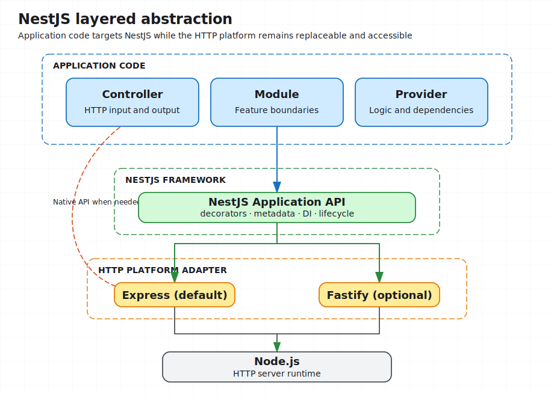
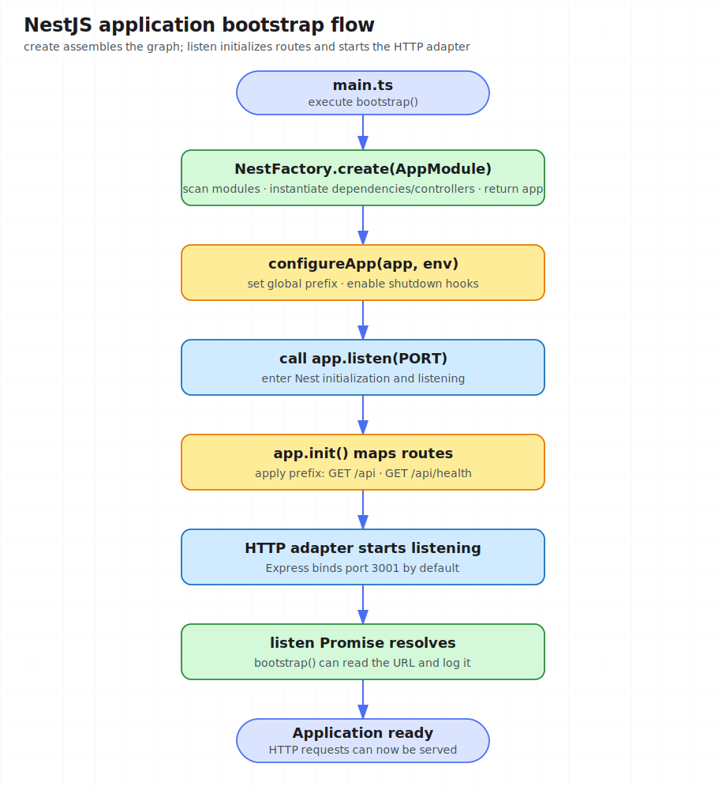

# Lesson 01: Meet NestJS and Bootstrap an Application

> Suggested time: 60–90 minutes
> Prerequisites: TypeScript, HTTP, npm, and Node.js 20 or later

## What this lesson solves

Before building a NestJS application, it helps to establish a few fundamentals:

- what NestJS adds on top of Express;
- how NestJS, Express, and Fastify relate to each other;
- how `main.ts`, the root module, controllers, and feature modules form an application;
- how startup configuration controls the port and global route prefix;
- what the minimal development, build, and local-run loop looks like.

## 1. Moving from frontend architecture to NestJS

An HTTP library such as Express provides routing, middleware, and request/response APIs, but does not prescribe how a large application should be organized. As a codebase grows, a team must define its own module boundaries, dependency management, testing strategy, and folder conventions.

NestJS adds an application architecture on top of the HTTP platform. It emphasizes modules, dependency injection, testability, and maintainability. Its heavy use of TypeScript, decorators, and modules should feel familiar to developers with frontend architecture experience.

A useful initial mental model is:

```text
NestJS = structured application framework + HTTP adapter + DI container
```

This lesson focuses on application structure and bootstrap. Providers, dependency injection, and module encapsulation are covered in Lesson 02.

## 2. NestJS, Express, and Fastify

NestJS uses Express by default and can be configured to use Fastify. Most modules and controllers target the Nest API rather than a specific HTTP implementation, while the native platform API remains available when needed.



This provides two immediate benefits:

- the team shares one project structure, programming model, and testing approach;
- most business code is not tightly coupled to one HTTP library.

Avoid using the native Express `Request` and `Response` objects everywhere. They are useful for platform-specific capabilities such as streaming or special file responses, not as the default style.

## 3. Create a project with the CLI

The Chinese documentation recommends using Nest CLI to create a standard project:

```bash
npm i -g @nestjs/cli
nest new project-name --strict
```

You can also avoid a global installation:

```bash
npx @nestjs/cli new project-name --strict
```

`--strict` enables stricter TypeScript settings. The demo in this repository is already prepared, so you do not need to create another project.

## 4. Explore the Lesson 01 demo

The demo is a minimal but complete NestJS application:

```text
demo/
├── src/
│   ├── main.ts                    # Creates and starts the application
│   ├── app.setup.ts               # Application setup separated from the entry
│   ├── app.module.ts              # Root composition module
│   ├── app.controller.ts          # GET /api
│   └── health/
│       ├── health.module.ts       # Health feature module
│       └── health.controller.ts   # GET /api/health
├── nest-cli.json                  # Nest CLI configuration
├── package.json                   # Scripts and dependencies
└── tsconfig.json                  # TypeScript configuration
```

A standard Nest project usually contains `main.ts`, a root module, a controller, and a service. This demo postpones the service until Lesson 02 so bootstrap remains clear; automated test cases are concentrated in Lesson 13.

## 5. Understand bootstrap from `main.ts`

Open [`demo/src/main.ts`](demo/src/main.ts):

```ts
import { Logger } from '@nestjs/common';
import { NestFactory } from '@nestjs/core';
import { env } from 'node:process';
import { AppModule } from './app.module';
import { configureApp } from './app.setup';

async function bootstrap(): Promise<void> {
  const app = await NestFactory.create(AppModule);
  const prefix = configureApp(app, env);

  const port = Number(env.PORT ?? 3001);
  await app.listen(port);
  Logger.log(
    `Lesson 01 is running at ${await app.getUrl()}/${prefix}`,
    'Bootstrap',
  );
}

void bootstrap();
```

Line by line:

1. `NestFactory.create(AppModule)` creates the application from the root module, using Express by default.
2. `setGlobalPrefix()` adds a prefix to every route; the default is `/api`.
3. `enableShutdownHooks()` lets the application handle process shutdown signals.
4. `listen()` starts the HTTP server on port `3001` by default.
5. `getUrl()` obtains the active URL; the log appends the global prefix and prints a directly usable base URL.

`configureApp()` lives in [`demo/src/app.setup.ts`](demo/src/app.setup.ts). It separates the global prefix and shutdown hooks from listening so each bootstrap responsibility remains visible.

The startup sequence is shown below:



## 6. Module and Controller responsibilities

The root module describes how the application is composed:

```ts
@Module({
  imports: [HealthModule],
  controllers: [AppController],
})
export class AppModule {}
```

- `imports`: modules required by this module;
- `controllers`: controllers that handle incoming requests;
- `providers`: container-managed services, not used yet;
- `exports`: providers exposed to other modules, not used yet.

A controller declares routes with decorators:

```ts
@Controller('health')
export class HealthController {
  @Get()
  getHealth() {
    return { status: 'ok', lesson: 1, platform: 'express' };
  }
}
```

`@Controller('health')` plus `@Get()` declares `GET /health`. The global `api` prefix makes the final route `GET /api/health`. Nest serializes the returned object as JSON.

## 7. Run the demo

Install workspace dependencies once from the repository root, then start Lesson 01:

```bash
npm install
cd lessons/01-nestjs-architecture/demo
npm run start:dev
```

Call both endpoints:

```bash
curl http://localhost:3001/api
curl http://localhost:3001/api/health
```

Expected health response:

```json
{
  "status": "ok",
  "lesson": 1,
  "platform": "express"
}
```

`start:dev` watches source files and recompiles automatically. Change the message in `app.controller.ts`, save it, and call the endpoint again.

## 8. Change bootstrap configuration

This lesson has not introduced the configuration module yet, so pass environment variables directly:

```bash
PORT=4001 APP_PREFIX=v1 npm run start:dev
curl http://localhost:4001/v1/health
```

This shows how one application can receive different startup configuration. Merely creating a `.env` file will not load it automatically; configuration support is introduced in a later lesson.

## 9. Minimal development loop

Run these commands inside the demo directory:

```bash
npm run lint
npm run format
npm run build
```

- `lint` checks and fixes common code issues;
- `format` applies Prettier formatting;
- `build` compiles TypeScript into `dist/`;

Outside the testing lesson, course Demos keep source code only and use the development server, production build, ESLint, and Prettier as the local loop. Automated testing is introduced in Lesson 13.

## 10. Hands-on verification

Use this sequence to observe the application's actual behavior:

1. Start the application and call both endpoints.
2. Change `PORT` to `4001` and `APP_PREFIX` to `v1`.
3. Edit the welcome message and observe hot reload.
4. Run lint and build to verify the source and project configuration.
5. Stop the process and confirm it handles the shutdown signal and exits. `enableShutdownHooks()` does not print shutdown logs by itself; lifecycle hooks perform cleanup once later lessons add resources such as a database.

The final `/api/health` path combines the global prefix, controller prefix, and method route. Changing any one of them and sending the request again makes the route mapping visible.

## 11. Common issues

### The endpoint returns 404

Check the global prefix. The default endpoint is `/api/health`, not `/health`.

### The port is already in use

Start on another port:

```bash
PORT=4001 npm run start:dev
```

### Editing `.env` has no effect

This lesson does not load `.env`. Use command-line environment variables until `ConfigModule` is introduced.

### Can I access the native Express API?

Yes, but prefer Nest's platform-independent APIs unless a feature genuinely requires the underlying platform.

Lesson 02 moves business logic into providers and connects modules, controllers, and services through dependency injection.
