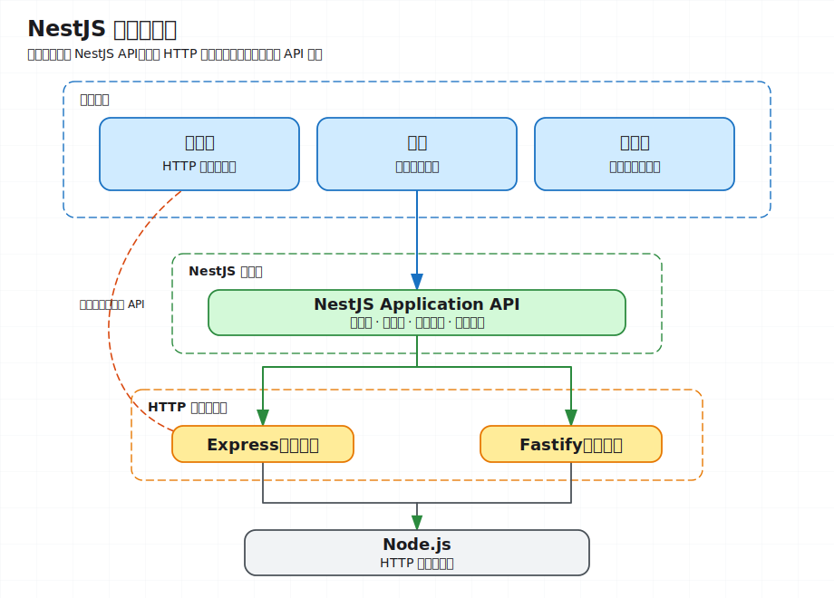
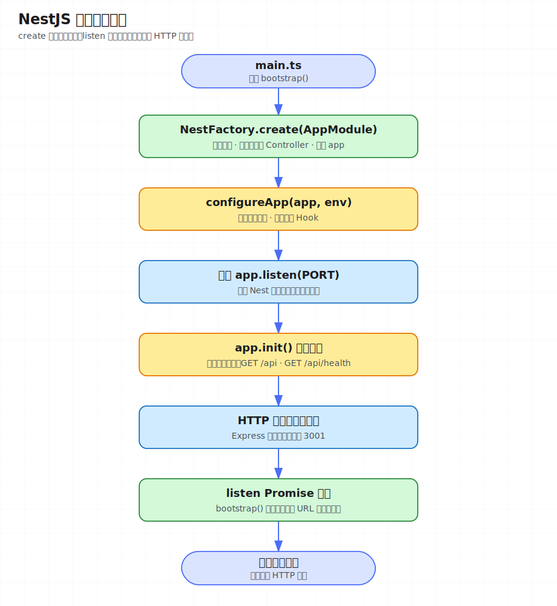

# 第 01 课：认识 NestJS 与启动一个应用

> 建议用时：60–90 分钟
> 前置要求：熟悉 TypeScript、HTTP 与 npm，Node.js 20 或更高版本

## 这一课解决什么问题

开始编写 NestJS 应用前，需要先建立几个基础认识：

- NestJS 相比直接使用 Express 增加了什么；
- NestJS、Express 和 Fastify 之间是什么关系；
- `main.ts`、根模块、控制器（Controller）和功能模块如何组成一个应用；
- 端口和全局路由前缀如何在启动时配置；
- 一个 NestJS 项目的最小开发、构建和本地运行闭环是什么。

## 1. 从前端工程迁移到 NestJS 的切入点

Express 这类 HTTP 库提供路由、中间件和请求响应 API，但不会强制规定大型项目如何组织。项目变大后，团队需要自行统一目录、依赖管理、测试方式和模块边界。

NestJS 在底层 HTTP 平台之上提供了一套应用架构，强调模块化、依赖注入、可测试性和可维护性。它大量使用 TypeScript、装饰器和模块概念；如果你熟悉 Angular、React 组件树或前端工程化，理解成本通常不高。

可以先用一句话建立心智模型：

```text
NestJS = 结构化应用框架 + HTTP 平台适配层 + 依赖注入容器
```

本课先关注“应用如何被组织并启动”。提供者（Provider）、依赖注入和模块封装将在第 2 课展开。

## 2. NestJS 与 Express/Fastify 的关系

NestJS 默认使用 Express，也可以切换为 Fastify。控制器、模块等多数业务代码面向 NestJS API 编写，因此不必在每个功能中直接依赖底层平台；确有需要时，仍可访问平台原生 API。



这种抽象带来两个直接收益：

- 团队可以使用一致的项目结构、测试工具和编程模型；
- 大部分业务代码不会与某个 HTTP 库深度绑定。

不要为了“更底层”而在所有控制器中直接操作 Express 的 `Request` 和 `Response`。只有流式响应、文件下载或平台特有能力等场景才有必要这样做。

## 3. 使用 CLI 创建项目

中文文档推荐使用 Nest CLI 创建标准项目：

```bash
npm i -g @nestjs/cli
nest new project-name --strict
```

也可以避免全局安装：

```bash
npx @nestjs/cli new project-name --strict
```

`--strict` 会启用更严格的 TypeScript 设置。当前仓库已经准备好 Demo，不需要重新创建项目；这里的命令用于理解标准项目从哪里来。

## 4. 认识第一课 Demo

本课使用一个最小但完整的 NestJS 应用：

```text
demo/
├── src/
│   ├── main.ts                    # 入口：创建并监听应用
│   ├── app.setup.ts               # 从入口逻辑中分离的应用配置
│   ├── app.module.ts              # 根模块：组合功能模块和 Controller
│   ├── app.controller.ts          # GET /api
│   └── health/
│       ├── health.module.ts       # 健康检查功能模块
│       └── health.controller.ts   # GET /api/health
├── nest-cli.json                  # Nest CLI 配置
├── package.json                   # 脚本与依赖
└── tsconfig.json                  # TypeScript 配置
```

标准 Nest 项目通常会看到 `main.ts`、根模块、控制器和服务（Service）。本 Demo 暂时不引入服务，是为了把注意力放在启动流程和路由注册上；测试用例统一到第 13 课再展开。

## 5. 从 `main.ts` 理解启动流程

打开 [`demo/src/main.ts`](demo/src/main.ts)：

```ts
import { Logger } from '@nestjs/common';
import { NestFactory } from '@nestjs/core';
import { env } from 'node:process';
import { AppModule } from './app.module';
import { configureApp } from './app.setup';

async function bootstrap(): Promise<void> {
  const app = await NestFactory.create(AppModule);
  const prefix = configureApp(app, env);

  const port = Number(env.PORT ?? 3001);
  await app.listen(port);
  Logger.log(
    `Lesson 01 is running at ${await app.getUrl()}/${prefix}`,
    'Bootstrap',
  );
}

void bootstrap();
```

逐行理解：

1. `NestFactory.create(AppModule)` 以根模块为入口创建应用实例；默认使用 Express 平台。
2. `setGlobalPrefix()` 给所有路由添加统一前缀，默认是 `/api`。
3. `enableShutdownHooks()` 让应用接收系统关闭信号，为以后释放数据库等资源做准备。
4. `listen()` 启动 HTTP 服务；端口默认是 `3001`。
5. `getUrl()` 在启动成功后取得真实访问地址，日志再追加全局前缀，输出可直接访问的基础 URL。

`configureApp()` 位于 [`demo/src/app.setup.ts`](demo/src/app.setup.ts)，把全局前缀和关闭钩子（Hook）从监听逻辑中分离，便于观察每个启动阶段的职责。

从代码结构看，启动过程如下：



## 6. 模块（Module）与控制器各自负责什么

根模块通过 `@Module()` 描述应用由哪些部分组成：

```ts
@Module({
  imports: [HealthModule],
  controllers: [AppController],
})
export class AppModule {}
```

- `imports`：当前模块依赖的其他模块；
- `controllers`：负责处理 HTTP 请求的控制器；
- `providers`：可被容器管理的服务，本课尚未使用；
- `exports`：允许其他模块使用的提供者，本课尚未使用。

控制器使用装饰器声明路由：

```ts
@Controller('health')
export class HealthController {
  @Get()
  getHealth() {
    return { status: 'ok', lesson: 1, platform: 'express' };
  }
}
```

`@Controller('health')` 加上 `@Get()` 表示 `GET /health`；再叠加全局前缀 `api`，最终地址是 `GET /api/health`。普通对象会由 Nest 自动序列化为 JSON。

## 7. 运行 Demo

先在仓库根目录安装工作区依赖，然后启动第一课：

```bash
npm install
cd lessons/01-nestjs-architecture/demo
npm run start:dev
```

访问两个接口：

```bash
curl http://localhost:3001/api
curl http://localhost:3001/api/health
```

健康检查应返回：

```json
{
  "status": "ok",
  "lesson": 1,
  "platform": "express"
}
```

`start:dev` 会监听源码变化并自动重新编译。修改 `app.controller.ts` 中的欢迎信息，保存后再次请求，确认结果已经变化。

## 8. 修改启动配置

第一课还没有引入配置模块，先直接从命令行传入环境变量：

```bash
PORT=4001 APP_PREFIX=v1 npm run start:dev
curl http://localhost:4001/v1/health
```

这说明同一份应用代码可以在启动时读取不同配置。注意：仅创建 `.env` 文件不会让 Nest 自动读取它；配置模块会在后续课程介绍。

## 9. 最小开发闭环

在 Demo 目录运行：

```bash
npm run lint
npm run format
npm run build
```

- `lint`：检查并修复常见代码规范问题；
- `format`：使用 Prettier 统一格式；
- `build`：将 TypeScript 编译到 `dist/`；

本课程在非测试主题的 Demo 中只保留源码，以开发服务器、生产构建、ESLint 和 Prettier 形成最小本地闭环；自动化测试集中到第 13 课。

## 10. 实际验证

可以用下面这轮修改观察应用的真实行为：

1. 启动应用并请求两个接口。
2. 将 `PORT` 改为 `4001`，将 `APP_PREFIX` 改为 `v1`。
3. 修改欢迎接口的 `message`，观察热更新。
4. 运行 Lint 和构建，确认源码与工程配置均可用。
5. 停止进程，确认进程可以响应关闭信号并退出。`enableShutdownHooks()` 本身不会自动打印关闭日志；后续接入数据库等资源时，生命周期钩子（Lifecycle Hook）才会执行相应清理逻辑。

`/api/health` 的最终路径由全局前缀、控制器前缀和方法路由三部分组合而成。修改其中任意一处后重新请求，可以直接观察路由映射的变化。

## 11. 常见问题

### 地址返回 404

先确认是否遗漏了全局前缀。默认地址是 `/api/health`，不是 `/health`。

### 端口被占用

换一个端口启动：

```bash
PORT=4001 npm run start:dev
```

### 修改 `.env` 没有效果

本课没有加载 `.env`。请先用命令行环境变量；后续引入 `ConfigModule` 后再使用配置文件。

### 能否直接使用 Express API

可以，但一般应优先使用 Nest 提供的平台无关 API，避免业务代码和底层平台耦合。

下一课将把业务逻辑放入提供者，并通过依赖注入连接模块、控制器和服务。
