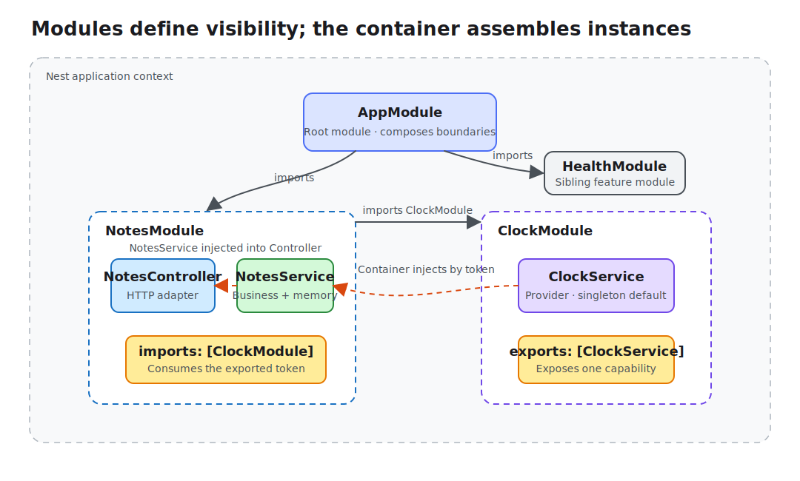

# Lesson 02: Modules and Dependency Injection

Lesson 1 treated a NestJS application as an object graph bootstrapped from a root module. The next practical question is who creates classes, where their dependencies come from, and which implementations are allowed to cross a boundary as notes, users, and authentication enter the application.

This lesson stays focused on modules and dependency injection. DTO validation, databases, and authentication remain in later lessons.

## From manual assembly to container management

Plain TypeScript can assemble the graph directly:

```ts
const clock = new ClockService();
const notesService = new NotesService(clock);
const controller = new NotesController(notesService);
```

That is clear for a few objects, but assembly code spreads as dependencies grow. Tests must understand the entire construction order, and replacing one implementation can affect every caller.

NestJS delegates assembly to its IoC container. Modules declare the Providers and Controllers available in a context; the container reads constructor metadata and creates instances in dependency order.



The arrows mean more than “this file can be imported”:

- `AppModule` composes feature modules through `imports`;
- `NotesModule` registers `NotesService`, so the service can be injected into `NotesController`;
- `ClockModule` registers `ClockService` and exposes it through `exports`;
- `NotesModule` can inject `ClockService` only after importing `ClockModule`.

## A module is a runtime boundary

`NotesModule` groups the protocol adapter and business logic for notes:

```ts
@Module({
  imports: [ClockModule],
  controllers: [NotesController],
  providers: [NotesService],
})
export class NotesModule {}
```

This resembles a frontend feature directory, with one crucial difference: a directory is source organization, while `@Module()` metadata controls runtime visibility and instance creation.

The four common fields answer different questions:

- `imports`: which exported Providers from other modules this context needs;
- `controllers`: which classes receive incoming requests;
- `providers`: which classes or factories this module's container manages;
- `exports`: which Providers importing modules are allowed to use.

Avoid putting every Provider in `AppModule` for convenience. The root module composes boundaries; feature modules encapsulate business capabilities.

## Providers, tokens, and instances

`@Injectable()` marks a class as container-managed:

```ts
@Injectable()
export class ClockService {
  now(): string {
    return new Date().toISOString();
  }
}
```

In `providers: [ClockService]`, the class has two roles:

1. the injection token used to locate the dependency;
2. the default implementation used to construct an instance.

It is shorthand for:

```ts
{
  provide: ClockService,
  useClass: ClockService,
}
```

Production projects can also use string or `Symbol` tokens and obtain values through `useValue`, `useFactory`, or `useExisting`. Those forms fit configuration, third-party clients, and multiple implementations of one capability. This lesson keeps a class token because it makes the dependency graph explicit.

## Constructor injection makes dependencies explicit

`NotesService` declares a clock dependency instead of reading system time directly:

```ts
@Injectable()
export class NotesService {
  constructor(private readonly clock: ClockService) {}

  create(dto: CreateNoteDto): Note {
    const note = {
      id: randomUUID(),
      ...dto,
      createdAt: this.clock.now(),
    };

    // Store and return the note
  }
}
```

The extra abstraction turns an unstable external source into an explicit dependency. A unit test can provide a fixed clock without freezing global time or accepting nondeterministic results.

Prefer constructor injection: dependencies remain visible in both the type and construction phases. Property injection is available, but it can hide what a class actually requires.

## `exports` exposes a capability, not a module's internals

The important part of `ClockModule` is `exports`:

```ts
@Module({
  providers: [ClockService],
  exports: [ClockService],
})
export class ClockModule {}
```

Remove `exports: [ClockService]` and the application fails to resolve the `NotesService` dependency at startup even though `NotesModule` imports `ClockModule`. A Provider is visible only inside its declaring module by default.

A module exports the capability behind a token; it does not turn every internal Provider into public API. A narrow export surface limits cross-module coupling.

## Choosing a Provider scope

Nest Providers use singleton scope by default: one application context normally reuses the same instance. This lesson's `NotesService` owns an in-memory `Map`, so later requests can see notes created earlier.

Two other scopes need deliberate use:

- request scope creates an instance for each request and fits objects that truly depend on request-local context;
- transient scope creates an instance at each injection site and fits lightweight objects with independent temporary state.

Request scope bubbles up the injection chain: a singleton Provider that depends on a request-scoped Provider must also be created per request. Transient scope does not propagate that way; it gives each consumer an independent instance without changing the consumer's own scope. Both increase construction work, so most stateless Services, repositories, and clients should remain singletons. Request identity is usually passed through Guards or explicit context instead of making an entire graph request-scoped.

## Run the Demo and observe the graph

After installing workspace dependencies at the repository root, start lesson 2:

```bash
cd lessons/02-modules-and-dependency-injection/demo
npm run start:dev
```

The default base URL is `http://localhost:3002/api`. Create a note:

```bash
curl -X POST http://localhost:3002/api/notes \
  -H 'Content-Type: application/json' \
  -d '{"title":"DI","content":"make dependencies explicit"}'
```

`NotesService` generates the `id`, while the injected `ClockService` supplies `createdAt`:

```json
{
  "id": "<uuid>",
  "title": "DI",
  "content": "make dependencies explicit",
  "createdAt": "<ISO timestamp>"
}
```

Read it back:

```bash
curl http://localhost:3002/api/notes
```

The array contains the note. Restarting the application clears it, an intentional in-memory boundary until lesson 5 introduces persistence.

## Understand injection through local behavior

Create two notes and each `createdAt` comes from the same clock capability, while the Controller knows nothing about how time is produced. A production project can replace the Provider behind the token with a fixed clock, tenant-aware time, or an external source without changing how `NotesService` calls it.

This Demo keeps source and directly runnable HTTP behavior only. Lesson 13 uses automated tests to demonstrate Provider replacement.

```bash
npm run lint
npm run build
```

## Common boundary mistakes

### Confusing TypeScript `import` with Nest `imports`

Being able to import a class in source code does not make it injectable at runtime. Check whether the token is registered in the current module or explicitly exported by an imported module.

### Registering the same Provider repeatedly

Putting `ClockService` in several modules' `providers` arrays creates separate module-context instances; it does not reuse the service exported by its owner. Import the owning module when the capability must be shared.

### Hiding boundaries with a global module

`@Global()` reduces explicit imports but makes dependency sources harder to trace. A few infrastructure concerns such as configuration or logging may justify it; business modules should remain explicit by default.

### Keeping circular dependencies alive with `forwardRef()`

`forwardRef()` can remove a construction-time blocker without removing two-way design coupling. Prefer extracting a shared capability, adding an orchestration service, or reversing the dependency with an event. Use `forwardRef()` as a transition only when the boundaries genuinely reference each other and cannot yet be separated.

The final dependency direction in this Demo is one-way: the root composes feature modules, `NotesModule` consumes the clock exported by `ClockModule`, and the business Service never depends back on a Controller or the root module.
