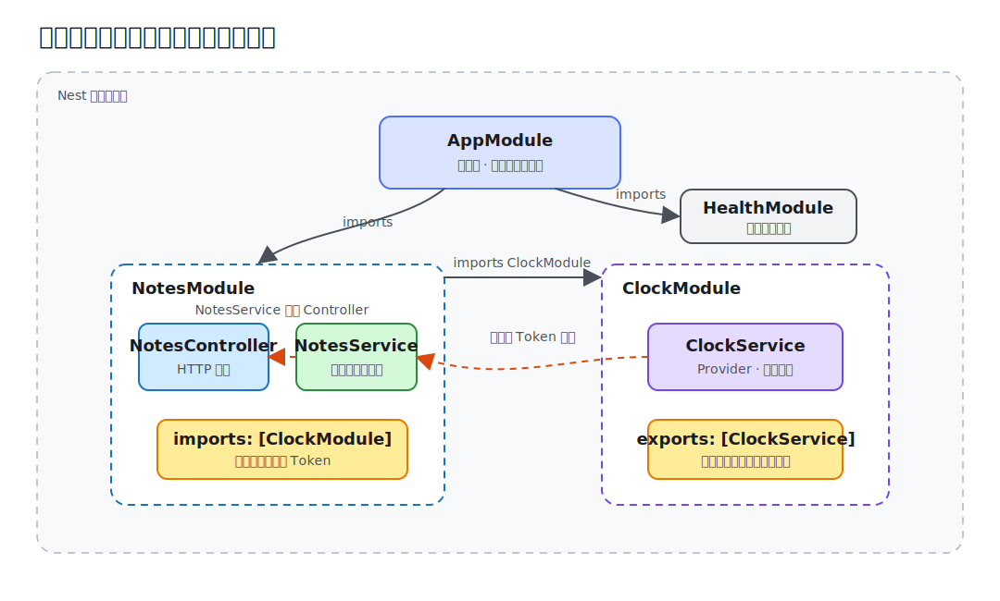

# 第 02 课：模块与依赖注入

第一课把 NestJS 应用看成一棵从根模块启动的对象图。本课继续追问一个更实际的问题：当应用开始出现笔记、用户、认证等功能时，类由谁创建、依赖从哪里来、哪些实现允许跨边界使用？

本课只处理模块和依赖注入。DTO 校验、数据库和认证仍留在后续课程。

## 从手动组装到容器管理

在普通 TypeScript 中，可以直接写：

```ts
const clock = new ClockService();
const notesService = new NotesService(clock);
const controller = new NotesController(notesService);
```

对象少时这很直观，但组装代码会随着依赖增长而分散。测试还要知道每一层的构造顺序，替换实现也容易影响调用方。

NestJS 把这件事交给 IoC 容器：模块声明当前上下文里有哪些提供者（Provider）和控制器（Controller），容器读取构造函数元数据，按依赖关系创建实例。



图中的箭头不是“文件可以 import”这么简单：

- `AppModule` 通过 `imports` 组合功能模块；
- `NotesModule` 注册 `NotesService`，因此可以把它注入 `NotesController`；
- `ClockModule` 不仅注册 `ClockService`，还通过 `exports` 将它公开；
- `NotesModule` 导入 `ClockModule` 后，才可以在自己的上下文中注入 `ClockService`。

## 模块是运行时边界

`NotesModule` 聚合笔记功能的协议入口和业务逻辑：

```ts
@Module({
  imports: [ClockModule],
  controllers: [NotesController],
  providers: [NotesService],
})
export class NotesModule {}
```

这与前端 feature directory 有相似之处，但差异很重要：目录只是源码组织，`@Module()` 元数据会真正决定 Nest 运行时的可见性和实例创建。

模块的四个常用字段分别回答：

- `imports`：当前模块要使用哪些模块公开的提供者；
- `controllers`：哪些类负责接收传入请求；
- `providers`：哪些类或工厂由当前模块的容器管理；
- `exports`：哪些提供者可以被导入本模块的其他模块使用。

不要为了省事把所有提供者都放进 `AppModule`。根模块适合组合边界，功能模块负责封装业务能力。

## 提供者与注入令牌

`@Injectable()` 表示这个类可以由 Nest 容器管理：

```ts
@Injectable()
export class ClockService {
  now(): string {
    return new Date().toISOString();
  }
}
```

在 `providers: [ClockService]` 中，类同时承担两个角色：

1. 注入令牌（Injection Token），用来查找依赖；
2. 默认实现，容器用它创建实例。

它等价于更完整的写法：

```ts
{
  provide: ClockService,
  useClass: ClockService,
}
```

真实项目还可以使用字符串或 `Symbol` 作为注入令牌，并通过 `useValue`、`useFactory`、`useExisting` 替换来源。这适合配置、第三方客户端或同一能力的多种实现。本课使用类作为注入令牌，因为依赖关系最直接。

## 构造函数注入让依赖显式化

`NotesService` 不直接读取系统时间，而是声明自己需要时钟：

```ts
@Injectable()
export class NotesService {
  constructor(private readonly clock: ClockService) {}

  create(dto: CreateNoteDto): Note {
    const note = {
      id: randomUUID(),
      ...dto,
      createdAt: this.clock.now(),
    };

    // 保存并返回笔记
  }
}
```

这样做不是为了多包一层，而是把不稳定的外部来源变成明确依赖。单测可以注入固定时钟，因此无需冻结全局时间，也不会得到偶发结果。

优先使用构造函数注入：依赖在类型和实例创建阶段都可见。属性注入虽然可用，但容易隐藏一个类真正需要什么。

## `exports` 公开能力，不公开整个模块内部

`ClockModule` 的关键是 `exports`：

```ts
@Module({
  providers: [ClockService],
  exports: [ClockService],
})
export class ClockModule {}
```

如果删除 `exports: [ClockService]`，即使 `NotesModule` 已经导入 `ClockModule`，启动时仍会出现 Nest 无法解析 `NotesService` 依赖的错误。提供者默认只在声明它的模块上下文中可见。

模块导出的是注入令牌对应的能力，不是把内部所有提供者自动变为公开 API。保持较小的导出面可以减少跨模块耦合。

## 提供者生命周期怎么选

Nest 提供者默认是单例作用域：一个应用上下文通常复用同一实例。本课的 `NotesService` 使用内存 `Map`，所以多次请求能看到之前创建的笔记。

另外两种作用域需要谨慎使用：

- 请求作用域（request scope）：每个请求创建一次，适合确实依赖请求上下文的对象；
- 瞬态作用域（transient scope）：每个注入点获得新实例，适合需要独立瞬时状态的轻量对象。

请求作用域会沿注入链向消费方冒泡：单例提供者若依赖请求作用域提供者，自身也必须按请求创建。瞬态作用域不会这样传播；它只为每个消费者提供独立实例，不改变消费者自身的作用域。两者都会增加实例创建成本，因此大多数无状态服务（Service）、仓储（Repository）和客户端应保留默认单例。请求身份通常通过守卫（Guard）或显式上下文传递，而不是把整条依赖链改成请求作用域。

## 运行 Demo 观察依赖结果

在仓库根目录安装依赖后启动第 2 课：

```bash
cd lessons/02-modules-and-dependency-injection/demo
npm run start:dev
```

默认地址是 `http://localhost:3002/api`。先创建一条笔记：

```bash
curl -X POST http://localhost:3002/api/notes \
  -H 'Content-Type: application/json' \
  -d '{"title":"DI","content":"make dependencies explicit"}'
```

响应中的 `id` 由 `NotesService` 生成，`createdAt` 来自注入的 `ClockService`：

```json
{
  "id": "<uuid>",
  "title": "DI",
  "content": "make dependencies explicit",
  "createdAt": "<ISO timestamp>"
}
```

再次查询：

```bash
curl http://localhost:3002/api/notes
```

会得到包含刚才笔记的数组。应用重启后数据消失，这是本课刻意保留的内存边界；第 5 课再切换到数据库。

## 从本地行为理解注入价值

连续创建两条笔记，可以看到每次 `createdAt` 都来自同一个时钟能力，而控制器完全不知道时间如何产生。若真实项目需要固定时间、租户时区或外部时间源，只需替换注入令牌对应的提供者，`NotesService` 的调用方式不变。

本课 Demo 只保留源码和可直接运行的 HTTP 行为，不包含测试用例；第 13 课会再用自动化测试展示如何替换提供者。

```bash
npm run lint
npm run build
```

## 常见边界问题

### 把 TypeScript `import` 当成 Nest `imports`

源码能导入一个类，不代表运行时容器能注入它。检查注入令牌是否注册在当前模块，或是否由已导入模块明确导出。

### 重复注册同一个提供者

在多个模块的 `providers` 中重复放入 `ClockService` 会创建多个模块上下文实例，而不是“复用导出的同一个服务”。需要共享时，应导入拥有它的模块。

### 用全局模块掩盖边界

`@Global()` 能减少显式导入，但也让依赖来源难以追踪。配置、日志等少数基础设施可能适合全局化，业务模块默认应显式导入。

### 用 `forwardRef()` 长期维持循环依赖

`forwardRef()` 可以解除初始化阶段的技术阻塞，却不会消除设计上的双向耦合。优先提取共同能力、引入编排服务或用事件反转依赖方向。只有边界确实互相引用且短期无法拆分时，才把 `forwardRef()` 作为过渡方案。

本课 Demo 的最终依赖方向是单向的：根模块组合功能模块，`NotesModule` 使用 `ClockModule` 公开的时钟能力，业务服务不反向依赖控制器或根模块。
