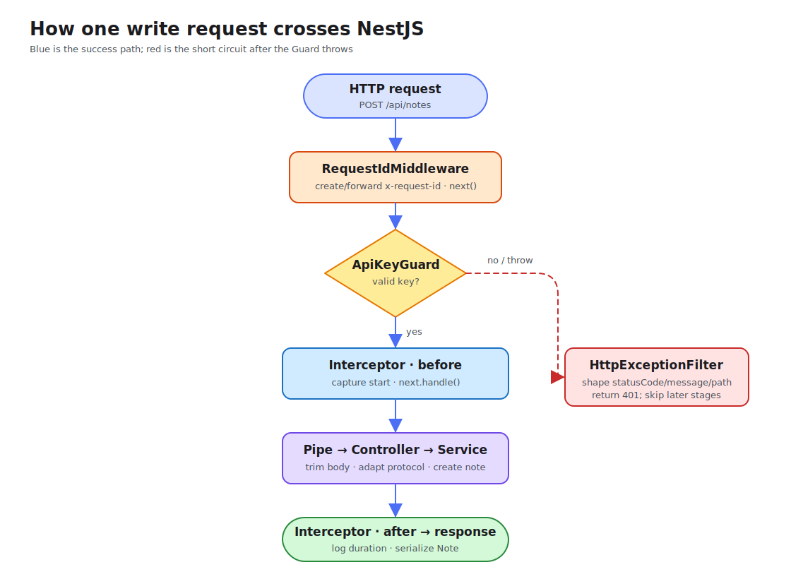

# Lesson 03: Request Lifecycle

An HTTP request does not call a NestJS Controller immediately. Authentication, input transformation, logging, and error formatting live at different extension points. Without their positions, rules end up in the wrong layer and skipped code becomes difficult to explain.

This lesson follows one note-creation request through Middleware, Guard, Interceptor, Pipe, Controller, and Exception Filter. Declarative DTO validation remains in Lesson 04.

## The main request path



For `POST /api/notes`, the success path is:

1. Express receives the request and `RequestIdMiddleware` creates or forwards a request ID;
2. after route matching, `ApiKeyGuard` decides whether processing may continue;
3. `RequestLoggingInterceptor` records the start time before the handler;
4. `TrimStringsPipe` transforms the `@Body()` argument;
5. `NotesController` calls `NotesService` to create the note;
6. the Interceptor logs method, path, and duration when the Observable finishes;
7. the HTTP adapter serializes and sends the response.

If the Guard throws `UnauthorizedException`, the Controller, Pipe, and Service never run. `HttpExceptionFilter` creates the error JSON. Whether an Interceptor observes an error depends on whether that error occurred inside the region it wraps; a Filter is not simply an ordinary final step.

## Middleware: protocol work before route handling

Middleware sits close to the Express pipeline and fits correlation IDs, low-level headers, or legacy protocol compatibility:

```ts
@Injectable()
export class RequestIdMiddleware implements NestMiddleware {
  use(request: Request, response: Response, next: NextFunction): void {
    const requestId = request.header('x-request-id') ?? randomUUID();
    response.setHeader('x-request-id', requestId);
    next();
  }
}
```

Its scope is explicit in the root module:

```ts
export class AppModule implements NestModule {
  configure(consumer: MiddlewareConsumer): void {
    consumer.apply(RequestIdMiddleware).forRoutes('{*path}');
  }
}
```

Middleware does not know the final Controller method and is a poor home for business authorization. Forgetting `next()` leaves the request hanging.

## Guard: whether the route can run

A Guard runs after Nest knows the target Controller and Handler, so it can inspect route metadata and make authentication or authorization decisions. This lesson uses a fixed API key only to expose that position:

```ts
@Injectable()
export class ApiKeyGuard implements CanActivate {
  canActivate(context: ExecutionContext): boolean {
    const request = context.switchToHttp().getRequest<Request>();
    const expected = process.env.DEMO_API_KEY ?? 'learning-key';

    if (request.header('x-api-key') !== expected) {
      throw new UnauthorizedException('Invalid x-api-key');
    }
    return true;
  }
}
```

`@UseGuards(ApiKeyGuard)` protects only creation; listing notes remains public. JWT authentication arrives in Lesson 07 and RBAC in Lesson 08. Here the concern is the Guard's place in the chain.

## Interceptor: observing before and after handler execution

An Interceptor resembles an HTTP-client interceptor or a function wrapper: it has an entry phase and can observe the return phase with RxJS operators.

```ts
intercept(context: ExecutionContext, next: CallHandler): Observable<unknown> {
  const request = context.switchToHttp().getRequest<Request>();
  const startedAt = Date.now();

  return next.handle().pipe(
    finalize(() => {
      this.logger.log(
        `${request.method} ${request.originalUrl} ${Date.now() - startedAt}ms`,
      );
    }),
  );
}
```

`next.handle()` enters later Pipes and the Handler. Interceptors fit shared logging, timing, response mapping, and caching—not note business rules.

## Pipe: transforming one argument

A Pipe runs for a Controller argument. This lesson trims top-level strings in the body:

```ts
@Post()
@UseGuards(ApiKeyGuard)
create(@Body(TrimStringsPipe) dto: CreateNoteDto): Note {
  return this.notesService.create(dto);
}
```

```ts
transform(value: unknown): unknown {
  if (typeof value !== 'object' || value === null) return value;

  return Object.fromEntries(
    Object.entries(value).map(([key, item]) => [
      key,
      typeof item === 'string' ? item.trim() : item,
    ]),
  );
}
```

It intentionally handles one object level. Lesson 04 adds `ValidationPipe`, `class-validator`, and transformation options for a complete input boundary.

## Exception Filter: shaping failures

Nest already converts `HttpException` values into responses. A custom Filter standardizes fields a team needs:

```ts
response.status(statusCode).json({
  statusCode,
  message: exception.message,
  path: request.originalUrl,
  timestamp: new Date().toISOString(),
});
```

This Demo registers it with `app.useGlobalFilters()`, so caught `HttpException` values use one shape. A production Filter should not swallow unknown errors or expose stacks; public messages and internal logs have different audiences.

## Run and observe both branches

```bash
cd lessons/03-request-lifecycle/demo
npm run start:dev
```

First omit the key:

```bash
curl -i -X POST http://localhost:3003/api/notes \
  -H 'content-type: application/json' \
  -H 'x-request-id: lifecycle-denied' \
  -d '{"title":" Lifecycle ","content":" denied "}'
```

The response forwards `x-request-id` and returns a standardized `401` body:

```json
{
  "statusCode": 401,
  "message": "Invalid x-api-key",
  "path": "/api/notes",
  "timestamp": "<ISO timestamp>"
}
```

Now include the key:

```bash
curl -i -X POST http://localhost:3003/api/notes \
  -H 'content-type: application/json' \
  -H 'x-api-key: learning-key' \
  -d '{"title":" Lifecycle ","content":" ordered stages "}'
```

The response contains trimmed `title` and `content`, and the terminal prints an Interceptor log similar to `POST /api/notes 3ms`. Actual timing varies.

```bash
npm run lint
npm run build
```

This source-only Demo has no test cases; the two requests above are the repeatable local verification path.

## Choose an extension point by responsibility

- work for every request near raw HTTP: Middleware;
- whether a Handler may run: Guard;
- transform or validate one argument: Pipe;
- observe or transform the process before and after Handler execution: Interceptor;
- map an exception to a response: Exception Filter;
- business rules after protocol adaptation: Service.

Global registration creates consistency but expands impact. Prove a rule at Controller or method scope before promoting a truly shared concern globally. The execution order is not an API list to memorize; it is a debugging map of which context is available and which stages a failure skips.
