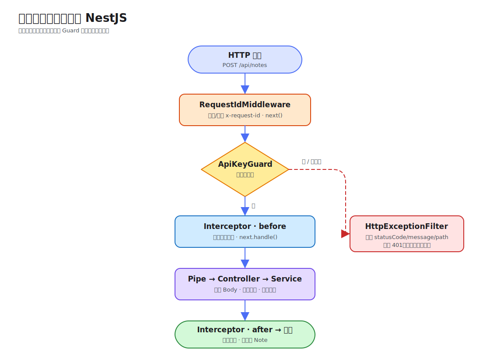

# 第 03 课：请求生命周期

一个 HTTP 请求进入 NestJS 后，不会直接调用 Controller。认证、输入转换、日志和异常格式化分布在不同扩展点；如果不知道它们的执行位置，很容易把规则放错层，或误判为什么某段代码没有运行。

本课用创建笔记的请求串起 Middleware、Guard、Interceptor、Pipe、Controller 和 Exception Filter。DTO 的声明式校验留到第 4 课。

## 一条请求的主路径



对本课 `POST /api/notes`，成功路径可以记成：

1. Express 收到请求，`RequestIdMiddleware` 最先生成或透传请求 ID；
2. 路由匹配后，`ApiKeyGuard` 判断请求是否允许继续；
3. `RequestLoggingInterceptor` 在处理器之前记录开始时间；
4. `TrimStringsPipe` 转换 `@Body()` 参数；
5. `NotesController` 调用 `NotesService` 创建笔记；
6. Interceptor 在 Observable 完成时记录方法、路径和耗时；
7. HTTP 适配器序列化返回值并发送响应。

如果 Guard 抛出 `UnauthorizedException`，Controller、Pipe 和 Service 都不会执行，异常交给 `HttpExceptionFilter` 生成统一 JSON。Interceptor 是否能观察到异常取决于异常发生在它包裹的范围内；不要把 Filter 当成普通的最后一步。

## Middleware：路由处理前的协议层工作

Middleware 接近 Express 请求管线，适合关联 ID、低层 Header 处理或兼容旧协议：

```ts
@Injectable()
export class RequestIdMiddleware implements NestMiddleware {
  use(request: Request, response: Response, next: NextFunction): void {
    const requestId = request.header('x-request-id') ?? randomUUID();
    response.setHeader('x-request-id', requestId);
    next();
  }
}
```

在根模块中显式指定作用范围：

```ts
export class AppModule implements NestModule {
  configure(consumer: MiddlewareConsumer): void {
    consumer.apply(RequestIdMiddleware).forRoutes('{*path}');
  }
}
```

Middleware 不知道最终会调用哪个 Controller 方法，也不适合承载业务权限规则。忘记调用 `next()` 会让请求悬挂。

## Guard：能否进入路由

Guard 在已经知道目标 Controller 和 Handler 后执行，因此可以读取元数据并做认证授权。本课用固定 API Key 观察位置：

```ts
@Injectable()
export class ApiKeyGuard implements CanActivate {
  canActivate(context: ExecutionContext): boolean {
    const request = context.switchToHttp().getRequest<Request>();
    const expected = process.env.DEMO_API_KEY ?? 'learning-key';

    if (request.header('x-api-key') !== expected) {
      throw new UnauthorizedException('Invalid x-api-key');
    }
    return true;
  }
}
```

`@UseGuards(ApiKeyGuard)` 只保护创建接口，读取列表仍公开。真实 JWT 认证在第 7 课，RBAC 在第 8 课；本课只关心 Guard 位于请求链的哪里。

## Interceptor：包裹处理器

Interceptor 的心智模型接近前端请求客户端的 interceptor 或函数装饰器：它既有“进入”阶段，也能通过 RxJS 操作符观察“返回”阶段。

```ts
intercept(context: ExecutionContext, next: CallHandler): Observable<unknown> {
  const request = context.switchToHttp().getRequest<Request>();
  const startedAt = Date.now();

  return next.handle().pipe(
    finalize(() => {
      this.logger.log(
        `${request.method} ${request.originalUrl} ${Date.now() - startedAt}ms`,
      );
    }),
  );
}
```

`next.handle()` 才会进入后续 Pipe 和 Handler。适合统一日志、耗时、响应映射和缓存，但不要在这里堆积笔记业务规则。

## Pipe：转换当前参数

Pipe 针对 Controller 参数运行。本课把 Body 顶层字符串两端空格移除：

```ts
@Post()
@UseGuards(ApiKeyGuard)
create(@Body(TrimStringsPipe) dto: CreateNoteDto): Note {
  return this.notesService.create(dto);
}
```

```ts
transform(value: unknown): unknown {
  if (typeof value !== 'object' || value === null) return value;

  return Object.fromEntries(
    Object.entries(value).map(([key, item]) => [
      key,
      typeof item === 'string' ? item.trim() : item,
    ]),
  );
}
```

它只处理一层对象，是刻意保持的最小示例。第 4 课会使用 `ValidationPipe`、`class-validator` 和转换选项建立完整输入边界。

## Exception Filter：控制失败响应

Nest 默认已经能把 `HttpException` 转为响应。自定义 Filter 的价值是统一团队需要的错误字段：

```ts
response.status(statusCode).json({
  statusCode,
  message: exception.message,
  path: request.originalUrl,
  timestamp: new Date().toISOString(),
});
```

本课通过 `app.useGlobalFilters()` 注册它，所以所有捕获到的 `HttpException` 使用同一结构。Filter 不应吞掉未知错误或泄露堆栈；生产系统还需要区分可公开消息与内部日志。

## 运行并观察两条分支

```bash
cd lessons/03-request-lifecycle/demo
npm run start:dev
```

先省略密钥：

```bash
curl -i -X POST http://localhost:3003/api/notes \
  -H 'content-type: application/json' \
  -H 'x-request-id: lifecycle-denied' \
  -d '{"title":" Lifecycle ","content":" denied "}'
```

响应 Header 会透传 `x-request-id`，Body 是统一的 `401`：

```json
{
  "statusCode": 401,
  "message": "Invalid x-api-key",
  "path": "/api/notes",
  "timestamp": "<ISO timestamp>"
}
```

再带上密钥：

```bash
curl -i -X POST http://localhost:3003/api/notes \
  -H 'content-type: application/json' \
  -H 'x-api-key: learning-key' \
  -d '{"title":" Lifecycle ","content":" ordered stages "}'
```

响应里的 `title` 和 `content` 已去掉两端空格，终端出现类似 `POST /api/notes 3ms` 的 Interceptor 日志。实际耗时会变化。

```bash
npm run lint
npm run build
```

本课 Demo 不包含测试用例；上述两次请求就是可重复的本地验证路径。

## 选择扩展点时先问职责

- 所有请求都要做、且接近原始 HTTP 协议：Middleware；
- 是否允许进入 Handler：Guard；
- 转换或校验某个参数：Pipe；
- 包裹 Handler 的前后过程：Interceptor；
- 把异常映射为响应：Exception Filter；
- 协议适配后的业务规则：Service。

全局注册能保证一致性，但也扩大影响面。先在 Controller 或方法级验证规则，再把确实通用的能力提升为全局配置。执行顺序不是用来背 API 的清单，而是定位“当前还能访问哪些上下文、失败会跳过哪些阶段”的调试地图。
