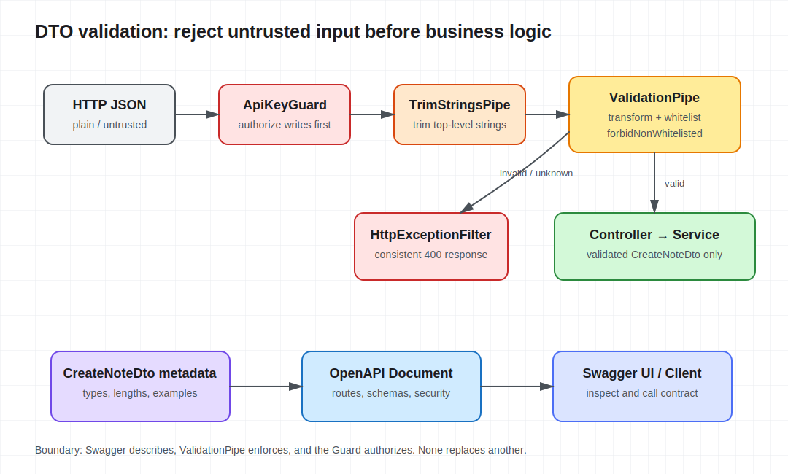

# Lesson 04: REST, DTOs, Validation, and Swagger

Lesson 3 established the request lifecycle, but data received by `@Body()` still comes from an untrusted HTTP boundary. TypeScript types exist only at compile time, so a client can still send numbers, empty strings, or unknown fields. This lesson establishes an explicit boundary for the knowledge API: the Controller receives transformed and validated DTOs, the Service handles trusted input, and OpenAPI describes the same contract.



## Model resources before choosing routes

`Note` is a resource, so its collection uses a plural noun:

| Operation | Method and path | Success status |
| --- | --- | --- |
| List notes | `GET /api/notes` | `200 OK` |
| Create a note | `POST /api/notes` | `201 Created` |

The Controller adapts HTTP while the Service creates and stores notes. Avoid action-oriented paths such as `/api/createNote`; first decide whether an action should instead be represented as a resource or state transition.

## A DTO is a runtime boundary, not just a type alias

Interfaces and type aliases disappear after compilation, so decorators cannot inspect them. DTOs use classes, allowing NestJS `ValidationPipe` to instantiate them from runtime metadata and execute validation rules:

```ts
export class CreateNoteDto {
  @ApiProperty({ example: 'Request lifecycle' })
  @IsString()
  @Length(1, 100)
  title!: string;

  @ApiProperty({ example: 'Middleware runs before guards.' })
  @IsString()
  @Length(1, 5000)
  content!: string;
}
```

The `!` only tells strict property initialization that the framework supplies the field. It performs no validation; the `class-validator` decorators provide the runtime constraints.

## Global Pipes define one input policy

This lesson registers two global Pipes in `configureApp()`:

```ts
app.useGlobalPipes(
  new TrimStringsPipe(),
  new ValidationPipe({
    transform: true,
    whitelist: true,
    forbidNonWhitelisted: true,
  }),
);
```

They process parameters in registration order: trim top-level string fields on the current DTO, then transform and validate with `ValidationPipe`. This lesson uses a flat DTO. If a real API accepts nested objects, define transformation rules for nested DTOs explicitly instead of assuming this minimal Pipe traverses arbitrary objects deeply.

- `transform: true` converts plain request objects into DTO instances and can convert path or query values to declared types. Transformation is not validation; decorators are still required.
- `whitelist: true` keeps properties that have validation decorators.
- `forbidNonWhitelisted: true` returns `400` for unknown fields instead of silently dropping them. The course chooses explicit rejection so client contract drift is visible early.

For a public API where backward compatibility matters more, using `whitelist` alone can tolerate deprecated fields from older clients, but it can also hide misspellings.

## The Controller receives validated input only

```ts
@Post()
@UseGuards(ApiKeyGuard)
@ApiSecurity('api-key')
@ApiCreatedResponse({ type: Note })
create(@Body() dto: CreateNoteDto): Note {
  return this.notesService.create(dto);
}
```

The Guard verifies write access before the Pipe validates the body. On validation failure, neither the Controller nor the Service runs, and the global Filter from the previous lesson formats the exception.

The current `Map` storage is synchronous, so the method returns `Note` instead of wrapping it in an artificial Promise. The Service becomes asynchronous when lesson 5 introduces persistence.

## Swagger is the executable contract entry point

`@nestjs/swagger` derives an OpenAPI document from Controller routes, DTO metadata, and response decorators:

```ts
const config = new DocumentBuilder()
  .setTitle('Knowledge API')
  .setVersion('1.0')
  .addApiKey({ type: 'apiKey', name: 'x-api-key', in: 'header' }, 'api-key')
  .build();

const document = SwaggerModule.createDocument(app, config);
SwaggerModule.setup('docs', app, document);
```

After startup, open `http://localhost:3004/docs`. `@ApiSecurity('api-key')` describes the security scheme but does not replace `ApiKeyGuard`; likewise, a Swagger schema does not replace `ValidationPipe`. Documentation, validation, and runtime authorization are separate responsibilities that must stay aligned.

## Run and observe the boundary

```bash
cd lessons/04-rest-dto-validation-swagger/demo
npm run start:dev
```

A valid request is trimmed and returns `201`:

```bash
curl -i -X POST http://localhost:3004/api/notes \
  -H 'content-type: application/json' \
  -H 'x-api-key: learning-key' \
  -d '{"title":"  DTO boundary  ","content":"  validated at runtime  "}'
```

An unknown field is rejected explicitly:

```bash
curl -i -X POST http://localhost:3004/api/notes \
  -H 'content-type: application/json' \
  -H 'x-api-key: learning-key' \
  -d '{"title":"DTO","content":"validation","admin":true}'
```

The response is `400` and includes `property admin should not exist`. Changing `title` to a number or a string longer than 100 characters also fails before the Controller runs.

## Engineering tradeoffs and common mistakes

- DTOs model external input; domain objects model internal state. Do not expose an ORM Entity directly as a request DTO.
- `@ApiProperty()` produces documentation while `@IsString()` and related decorators enforce validation. Omitting either makes the contract drift.
- `transform` is not a sanitizer. SQL injection, HTML output encoding, and business authorization belong at their own boundaries.
- A global Pipe keeps every Controller on one policy. Register an explicit local Pipe for exceptions instead of quietly bypassing validation in business code.
- This lesson implements create and list only. Update, delete, pagination, and structured business errors stay in lesson 6 so this lesson remains focused.

See the [Demo README](demo/README.md) for complete startup commands and expected results.
