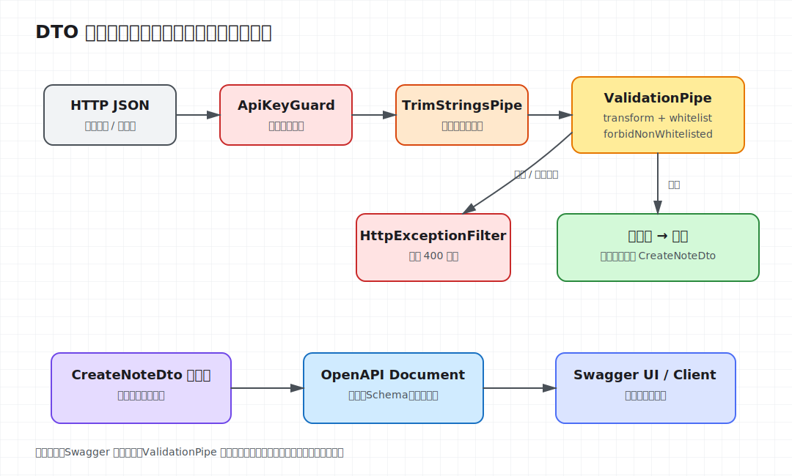

# 第 04 课：REST、DTO、校验与 Swagger

第 3 课已经打通请求链路，但 `@Body()` 收到的数据仍来自不可信的 HTTP 输入。TypeScript 类型只约束编译期，客户端发送数字、空字符串或额外字段时不会自动报错。本课在知识管理 API 中建立一条明确边界：Controller 接收经过转换和校验的 DTO，Service 只处理可信输入，OpenAPI 文档描述同一份契约。



## 先建模资源，再决定路由

`Note` 是资源，集合路径使用复数名词：

| 操作 | 方法与路径 | 成功状态 |
| --- | --- | --- |
| 查询列表 | `GET /api/notes` | `200 OK` |
| 创建资源 | `POST /api/notes` | `201 Created` |

Controller 负责 HTTP 适配，Service 负责创建和保存笔记。不要把动作写进路径，例如 `/api/createNote`；需要表达动作时，应先判断它是否其实是一个新资源或状态变化。

## DTO 是运行时边界，不只是类型别名

接口和 `type` 会在编译后消失，装饰器无法读取它们。DTO 使用 class，使 NestJS 的 `ValidationPipe` 可以根据运行时元数据实例化对象并执行规则：

```ts
export class CreateNoteDto {
  @ApiProperty({ example: 'Request lifecycle' })
  @IsString()
  @Length(1, 100)
  title!: string;

  @ApiProperty({ example: 'Middleware runs before guards.' })
  @IsString()
  @Length(1, 5000)
  content!: string;
}
```

`!` 只是在严格属性初始化下声明字段由框架填充，不会执行校验。真正的运行时约束来自 `class-validator` 装饰器。

## 全局 Pipe 统一输入策略

本课在 `configureApp()` 中注册两个全局 Pipe：

```ts
app.useGlobalPipes(
  new TrimStringsPipe(),
  new ValidationPipe({
    transform: true,
    whitelist: true,
    forbidNonWhitelisted: true,
  }),
);
```

它们按注册顺序处理参数：先修剪当前 DTO 顶层的字符串字段，再由 `ValidationPipe` 转换和校验。本课 DTO 是扁平结构；若真实项目允许嵌套对象，应为嵌套 DTO 显式定义转换规则，而不是假设这个最小 Pipe 会深度遍历任意对象。

- `transform: true`：把普通请求对象转换为 DTO 实例，也允许路径和查询参数按声明类型转换；转换不代表校验，仍需装饰器。
- `whitelist: true`：只保留带校验装饰器的属性。
- `forbidNonWhitelisted: true`：遇到额外字段直接返回 `400`，而不是静默删除。课程选择显式拒绝，便于尽早发现客户端契约漂移。

在面向兼容性更重要的公开 API 中，可以只启用 `whitelist`；那会容忍旧客户端携带已废弃字段，但也可能掩盖拼写错误。

## Controller 只接收已校验输入

```ts
@Post()
@UseGuards(ApiKeyGuard)
@ApiSecurity('api-key')
@ApiCreatedResponse({ type: Note })
create(@Body() dto: CreateNoteDto): Note {
  return this.notesService.create(dto);
}
```

Guard 先确认写权限，随后 Pipe 校验 Body。校验失败时 Controller 和 Service 都不会执行，异常由上一课的全局 Filter 统一输出。

这里仍使用同步内存 `Map`，因此返回 `Note` 而不是人为包装 Promise。第 5 课接入数据库后，Service 才转为异步持久化。

## Swagger 是可执行契约的入口

`@nestjs/swagger` 根据 Controller 路由、DTO 元数据和响应装饰器生成 OpenAPI 文档：

```ts
const config = new DocumentBuilder()
  .setTitle('Knowledge API')
  .setVersion('1.0')
  .addApiKey({ type: 'apiKey', name: 'x-api-key', in: 'header' }, 'api-key')
  .build();

const document = SwaggerModule.createDocument(app, config);
SwaggerModule.setup('docs', app, document);
```

启动后访问 `http://localhost:3004/docs`。`@ApiSecurity('api-key')` 只描述安全方案，不会替代 `ApiKeyGuard`；同样，Swagger schema 也不会替代 `ValidationPipe`。文档、校验和运行时授权是三层不同职责，必须保持一致。

## 运行并观察边界

```bash
cd lessons/04-rest-dto-validation-swagger/demo
npm run start:dev
```

合法请求会去掉首尾空格并返回 `201`：

```bash
curl -i -X POST http://localhost:3004/api/notes \
  -H 'content-type: application/json' \
  -H 'x-api-key: learning-key' \
  -d '{"title":"  DTO boundary  ","content":"  validated at runtime  "}'
```

额外字段会被明确拒绝：

```bash
curl -i -X POST http://localhost:3004/api/notes \
  -H 'content-type: application/json' \
  -H 'x-api-key: learning-key' \
  -d '{"title":"DTO","content":"validation","admin":true}'
```

响应为 `400`，错误消息包含 `property admin should not exist`。把 `title` 改成数字或超过 100 个字符，也会在进入 Controller 前失败。

## 工程取舍与易错点

- DTO 表达外部输入，领域对象表达内部状态；不要直接把 ORM Entity 暴露为请求 DTO。
- `@ApiProperty()` 负责文档，`@IsString()` 等负责校验，两者缺一时契约会出现偏差。
- `transform` 不是消毒器。SQL 注入、HTML 输出编码和业务权限需要在各自边界处理。
- 全局 Pipe 能保证所有 Controller 使用同一策略；局部例外应显式注册局部 Pipe，而不是在业务代码里偷偷绕开。
- 当前只实现创建和列表，更新、删除、分页与结构化业务异常留到第 6 课，避免在本课混入完整 CRUD。

完整启动命令与预期结果见 [Demo README](demo/README.md)。
