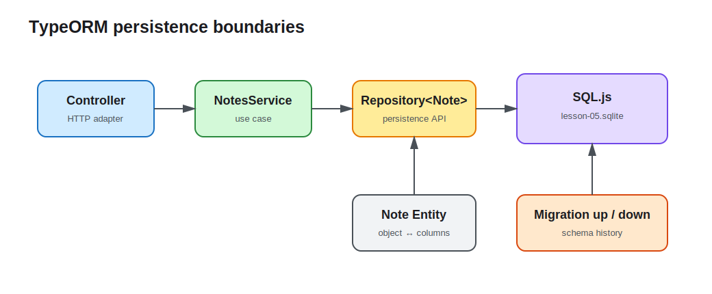

# Lesson 05: Database, ORM, and Migrations

The lesson 4 `Map` loses data when the process exits and cannot support multiple application instances. This lesson connects Notes to a TypeORM Repository and a file-backed SQL.js database. The goal is to establish persistence boundaries, not to pretend SQL no longer exists.



## Keep four roles separate

- An Entity maps objects to table columns.
- A Repository is the read/write entry point for one Entity.
- A Migration records how the schema moves from one version to the next.
- A Service coordinates use cases without owning a connection or assembling SQL.

SQL.js keeps the Demo runnable without Docker and persists a file through `location`. Production projects commonly replace it with PostgreSQL or another server database, while retaining the same boundaries.

## An Entity is a persistence model

```ts
@Entity({ name: 'notes' })
export class Note {
  @PrimaryGeneratedColumn('uuid')
  id!: string;

  @Column({ length: 100 })
  title!: string;

  @Column({ type: 'text' })
  content!: string;

  @Column({ type: 'varchar', default: NoteStatus.Draft })
  status!: NoteStatus;
}
```

The Entity currently also serves as the response model, but it must not be the external write DTO. Otherwise clients could write `id`, timestamps, or future internal fields. Create requests still accept only `CreateNoteDto`.

## A Repository isolates persistence details

`TypeOrmModule.forFeature([Note])` registers the Repository in `NotesModule`, and the Service receives it through constructor injection:

```ts
constructor(
  @InjectRepository(Note)
  private readonly notes: Repository<Note>,
  private readonly clock: ClockService,
) {}

findAll(): Promise<Note[]> {
  return this.notes.find({ order: { createdAt: 'DESC' } });
}
```

`create()` constructs an Entity without writing; `save()` performs the insert or update. Database I/O is asynchronous, so Controllers and Services now return Promises rather than leaving operations unawaited.

## A Migration is a reviewable schema change

The Demo disables `synchronize` and registers an initial Migration:

```ts
TypeOrmModule.forRoot({
  type: 'sqljs',
  location: process.env.DATABASE_PATH ?? 'lesson-05.sqlite',
  autoSave: true,
  entities: [Note],
  migrations: [InitialKnowledgeSchema1700000000000],
  migrationsRun: true,
  synchronize: false,
});
```

`synchronize: true` mutates tables from the current Entity definition. It is useful for disposable prototypes, but not as a production evolution mechanism because changes are difficult to review and lack dependable rollback history. This lesson uses `up()` to create the table and `down()` to remove it. TypeORM's migration table prevents the same migration from running twice.

Production systems commonly run migrations as a separate release step instead of letting every application replica race during startup. `migrationsRun` is enabled here so this single-process learning Demo works immediately.

## Run and verify persistence

```bash
cd lessons/05-database-orm-migrations/demo
cp .env.example .env
npm run start:dev
```

Create a record:

```bash
curl -i -X POST http://localhost:3005/api/notes \
  -H 'content-type: application/json' \
  -H 'x-api-key: learning-key' \
  -d '{"title":"Persistent note","content":"Stored by TypeORM"}'
```

Stop and restart the application, then run `curl http://localhost:3005/api/notes`; the record remains. `DATABASE_PATH` controls the file location. Local `.sqlite` files are runtime artifacts and must not be committed.

## Engineering tradeoffs and common mistakes

- Change the Migration together with the Entity; changing only the Entity does not update an existing table when `synchronize` is false.
- Keep Repository access out of Controllers so the protocol layer does not absorb business and transaction responsibilities.
- `save()` chooses insert or update from the primary key. Prefer controlled DTOs and dedicated methods when update semantics must be explicit.
- The single-file database demonstrates persistence; it is not a production database recommendation. Pools, indexes, and transactions appear when their course topics require them.
- Deleting the database file resets this Demo, but it is not a production rollback strategy.

See the [Demo README](demo/README.md) for complete commands.
