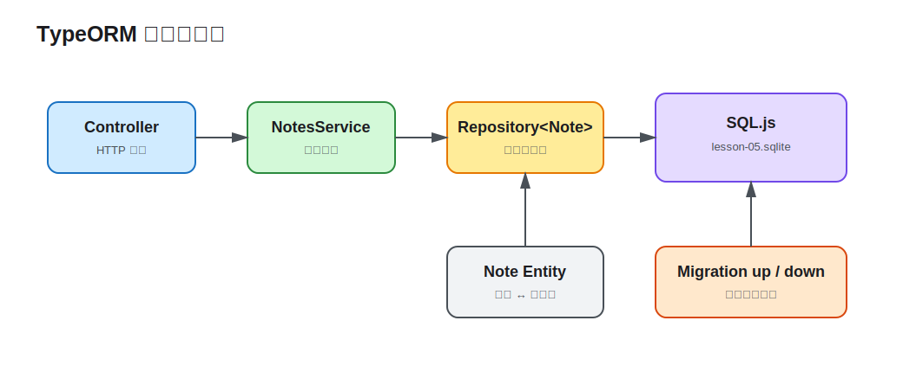

# 第 05 课：数据库、ORM 与迁移

第 4 课的 `Map` 在进程退出后会丢失数据，也无法支持多实例部署。本课把 Notes 接入 TypeORM Repository 和 SQL.js 文件数据库，重点是建立持久化边界，而不是把 SQL 隐藏起来。



## 四个角色不要混在一起

- Entity 描述对象与表字段的映射。
- Repository 提供当前 Entity 的读写入口。
- Migration 记录数据库结构如何从一个版本演进到下一个版本。
- Service 组织业务用例，不直接持有数据库连接或拼接 SQL。

SQL.js 让 Demo 无需 Docker 即可运行，并通过 `location` 将数据库保存为文件；生产项目通常换成 PostgreSQL 等服务型数据库，但上述边界不变。

## Entity 是持久化模型

```ts
@Entity({ name: 'notes' })
export class Note {
  @PrimaryGeneratedColumn('uuid')
  id!: string;

  @Column({ length: 100 })
  title!: string;

  @Column({ type: 'text' })
  content!: string;

  @Column({ type: 'varchar', default: NoteStatus.Draft })
  status!: NoteStatus;
}
```

Entity 同时服务于 TypeORM 和当前响应模型，但不应直接作为外部写入 DTO。否则客户端可能写入 `id`、时间戳或未来新增的内部字段。创建请求仍只接受 `CreateNoteDto`。

## Repository 隔离持久化细节

`TypeOrmModule.forFeature([Note])` 在 `NotesModule` 注册对应 Repository，Service 通过构造函数注入：

```ts
constructor(
  @InjectRepository(Note)
  private readonly notes: Repository<Note>,
  private readonly clock: ClockService,
) {}

findAll(): Promise<Note[]> {
  return this.notes.find({ order: { createdAt: 'DESC' } });
}
```

`create()` 只构造 Entity，不写库；`save()` 才执行插入或更新。接入数据库后 I/O 是异步的，因此 Controller 与 Service 返回 `Promise`，不要用未等待的数据库调用制造竞态。

## Migration 是可审查的结构变更

Demo 关闭 `synchronize`，并注册初始 Migration：

```ts
TypeOrmModule.forRoot({
  type: 'sqljs',
  location: process.env.DATABASE_PATH ?? 'lesson-05.sqlite',
  autoSave: true,
  entities: [Note],
  migrations: [InitialKnowledgeSchema1700000000000],
  migrationsRun: true,
  synchronize: false,
});
```

`synchronize: true` 会根据当前 Entity 直接修改表，适合一次性原型，不适合作为生产演进机制：变更难审查，也没有可靠回滚历史。本课用 `up()` 建表、`down()` 删除表；启动自动执行尚未运行的迁移，TypeORM 的迁移表保证同一迁移不会重复执行。

生产服务通常在发布流水线中单独运行迁移，而不是让每个应用副本启动时竞争执行。这里启用 `migrationsRun` 是为了让单进程学习 Demo 开箱即用。

## 运行并验证持久化

```bash
cd lessons/05-database-orm-migrations/demo
cp .env.example .env
npm run start:dev
```

创建一条记录：

```bash
curl -i -X POST http://localhost:3005/api/notes \
  -H 'content-type: application/json' \
  -H 'x-api-key: learning-key' \
  -d '{"title":"Persistent note","content":"Stored by TypeORM"}'
```

停止并重新启动应用，再执行 `curl http://localhost:3005/api/notes`，记录仍然存在。数据库路径由 `DATABASE_PATH` 控制；本地 `.sqlite` 文件是运行产物，不应提交。

## 工程取舍与易错点

- Migration 与 Entity 必须同步修改；只改 Entity 在 `synchronize: false` 下不会改变现有表。
- Repository 是基础设施入口，不要从 Controller 直接注入，否则协议层会承担业务和事务职责。
- `save()` 会根据主键决定插入或更新；需要明确更新语义时优先使用受控 DTO 和专门方法。
- 当前单文件数据库用于观察持久化，不代表生产数据库选型；连接池、索引和事务在后续课程按主题展开。
- 删除数据库文件可以重置本课 Demo，但这不是生产环境的回滚方式。

完整命令见 [Demo README](demo/README.md)。
