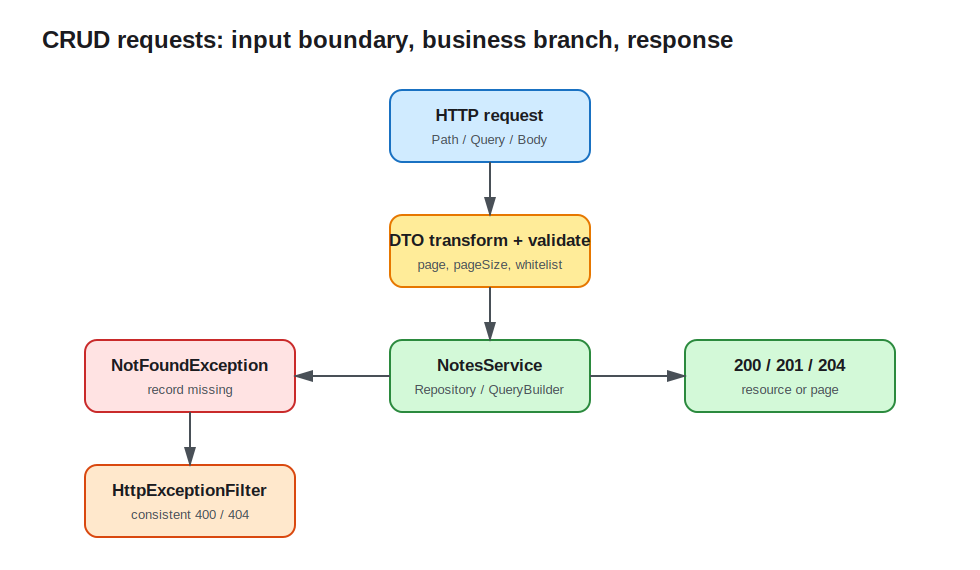

# Lesson 06: CRUD, Pagination, Errors, and Configuration

The first five lessons can validate and persist notes, but the API still lacks lookup by ID, update, deletion, and controlled list queries. This lesson completes CRUD and gives pagination, business errors, and startup configuration explicit boundaries.



## Routes express resource semantics

| Operation | Route | Success response |
| --- | --- | --- |
| List, filter, paginate | `GET /api/notes` | `200` + page object |
| Get one | `GET /api/notes/:id` | `200` or `404` |
| Create | `POST /api/notes` | `201` |
| Partial update | `PATCH /api/notes/:id` | `200` or `404` |
| Delete | `DELETE /api/notes/:id` | `204` or `404` |

`ApiKeyGuard` still protects writes. `PATCH` has partial-update semantics, so `UpdateNoteDto` uses Swagger `PartialType(CreateNoteDto)` to inherit validation while making fields optional. `PUT` is better suited to full replacement.

## Query parameters belong in a DTO too

HTTP query values begin as strings. `ListNotesQueryDto` converts page fields with `@Type(() => Number)` and then validates their range:

```ts
export class ListNotesQueryDto {
  @Type(() => Number)
  @IsInt()
  @Min(1)
  page = 1;

  @Type(() => Number)
  @IsInt()
  @Min(1)
  @Max(100)
  pageSize = 10;

  @IsOptional()
  @IsEnum(NoteStatus)
  status?: NoteStatus;
}
```

Defaults are part of the API contract, not merely Swagger descriptions. The page-size cap prevents one request from fetching every record.

## A page returns data and metadata

The Service composes optional conditions with QueryBuilder and binds search input as a parameter:

```ts
const [items, total] = await builder
  .orderBy('note.createdAt', 'DESC')
  .skip((query.page - 1) * query.pageSize)
  .take(query.pageSize)
  .getManyAndCount();

return { items, total, page: query.page, pageSize: query.pageSize };
```

Parameter binding avoids concatenating input into SQL. Offset pagination fits admin tools and moderate data sets; cursor pagination is more stable for large or frequently changing collections.

## Missing business data becomes an HTTP exception

The Repository returns `null` for an unknown row. The Service promotes that to a meaningful failure:

```ts
async findOne(id: string): Promise<Note> {
  const note = await this.notes.findOneBy({ id });
  if (!note) {
    throw new NotFoundException(`Note ${id} was not found`);
  }
  return note;
}
```

The global Filter preserves a string or validation-message array from `exception.getResponse()` and adds `statusCode`, `path`, and `timestamp`. The Service chooses error semantics; the Filter shapes the response. Controllers do not need repeated `try/catch` blocks.

## Configuration is external input

`ConfigModule.forRoot()` loads environment variables and calls `validateConfig` during bootstrap. The port must be an integer from 1 to 65535 and other values must be strings. Invalid configuration terminates startup before the application accepts traffic.

```ts
ConfigModule.forRoot({
  isGlobal: true,
  cache: true,
  validate: validateConfig,
});
```

Database configuration injects `ConfigService` through `forRootAsync`; the port and global prefix use the same source. `.env.example` contains safe examples while a real `.env` stays uncommitted.

## Observe the behavior locally

```bash
cd lessons/06-crud-pagination-errors-config/demo
cp .env.example .env
npm run start:dev
```

Create a note and keep its response `id`, then run:

```bash
curl 'http://localhost:3006/api/notes?page=1&pageSize=10&search=Persistent'
curl -i http://localhost:3006/api/notes/not-found
curl -i -X PATCH http://localhost:3006/api/notes/<id> \
  -H 'content-type: application/json' -H 'x-api-key: learning-key' \
  -d '{"status":"published"}'
curl -i -X DELETE http://localhost:3006/api/notes/<id> \
  -H 'x-api-key: learning-key'
```

The list returns `items/total/page/pageSize`; an unknown ID returns a structured `404`; successful deletion has no body. Run `PORT=abc npm run start` to see configuration fail before listening.

## Engineering tradeoffs and common mistakes

- Do not leave page values as implicit strings. Arithmetic may appear to work while invalid input bypasses the boundary.
- `Object.assign` is safe here only because the DTO passed through whitelist validation. Never merge a raw body into an Entity.
- Offset pagination is not universally optimal; choose based on scale and consistency needs.
- `404`, `400`, and `401` express distinct failures. Do not return `200` with a business error code for all of them.
- Centralize defaults in validation or configuration factories so consumers do not invent conflicting defaults.

See the [Demo README](demo/README.md) for the complete flow.
