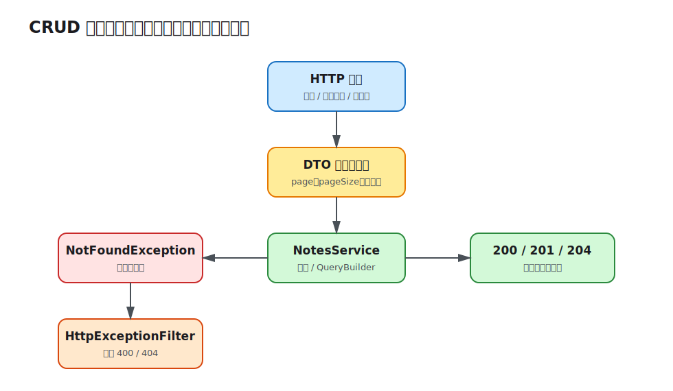

# 第 06 课：CRUD、分页、异常与配置

前五课已经能校验并持久化笔记，但 API 还缺少按 ID 查询、修改、删除和受控列表查询。本课补齐 CRUD，并把分页、业务异常和启动配置放到明确边界中。



## 路由表达资源语义

| 操作 | 路由 | 成功响应 |
| --- | --- | --- |
| 列表、筛选、分页 | `GET /api/notes` | `200` + 分页对象 |
| 查询单条 | `GET /api/notes/:id` | `200` 或 `404` |
| 创建 | `POST /api/notes` | `201` |
| 局部更新 | `PATCH /api/notes/:id` | `200` 或 `404` |
| 删除 | `DELETE /api/notes/:id` | `204` 或 `404` |

写操作继续由 `ApiKeyGuard` 保护。`PATCH` 使用局部更新语义，因此 `UpdateNoteDto` 通过 Swagger 的 `PartialType(CreateNoteDto)` 继承校验规则并把字段变为可选；`PUT` 更适合完整替换。

## 查询参数也必须进入 DTO

HTTP 查询参数本质上都是字符串。`ListNotesQueryDto` 用 `@Type(() => Number)` 转换分页字段，再用校验器限制范围：

```ts
export class ListNotesQueryDto {
  @Type(() => Number)
  @IsInt()
  @Min(1)
  page = 1;

  @Type(() => Number)
  @IsInt()
  @Min(1)
  @Max(100)
  pageSize = 10;

  @IsOptional()
  @IsEnum(NoteStatus)
  status?: NoteStatus;
}
```

默认值属于 API 契约，不能只写在 Swagger 说明里。`pageSize` 上限避免单个请求拖走全部记录。

## 分页查询返回数据和元信息

Service 用 QueryBuilder 组合可选条件，并参数化搜索值：

```ts
const [items, total] = await builder
  .orderBy('note.createdAt', 'DESC')
  .skip((query.page - 1) * query.pageSize)
  .take(query.pageSize)
  .getManyAndCount();

return { items, total, page: query.page, pageSize: query.pageSize };
```

参数绑定避免把输入直接拼进 SQL。当前使用 offset 分页，适合管理后台和中小数据集；数据量大或记录频繁插入时，游标分页能提供更稳定的性能与翻页结果。

## 业务缺失应转换为 HTTP 异常

Repository 找不到记录只会返回 `null`。Service 把它提升为领域可理解的失败：

```ts
async findOne(id: string): Promise<Note> {
  const note = await this.notes.findOneBy({ id });
  if (!note) {
    throw new NotFoundException(`Note ${id} was not found`);
  }
  return note;
}
```

全局 `HttpExceptionFilter` 从 `exception.getResponse()` 保留字符串或校验消息数组，并统一加入 `statusCode`、`path` 和 `timestamp`。Filter 负责响应形状，Service 负责选择异常语义；不要在每个 Controller 重复 `try/catch`。

## 配置也属于外部输入

`ConfigModule.forRoot()` 加载环境变量并在应用启动时调用 `validateConfig`。端口必须是 `1–65535` 的整数，其余值必须是字符串；无效配置会让进程立即失败，而不是在接收请求后才暴露问题。

```ts
ConfigModule.forRoot({
  isGlobal: true,
  cache: true,
  validate: validateConfig,
});
```

数据库配置通过 `forRootAsync` 注入 `ConfigService`，启动端口和全局前缀也从同一来源读取。`.env.example` 只提供安全示例，真实 `.env` 不提交。

## 本地运行观察

```bash
cd lessons/06-crud-pagination-errors-config/demo
cp .env.example .env
npm run start:dev
```

先创建一条笔记并保存响应中的 `id`，再执行：

```bash
curl 'http://localhost:3006/api/notes?page=1&pageSize=10&search=Persistent'
curl -i http://localhost:3006/api/notes/not-found
curl -i -X PATCH http://localhost:3006/api/notes/<id> \
  -H 'content-type: application/json' -H 'x-api-key: learning-key' \
  -d '{"status":"published"}'
curl -i -X DELETE http://localhost:3006/api/notes/<id> \
  -H 'x-api-key: learning-key'
```

列表返回 `items/total/page/pageSize`；不存在 ID 返回结构化 `404`；删除成功没有响应体。用 `PORT=abc npm run start` 可观察配置在监听端口前失败。

## 工程取舍与易错点

- 不要把分页参数留成隐式字符串，否则减法可能“碰巧可用”，无效输入却绕过边界。
- `Object.assign` 只接受经过白名单校验的 DTO；不要把原始 Body 合并进 Entity。
- offset 分页不是通用最优解，应按数据规模和一致性需求选择。
- `404`、`400`、`401` 表达不同失败，不能统一返回 `200` 再塞业务错误码。
- 配置默认值应集中在验证函数或配置工厂中，避免各消费方出现不同默认值。

完整演示见 [Demo README](demo/README.md)。
