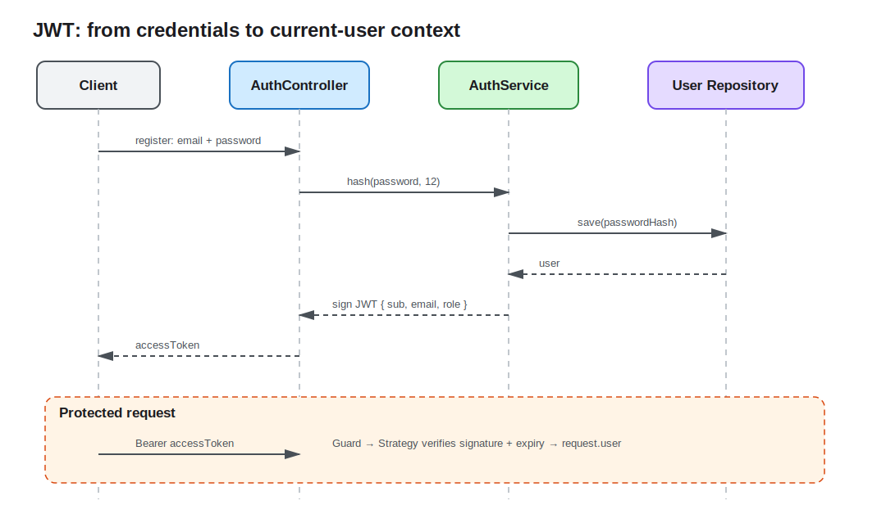

# Lesson 07: Users and JWT Authentication

The previous API used one fixed API key for writes. It could not identify the caller or isolate each user's data. This lesson adds registration, password hashing, JWT login, a Passport Strategy, and current-user context, then assigns every Note to its authenticated owner.



## Authentication answers “who are you?”

Authentication and authorization are different. Authentication verifies identity and establishes user context; authorization decides what that user may do. Lesson 7 establishes identity, while lesson 8 applies roles to permissions.

The authentication API exposes:

- `POST /api/auth/register`: create a user and return an access token;
- `POST /api/auth/login`: verify credentials and return an access token;
- `GET /api/auth/me`: verify a Bearer Token and return the current user.

The Notes Controller applies `JwtAuthGuard` at class level, so reads and writes both require authentication.

## Store a one-way password hash only

```ts
const user = await this.users.save(
  this.users.create({
    email: dto.email.toLowerCase(),
    passwordHash: await hash(dto.password, 12),
    role: UserRole.User,
  }),
);
```

A bcrypt hash includes a random salt. The database stores no plaintext password or separate salt. Login calls `compare()` instead of hashing again and comparing strings. Cost factor 12 works for this local Demo; production values should be benchmarked against acceptable login latency and brute-force cost.

Emails are normalized to lowercase and backed by a database unique constraint. The Service pre-check gives a friendly `409`, but concurrent requests must still handle unique-constraint failure; “check then insert” is not a concurrency guarantee.

## A JWT is a signed claim, not an encrypted session

The payload contains a stable user ID, email, and role:

```ts
const accessToken = await this.jwtService.signAsync({
  id: user.id,
  email: user.email,
  role: user.role,
  sub: user.id,
});
```

`sub` is the standard JWT subject claim. Clients can decode the payload, so it must never contain passwords, secrets, or private data. A signature prevents tampering; it does not provide confidentiality. Demo access tokens expire after two hours.

`JWT_SECRET` comes from configuration. The value in `.env.example` is local-only; production requires a separate high-entropy secret injected through secret management. Rotation, refresh tokens, and revocation are necessary session-design decisions in real systems but remain outside this minimal lesson.

## The Strategy verifies; the Guard admits

`JwtStrategy` extracts `Authorization: Bearer <token>`, verifies signature and expiration, then places the value returned by `validate()` on `request.user`:

```ts
validate(payload: JwtPayload): AuthenticatedUser {
  return { id: payload.sub, email: payload.email, role: payload.role };
}
```

`JwtAuthGuard` extends `AuthGuard('jwt')` to select this Strategy. A custom parameter decorator keeps Controllers independent from the Express Request object:

```ts
me(@CurrentUser() user: AuthenticatedUser): AuthenticatedUser {
  return user;
}
```

This only resembles a frontend route guard superficially. A client guard improves navigation UX but cannot enforce security; the server Guard rejects requests inside the trusted boundary.

## User context must constrain every query

JWT verification alone is insufficient. If the Service still queries only by note ID, any authenticated user could fetch someone else's record. Every Notes query includes `ownerId`:

```ts
const note = await this.notes.findOneBy({ id, ownerId });
```

List, read, update, and delete all use the current user ID. Both a missing record and another user's record return `404`, reducing resource-enumeration information. A Migration adds `users` and `notes.ownerId`. The new column is temporarily nullable for compatibility with a lesson 6 database; legacy rows are invisible to every user.

## Run the full flow locally

```bash
cd lessons/07-jwt-authentication/demo
cp .env.example .env
npm run start:dev
```

Register and copy `accessToken` from the response:

```bash
curl -i -X POST http://localhost:3007/api/auth/register \
  -H 'content-type: application/json' \
  -d '{"email":"learner@example.com","password":"secure-password"}'

curl -i http://localhost:3007/api/auth/me \
  -H 'authorization: Bearer <access-token>'

curl -i -X POST http://localhost:3007/api/notes \
  -H 'content-type: application/json' \
  -H 'authorization: Bearer <access-token>' \
  -d '{"title":"Owned note","content":"JWT identifies the owner"}'
```

A missing token, any changed character, or an expired token returns `401`. Register a second email and list Notes to observe an independent empty collection.

## Engineering tradeoffs and common mistakes

- Never store access tokens in logs, URLs, error responses, or the database.
- Use the same “invalid email or password” response for login failures so account existence is not disclosed.
- A role embedded in JWT can become stale until expiration; high-risk authorization needs shorter lifetimes or server-side state checks.
- `@ApiBearerAuth()` generates documentation; Guard and Strategy perform verification.
- User isolation must be part of Repository conditions, not merely hidden by the Controller.

See the [Demo README](demo/README.md) for the complete flow.
