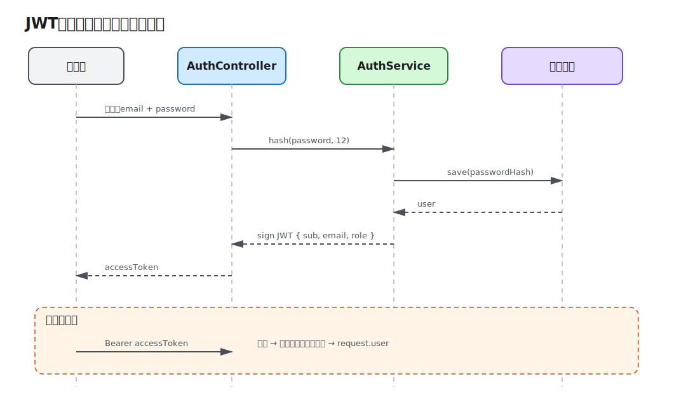

# 第 07 课：用户与 JWT 认证

前面的 API 用固定 API Key 保护写操作，无法识别“谁”正在请求，也无法隔离每个用户的数据。本课加入注册、密码哈希、登录签发 JWT、Passport Strategy 和当前用户上下文，并让 Notes 归属于登录用户。



## 认证回答“你是谁”

认证与授权不是同一件事：认证验证身份并建立用户上下文；授权决定这个用户能否执行某个动作。第 7 课只建立可靠身份，第 8 课再用角色表达权限。

本课提供三个认证端点：

- `POST /api/auth/register`：创建用户并返回访问令牌；
- `POST /api/auth/login`：验证凭据并返回访问令牌；
- `GET /api/auth/me`：验证 Bearer Token 并返回当前用户。

Notes Controller 整体使用 `JwtAuthGuard`，因此读取和写入都需要登录。

## 密码只保存不可逆哈希

```ts
const user = await this.users.save(
  this.users.create({
    email: dto.email.toLowerCase(),
    passwordHash: await hash(dto.password, 12),
    role: UserRole.User,
  }),
);
```

bcrypt 哈希包含随机盐，数据库中不保存明文密码，也不需要单独保存盐。登录使用 `compare()`，而不是重新哈希后比较字符串。成本因子 12 适合本地演示；生产值应根据硬件基准权衡登录延迟和暴力破解成本。

邮箱先统一为小写，并由数据库唯一约束兜底。Service 的存在性检查能给出友好 `409`，但高并发下仍必须处理唯一约束冲突；“先查再写”本身不是并发保证。

## JWT 是签名声明，不是加密会话

签发内容包含稳定用户 ID、邮箱和角色：

```ts
const accessToken = await this.jwtService.signAsync({
  id: user.id,
  email: user.email,
  role: user.role,
  sub: user.id,
});
```

`sub` 是 JWT 的标准主体声明。令牌内容可以被客户端解码，不能放密码、密钥或隐私数据；签名只能防篡改，不能保密。Demo 的访问令牌有效期为两小时。

`JWT_SECRET` 来自环境配置。`.env.example` 中的值只用于本地运行，生产环境必须使用独立的高熵秘密并通过密钥管理系统注入。轮换、Refresh Token 和撤销列表属于真实系统必须设计的会话策略，但不在本课最小实现中展开。

## Strategy 验证令牌，Guard 决定是否放行

`JwtStrategy` 从 `Authorization: Bearer <token>` 提取令牌，验证签名和过期时间，然后把 `validate()` 返回值写到 `request.user`：

```ts
validate(payload: JwtPayload): AuthenticatedUser {
  return { id: payload.sub, email: payload.email, role: payload.role };
}
```

`JwtAuthGuard` 继承 `AuthGuard('jwt')`，用于选择这套 Strategy。自定义参数装饰器让 Controller 不必直接依赖 Express Request：

```ts
me(@CurrentUser() user: AuthenticatedUser): AuthenticatedUser {
  return user;
}
```

这和前端路由守卫只有表面相似：前端守卫改善导航体验，不能构成安全边界；服务端 Guard 才在受信任环境中拒绝请求。

## 用户上下文必须进入数据查询

仅验证 JWT 还不够。如果 Service 仍按笔记 ID 查询，任何已登录用户都可能读取别人的记录。所有 Notes 查询都带上 `ownerId`：

```ts
const note = await this.notes.findOneBy({ id, ownerId });
```

列表、读取、更新和删除都使用当前用户 ID。对“不存在”和“不属于你”的记录统一返回 `404`，可以减少资源枚举信息。Migration 新增 `users` 表和 `notes.ownerId`；为兼容前一课已有数据库，ownerId 暂时允许空值，旧记录不会出现在任何用户列表中。

## 本地运行完整流程

```bash
cd lessons/07-jwt-authentication/demo
cp .env.example .env
npm run start:dev
```

注册并从响应复制 `accessToken`：

```bash
curl -i -X POST http://localhost:3007/api/auth/register \
  -H 'content-type: application/json' \
  -d '{"email":"learner@example.com","password":"secure-password"}'

curl -i http://localhost:3007/api/auth/me \
  -H 'authorization: Bearer <access-token>'

curl -i -X POST http://localhost:3007/api/notes \
  -H 'content-type: application/json' \
  -H 'authorization: Bearer <access-token>' \
  -d '{"title":"Owned note","content":"JWT identifies the owner"}'
```

省略令牌、修改任意字符或等待过期都会返回 `401`。使用第二个邮箱注册后查询 Notes，会得到独立的空列表。

## 工程取舍与易错点

- 不在日志、URL、错误响应或数据库中保存访问令牌。
- 登录失败统一返回“邮箱或密码错误”，避免泄露账号是否存在。
- JWT 中的角色在令牌过期前可能陈旧；高风险授权需要更短时效或服务端状态检查。
- `@ApiBearerAuth()` 只生成文档，真正验证来自 Guard 和 Strategy。
- 用户隔离必须落实到 Repository 条件，不能只靠 Controller 隐藏字段。

完整演示步骤见 [Demo README](demo/README.md)。
