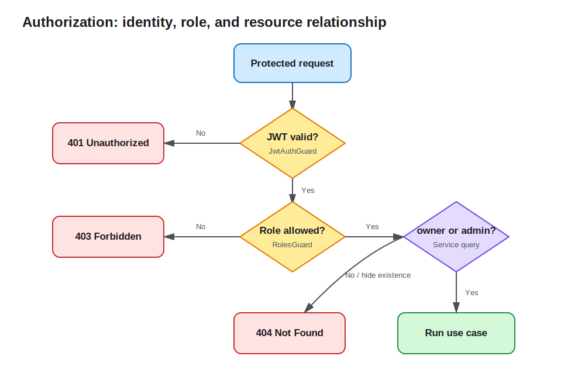

# Lesson 08: Authorization and RBAC

Lesson 7 verifies identity, but authentication does not grant every action. This lesson combines role metadata, `RolesGuard`, and resource ownership: regular users access their own notes, administrators can list all notes, and deletion requires the admin role.



## Authorization needs two kinds of information

RBAC decides action permission from a role, such as allowing only `admin` to delete. Resource authorization evaluates relationships, such as allowing a user to read only their Note. Real APIs often need both:

```text
request allowed = valid identity && role permits action && relationship permits resource
```

A role-only check can let any authenticated user access any resource. Ownership alone cannot express administrators, reviewers, or other cross-resource permissions.

## A decorator declares policy; a Guard enforces it

`@Roles()` only writes required roles into route metadata:

```ts
export const Roles = (...roles: UserRole[]) =>
  SetMetadata(ROLES_KEY, roles);

@Delete(':id')
@Roles(UserRole.Admin)
remove(...) { ... }
```

`RolesGuard` uses `Reflector.getAllAndOverride()` across handler and Controller metadata. No role metadata means no additional role restriction. When roles are present, it checks the `request.user` established by `JwtAuthGuard`:

```ts
const requiredRoles = this.reflector.getAllAndOverride<UserRole[]>(
  ROLES_KEY,
  [context.getHandler(), context.getClass()],
);

if (!request.user || !requiredRoles.includes(request.user.role)) {
  throw new ForbiddenException('Insufficient permissions');
}
```

Guard order matters: `@UseGuards(JwtAuthGuard, RolesGuard)` authenticates before checking roles. A missing or invalid token produces `401`; a valid identity with insufficient role produces `403`.

## Resource ownership belongs in Service queries

A role Guard sees route metadata but cannot infer who owns a Note. The Service must carry user context into its query:

```ts
const note = await this.notes.findOneBy({ id });
const canRead =
  note && (user.role === UserRole.Admin || note.ownerId === user.id);
if (!canRead) {
  throw new NotFoundException(`Note ${id} was not found`);
}
```

List queries constrain `ownerId` for regular users and omit that condition for administrators. An unauthorized resource lookup returns `404` to avoid confirming existence, while an explicit role failure on deletion returns `403`. The codes protect different information boundaries.

## Role source and admin seed

Public registration always creates `user`; the DTO never accepts a client-selected role. At startup, `AdminSeedService` creates one administrator from `ADMIN_EMAIL` and `ADMIN_PASSWORD`, and does nothing if that email exists.

This makes the local flow convenient, but the default password is learning-only. Production systems should assign privileged roles through one-time bootstrap, an audited administration flow, or an identity provider, and rotate initial credentials. A changed role remains stale inside an old JWT until expiration, which is a tradeoff of stateless tokens.

## Verify roles and ownership locally

```bash
cd lessons/08-authorization-rbac/demo
cp .env.example .env
npm run start:dev
```

Register a regular user and create a Note, then log in as the administrator:

```bash
curl -X POST http://localhost:3008/api/auth/login \
  -H 'content-type: application/json' \
  -d '{"email":"admin@example.com","password":"admin-password"}'
```

Keep the user token, admin token, and Note ID:

```bash
# regular user delete: 403
curl -i -X DELETE http://localhost:3008/api/notes/<id> \
  -H 'authorization: Bearer <user-token>'

# administrator sees all users' notes
curl -i http://localhost:3008/api/notes \
  -H 'authorization: Bearer <admin-token>'

# administrator delete: 204
curl -i -X DELETE http://localhost:3008/api/notes/<id> \
  -H 'authorization: Bearer <admin-token>'
```

Register a second regular user and use that token to fetch the first user's Note; the response is `404`.

## Engineering tradeoffs and common mistakes

- `@Roles()` is a declaration, not protection by itself; the matching Guard must actually be attached.
- Never accept `role` from public client input. Role changes require a protected and auditable operation.
- Hiding UI actions or response fields is not authorization. Service and Repository queries must constrain resources.
- Roles fit coarse permissions; organizations, project membership, and ABAC conditions need a separate policy layer.
- Do not copy a default privileged password or automatic seed directly into production.

See the [Demo README](demo/README.md) for complete requests.
