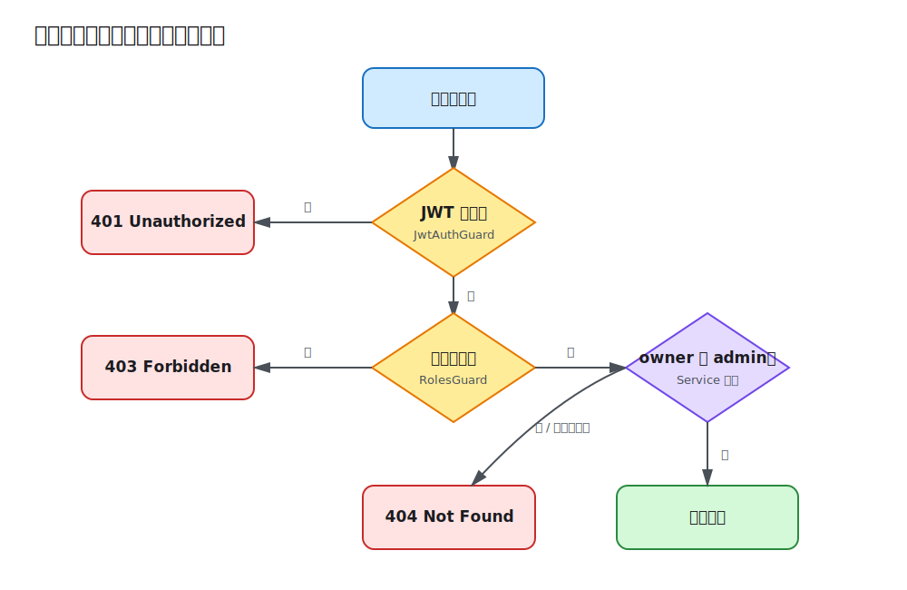

# 第 08 课：授权与 RBAC

第 7 课已经能确认请求者身份，但“已登录”不代表“可以做任何事”。本课把角色元数据、`RolesGuard` 和资源所有权组合起来：普通用户只能访问自己的笔记，管理员可以查看全部笔记，删除操作只允许管理员执行。



## 授权需要两类信息

RBAC 根据角色判断动作权限，例如只有 `admin` 可以删除；资源级授权根据对象关系判断，例如普通用户只能读取自己的 Note。真实 API 经常需要两者同时存在：

```text
能否执行请求 = 身份有效 && 角色允许动作 && 资源关系允许访问
```

只检查角色会造成“任意已登录用户可访问任意资源”；只检查 owner 又难以表达管理员、审核员等跨资源权限。

## 装饰器声明策略，Guard 执行策略

`@Roles()` 只把所需角色写入路由元数据：

```ts
export const Roles = (...roles: UserRole[]) =>
  SetMetadata(ROLES_KEY, roles);

@Delete(':id')
@Roles(UserRole.Admin)
remove(...) { ... }
```

`RolesGuard` 使用 `Reflector.getAllAndOverride()` 合并方法与 Controller 元数据。没有声明角色时它不额外限制；声明角色时，它检查上一层 `JwtAuthGuard` 写入的 `request.user`：

```ts
const requiredRoles = this.reflector.getAllAndOverride<UserRole[]>(
  ROLES_KEY,
  [context.getHandler(), context.getClass()],
);

if (!request.user || !requiredRoles.includes(request.user.role)) {
  throw new ForbiddenException('Insufficient permissions');
}
```

Guard 顺序很重要：`@UseGuards(JwtAuthGuard, RolesGuard)` 先完成认证，再执行角色判断。缺少或无效 Token 返回 `401`；身份有效但角色不足返回 `403`。

## 资源所有权在 Service 查询中落实

角色 Guard 只能看到路由元数据，无法自动理解某条 Note 属于谁。Service 必须把用户上下文带进查询：

```ts
const note = await this.notes.findOneBy({ id });
const canRead =
  note && (user.role === UserRole.Admin || note.ownerId === user.id);
if (!canRead) {
  throw new NotFoundException(`Note ${id} was not found`);
}
```

列表对普通用户追加 `ownerId` 条件，管理员则不追加。单条资源对越权访问返回 `404` 而非 `403`，避免确认资源是否存在；角色明确不足的删除请求返回 `403`。两种状态码服务于不同的信息暴露边界。

## 角色来源与管理员种子

公开注册始终创建 `user`，客户端不能在 DTO 中自行提交角色。Demo 启动时由 `AdminSeedService` 根据 `ADMIN_EMAIL` 和 `ADMIN_PASSWORD` 创建一个管理员；已存在时不重复创建。

这让本地流程无需手改数据库，但默认管理员密码只适合学习。生产系统应通过一次性引导、受审计的后台流程或身份提供商分配高权限角色，并在首次使用时强制轮换凭据。角色变化后，旧 JWT 中的角色会持续到令牌过期，这是无状态令牌的取舍。

## 本地验证角色和所有权

```bash
cd lessons/08-authorization-rbac/demo
cp .env.example .env
npm run start:dev
```

先注册普通用户并创建一条 Note，再登录管理员：

```bash
curl -X POST http://localhost:3008/api/auth/login \
  -H 'content-type: application/json' \
  -d '{"email":"admin@example.com","password":"admin-password"}'
```

分别保存普通用户 Token、管理员 Token 和 Note ID：

```bash
# 普通用户删除：403
curl -i -X DELETE http://localhost:3008/api/notes/<id> \
  -H 'authorization: Bearer <user-token>'

# 管理员列表可看到所有用户笔记
curl -i http://localhost:3008/api/notes \
  -H 'authorization: Bearer <admin-token>'

# 管理员删除：204
curl -i -X DELETE http://localhost:3008/api/notes/<id> \
  -H 'authorization: Bearer <admin-token>'
```

再注册第二个普通用户，用其 Token 读取第一个用户的 Note，会得到 `404`。

## 工程取舍与易错点

- `@Roles()` 是声明，不是保护；必须确保对应 Guard 实际挂载。
- 不接受客户端提交 `role`，角色变更必须是受保护且可审计的操作。
- 仅在 Controller 隐藏按钮或字段不是授权，Service/Repository 查询必须约束资源。
- 角色适合粗粒度权限；组织、项目成员关系或 ABAC 条件需要独立策略层。
- 高权限账号的默认密码和自动种子不能直接照搬到生产环境。

完整请求见 [Demo README](demo/README.md)。
