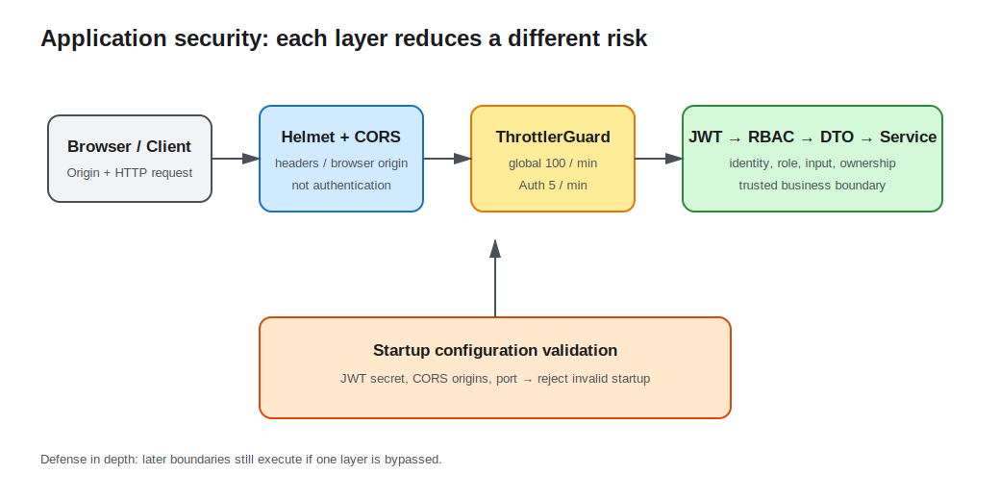

# Lesson 09: Application Security

Authentication and authorization answer only “who may do what.” A public API also faces cross-origin calls, brute-force login, weak secrets, and unsafe browser headers. This lesson adds Helmet, strict CORS, global throttling, tighter auth-endpoint limits, and startup secret validation as layered defenses.



## Each security control solves a different problem

- Helmet sets CSP, `X-Content-Type-Options`, and other response headers that reduce common browser attack surface.
- CORS tells browsers which origins may read responses. It is not authentication and does not stop curl or service clients.
- Throttling limits request volume over time and raises the cost of abuse and brute force.
- Configuration validation prevents startup with a weak secret.
- Existing DTO, JWT, RBAC, and ownership conditions continue to own input, identity, and permission boundaries.

No layer replaces another.

## Helmet belongs at the HTTP entry point

```ts
const app = await NestFactory.create(AppModule);
app.use(helmet());
```

Helmet provides a baseline; it does not automatically fix XSS. Content rendered as HTML still needs output encoding or trustworthy sanitization, and database queries still need parameter binding.

Run `curl -I http://localhost:3009/api/health` to observe `content-security-policy`, `x-content-type-options: nosniff`, and related headers. If CSP blocks Swagger, static assets, or embedded pages, adjust directives for actual resources rather than disabling the policy entirely.

## CORS is a browser read policy

```ts
app.enableCors({
  origin: config.get<string>('CORS_ORIGINS').split(','),
  credentials: true,
});
```

The course uses an explicit origin list and avoids a wildcard when credentials are enabled. Multiple origins are comma-separated. Browser preflight checks Origin, method, and headers. A script from an unlisted site cannot read the response, but the request may still reach the server, so writes still require JWT, Guards, and business authorization.

Production configuration should normalize origins, reject empty entries, and follow deployed domains. CORS is not a complete CSRF defense. This lesson sends Bearer Tokens explicitly in a header rather than relying on automatically attached cookies.

## Global and sensitive-endpoint throttling

```ts
ThrottlerModule.forRoot([{ ttl: 60_000, limit: 100 }]);

providers: [{ provide: APP_GUARD, useClass: ThrottlerGuard }]
```

The global default is 100 requests per minute, while registration and login are reduced to five:

```ts
@Throttle({ default: { limit: 5, ttl: 60_000 } })
@Post('login')
login(...) { ... }
```

Excess requests return `429 Too Many Requests`. The default store lives in one process, so replicas count independently. Multi-instance deployments need shared storage or gateway-level throttling. Behind a proxy, trusted-proxy configuration must be correct or all traffic can share a proxy IP, or clients may spoof addresses.

Throttling raises attack cost but does not replace account protection, anomaly detection, or credential-incident response.

## Validate secrets before startup

`validateConfig` requires at least 16 characters for `JWT_SECRET`. Length is only an observable minimum for this lesson, not proof of entropy. Production secrets should be random, external to source and images, and rotatable.

```bash
JWT_SECRET=short npm run start
```

The process exits before listening. The public development value in `.env.example` must never be deployed.

## Observe the layers locally

```bash
cd lessons/09-application-security/demo
cp .env.example .env
npm run start:dev
```

```bash
# Helmet headers
curl -I http://localhost:3009/api/health

# Allowed origin receives Access-Control-Allow-Origin
curl -i http://localhost:3009/api/health \
  -H 'Origin: http://localhost:3000'

# An unlisted origin does not receive that allow header
curl -i http://localhost:3009/api/health \
  -H 'Origin: https://untrusted.example'

# Six failed logins: the sixth returns 429
for i in 1 2 3 4 5 6; do
  curl -s -o /dev/null -w '%{http_code}\n' -X POST \
    http://localhost:3009/api/auth/login \
    -H 'content-type: application/json' \
    -d '{"email":"nobody@example.com","password":"wrong-password"}'
done
```

## Engineering tradeoffs and common mistakes

- Never treat CORS as API access control; non-browser clients do not obey it.
- Throttle keys, shared storage, and trusted proxies must match the deployment topology.
- Validate security headers with actual frontend resources instead of copying a configuration blindly.
- Never log passwords, Authorization headers, or full tokens.
- Dependency scanning, TLS, secret management, and edge protection belong to the delivery system; this lesson establishes the in-application baseline.

See the [Demo README](demo/README.md) for complete commands.
