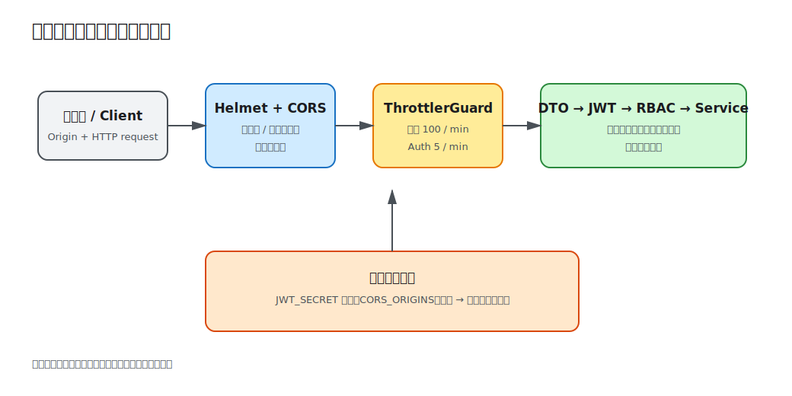

# 第 09 课：应用安全

认证和授权只覆盖“谁能做什么”。公开 API 还要面对跨站调用、暴力登录、弱密钥和不安全响应头。本课在现有请求链上增加 Helmet、严格 CORS、全局限流、认证端点专用限流和启动密钥检查，形成多层防护。



## 安全控制各自解决不同问题

- Helmet 设置 CSP、`X-Content-Type-Options` 等安全响应头，降低浏览器侧常见攻击面。
- CORS 告诉浏览器哪些来源可以读取响应；它不是服务端认证，也挡不住 curl 或服务间请求。
- 限流限制单位时间的请求数量，降低滥用和暴力尝试成本。
- 配置校验让弱密钥在启动时失败，避免带着危险默认值提供服务。
- 既有 DTO、JWT、RBAC 和所有权条件继续分别负责输入、身份和权限。

任何一层都不能代替其他层。

## Helmet 放在 HTTP 入口

```ts
const app = await NestFactory.create(AppModule);
app.use(helmet());
```

Helmet 提供安全基线，而不是自动修复 XSS。用户内容若被渲染为 HTML，仍需输出编码或可靠的 HTML 清洗；数据库查询仍需参数绑定。

可以用 `curl -I http://localhost:3009/api/health` 观察 `content-security-policy`、`x-content-type-options: nosniff` 等响应头。若 Swagger、静态资源或嵌入页面受到 CSP 限制，应针对实际资源收紧或调整指令，不要直接关闭全部策略。

## CORS 是浏览器读取策略

```ts
app.enableCors({
  origin: config.get<string>('CORS_ORIGINS').split(','),
  credentials: true,
});
```

课程采用明确来源列表，避免在携带凭据时使用通配符。多个来源用逗号分隔。浏览器预检请求会检查 Origin、方法和 Header；不在列表中的网页脚本不能读取响应，但请求仍可能到达服务端，因此写操作仍必须依赖 JWT、Guard 和业务授权。

生产环境还应规范化来源配置并拒绝空项，按部署域名维护允许列表。CORS 不是 CSRF 的完整解决方案；本课 Bearer Token 通过 Header 显式发送，不依赖自动附带的 Cookie。

## 全局限流与敏感端点限流

```ts
ThrottlerModule.forRoot([{ ttl: 60_000, limit: 100 }]);

providers: [{ provide: APP_GUARD, useClass: ThrottlerGuard }]
```

全局默认每分钟 100 次，注册和登录通过装饰器收紧为每分钟 5 次：

```ts
@Throttle({ default: { limit: 5, ttl: 60_000 } })
@Post('login')
login(...) { ... }
```

超过限制返回 `429 Too Many Requests`。默认存储位于当前进程内，多实例部署会各自计数，必须换成共享存储或由 API Gateway 执行统一限流。反向代理环境还要正确配置可信代理，否则所有请求可能共享一个代理 IP，或攻击者伪造来源地址。

限流只能增加攻击成本，不能替代账号锁定策略、异常检测和凭据泄露响应。

## 密钥在启动前验证

`validateConfig` 要求 `JWT_SECRET` 至少 16 个字符。长度只是本课可观察的最低门槛，不等于足够熵；生产秘密应随机生成、独立于代码和镜像，并支持轮换。

```bash
JWT_SECRET=short npm run start
```

应用会在监听端口前退出。`.env.example` 的开发值可公开但绝不能部署。

## 本地观察安全层

```bash
cd lessons/09-application-security/demo
cp .env.example .env
npm run start:dev
```

```bash
# Helmet 响应头
curl -I http://localhost:3009/api/health

# 允许来源会得到 Access-Control-Allow-Origin
curl -i http://localhost:3009/api/health \
  -H 'Origin: http://localhost:3000'

# 不允许来源不会得到该允许头
curl -i http://localhost:3009/api/health \
  -H 'Origin: https://untrusted.example'

# 连续 6 次错误登录，第 6 次返回 429
for i in 1 2 3 4 5 6; do
  curl -s -o /dev/null -w '%{http_code}\n' -X POST \
    http://localhost:3009/api/auth/login \
    -H 'content-type: application/json' \
    -d '{"email":"nobody@example.com","password":"wrong-password"}'
done
```

## 工程取舍与易错点

- 不把 CORS 当作 API 访问控制，非浏览器客户端不受它约束。
- 限流键、共享存储和代理信任配置必须符合真实部署拓扑。
- 安全 Header 需要结合前端资源验证，不能机械复制后不观察浏览器行为。
- 错误日志不要记录密码、Authorization Header 或完整 Token。
- 依赖漏洞扫描、TLS、密钥管理和边缘防护属于部署体系，本课只建立应用内基线。

完整命令见 [Demo README](demo/README.md)。
