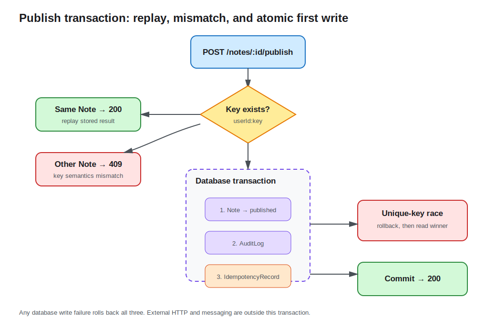

# Lesson 10: Transactions, Concurrency, and Idempotency

Publishing a note changes more than one status: it also writes an audit row and an idempotency record. A partial failure could leave a published note without an audit or let retries repeat side effects. This lesson places all three writes in one transaction and uses a unique idempotency key to handle retries and concurrent races.



## Transaction boundaries follow business invariants

A successful publish must atomically satisfy:

1. `notes.status` becomes `published`;
2. `audit_logs` receives `note.published`;
3. `idempotency_records` stores the request result.

```ts
return this.dataSource.transaction(async (manager) => {
  note.status = NoteStatus.Published;
  await manager.save(note);
  await manager.save(auditLog);
  await manager.save(idempotencyRecord);
  return note;
});
```

A normal return commits; an exception rolls back. Every operation inside must use the callback `EntityManager`, not an outside Repository, or writes can escape the transaction.

The safest transaction is not the largest HTTP request. Cover the smallest scope that maintains one database invariant, avoiding long-held connections and locks.

## An idempotency key maps retries to one result

The client identifies one publish intent through `idempotency-key`. The Service trims it and scopes it by user:

```ts
const scopedKey = `${user.id}:${idempotencyKey.trim()}`;
```

The first request executes the transaction. The same user, key, and Note later returns the stored Note without another audit write. A missing key returns `400`.

The key must bind request semantics. Reusing it for another Note returns `409 Conflict` rather than silently returning the first resource:

```ts
if (record.noteId !== requestedNoteId) {
  throw new ConflictException(
    'Idempotency key was already used for another note',
  );
}
```

Payment and create APIs commonly store a request-body hash, status code, and response snapshot, plus key expiration and cleanup policy.

## A unique constraint closes the race

“Check then insert” races when two requests see no row simultaneously. `idempotency_records.key` is the primary key, so the database is the final arbiter. If concurrent insert loses the unique race, the Service reads the winning committed record and replays it. A key bound to another Note still produces `409`.

Other concurrency patterns serve other problems:

- Optimistic locking carries a version and atomically updates with `WHERE id = ? AND version = ?`; callers retry conflicts.
- Pessimistic locking serializes a hot row inside a short transaction but reduces throughput and can deadlock.
- A unique constraint best expresses “only one may exist,” such as an idempotency key or email.

The course chooses uniqueness over row locking because SQL.js is used to observe idempotency. Isolation, lock waits, and deadlock retries must be verified against the production driver.

## External side effects do not belong inside the transaction

Email, third-party HTTP, and message publication do not roll back with a database. Network calls also extend lock time. A common solution is an Outbox: write business data and a pending event in one transaction, then deliver it reliably after commit. Lesson 12 continues this boundary with queues.

## Verify locally

```bash
cd lessons/10-transactions-concurrency-idempotency/demo
cp .env.example .env
npm run start:dev
```

Log in, create a Note, and keep the token and ID:

```bash
curl -i -X POST http://localhost:3010/api/notes/<id>/publish \
  -H 'authorization: Bearer <token>' \
  -H 'idempotency-key: publish-1'
```

The response is `200` with `published`. Repeating the same key returns the same Note. Reuse `publish-1` for a second Note to get `409`; omit it to get `400`.

Send the same request simultaneously from two terminals. Both responses should succeed and reference one resource, while uniqueness preserves one idempotency row.

## Engineering tradeoffs and common mistakes

- Idempotency does not mean every duplicate succeeds; mismatched request semantics must conflict.
- Do not protect idempotency with an in-process Map. Replicas need shared consistent storage.
- Rollback covers writes on the same database connection, not logs, HTTP calls, or messaging systems.
- Recognize only the expected unique error; rethrow other database failures instead of treating them as replay.
- `POST /publish` changes and returns an existing resource, so it explicitly responds `200`, not the default `201`.

See the [Demo README](demo/README.md) for the complete flow.
