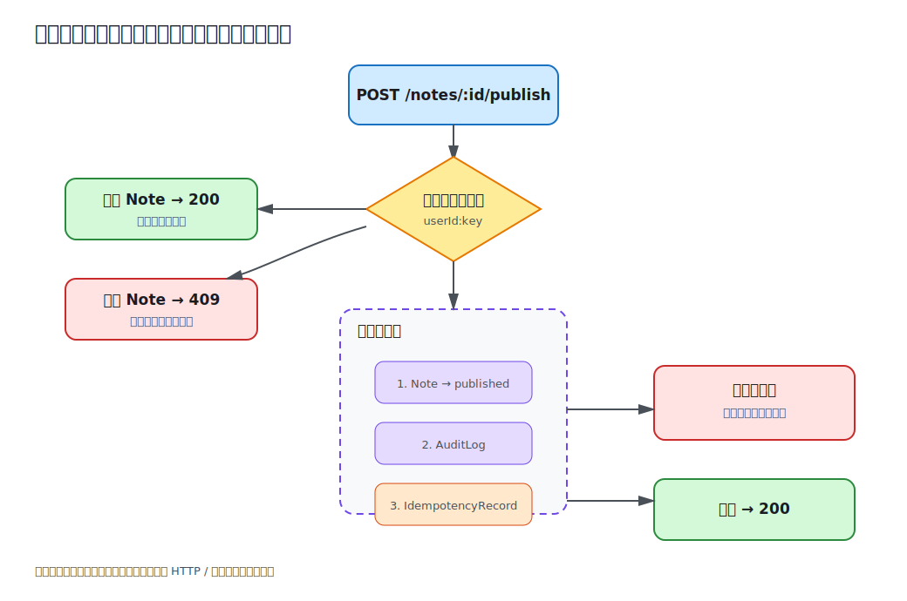

# 第 10 课：事务、并发与幂等

“发布笔记”不只是修改一个状态：还要写审计记录和幂等记录。如果中途失败却只完成一部分，系统会出现已发布但无审计、或重复请求重复产生副作用的问题。本课把三个数据库写入放进同一事务，并用唯一幂等键处理重试与并发竞争。



## 事务边界围绕业务不变量

本课要求一个不变量：一次成功发布必须同时满足：

1. `notes.status` 变为 `published`；
2. `audit_logs` 新增 `note.published`；
3. `idempotency_records` 保存本次请求结果。

```ts
return this.dataSource.transaction(async (manager) => {
  note.status = NoteStatus.Published;
  await manager.save(note);
  await manager.save(auditLog);
  await manager.save(idempotencyRecord);
  return note;
});
```

回调正常返回时提交，抛出异常时回滚。事务内必须始终使用回调提供的 `EntityManager`，不能混用外部仓储（Repository），否则部分写入可能落在事务之外。

事务边界不是“整个 HTTP 请求越大越安全”。它应覆盖维护同一数据库不变量所需的最小范围，避免长事务占用连接和锁。

## 幂等键把重试映射到同一结果

客户端通过 `idempotency-key` 标识一次发布意图。服务（Service）先去除首尾空格，再与用户 ID 组合，避免不同用户互相碰撞：

```ts
const scopedKey = `${user.id}:${idempotencyKey.trim()}`;
```

首次请求执行事务并保存结果；同一用户、同一幂等键、同一 Note 的后续请求读取记录并返回原 Note，不重复写审计。缺少幂等键返回 `400`。

幂等键必须绑定请求语义。若同一个幂等键被用于另一个 Note，返回 `409 Conflict`，不能悄悄返回第一次的资源：

```ts
if (record.noteId !== requestedNoteId) {
  throw new ConflictException(
    'Idempotency key was already used for another note',
  );
}
```

真实支付或创建接口通常保存请求体哈希、状态码和响应快照，而不只是资源 ID；还要定义幂等键的过期与清理策略。

## 唯一约束关闭并发竞态

“先查询幂等键，再插入”存在竞态：两个请求可能同时查不到。`idempotency_records.key` 是主键，因此数据库是最终裁判。若并发插入触发唯一约束，服务在事务失败后读取获胜请求写入的记录，再按同键重放；若幂等键指向不同 Note，仍返回 `409`。

这种方案适合“同一请求只应产生一次结果”。其他并发问题可采用：

- 乐观锁：更新时携带版本号，并在 `WHERE id = ? AND version = ?` 中原子比较；冲突后让调用方重试。
- 悲观锁：事务内锁定行，适合冲突频繁且必须串行的短操作，但会降低吞吐并可能死锁。
- 数据库唯一约束：最适合“只能存在一条”的不变量，例如幂等键、邮箱。

课程采用唯一约束而不是行锁，因为 Demo 的 SQL.js 重点是观察幂等竞争；生产数据库的隔离级别、锁等待和死锁重试应按具体驱动验证。

## 外部副作用不能直接塞进数据库事务

发送邮件、调用第三方 API 或发布消息不会随数据库回滚。把网络调用放在事务里既延长锁持有时间，也无法获得真正原子性。常见方案是事务发件箱（Transactional Outbox）：事务内写业务数据和待发送事件，事务提交后由后台任务可靠投递。第 12 课的队列会继续这一边界。

## 本地验证

```bash
cd lessons/10-transactions-concurrency-idempotency/demo
cp .env.example .env
npm run start:dev
```

登录、创建 Note 并记录令牌和 ID，然后执行：

```bash
curl -i -X POST http://localhost:3010/api/notes/<id>/publish \
  -H 'authorization: Bearer <token>' \
  -H 'idempotency-key: publish-1'
```

响应为 `200` 且状态为 `published`。用相同幂等键重复请求得到同一 Note。创建第二条 Note 后复用 `publish-1` 会得到 `409`；省略请求头得到 `400`。

可从两个终端同时发送相同请求，两个响应都应成功且指向同一资源。唯一约束确保只保留一个幂等记录。

## 工程取舍与易错点

- 幂等不是“所有重复请求都返回成功”，幂等键与请求语义不一致必须冲突。
- 不依赖进程内 Map 保护幂等，多实例必须共享数据库或一致性存储。
- 事务回滚只覆盖同一数据库连接中的写入，不覆盖日志、HTTP 和消息系统。
- 对数据库错误只识别预期唯一冲突；其他异常继续抛出，不能吞成重放结果。
- `POST /publish` 修改既有资源并返回它，因此显式响应 `200`，不使用默认 `201`。

完整步骤见 [Demo README](demo/README.md)。
