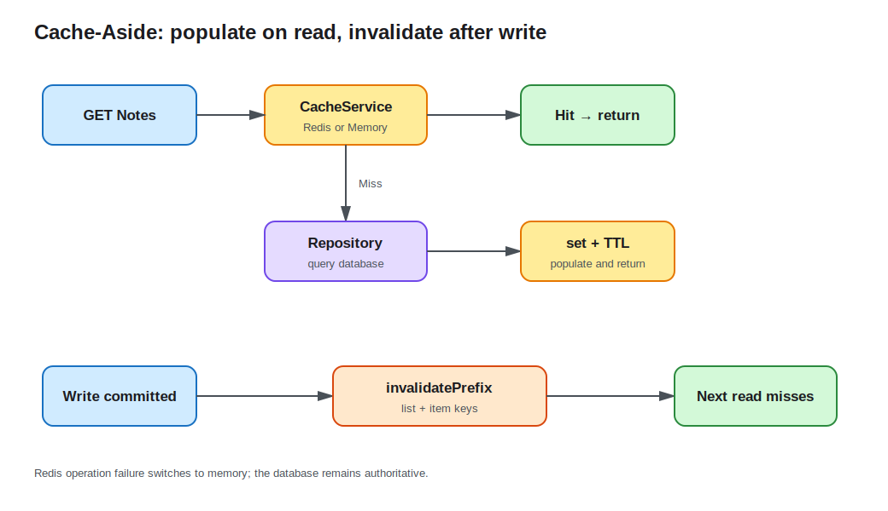

# Lesson 11: Redis and Caching

Database queries are correct, but every hot list and item read still reaches the database. This lesson adds Cache-Aside: read cache first, query and populate on a miss, and invalidate relevant keys after a successful write. A configured Redis provides shared cache; missing configuration, connection failure, or runtime operation failure falls back to an in-process TTL cache.



## Cache is a copy, not the source of truth

The database remains authoritative. Cache data must be disposable and rebuildable. Cache-Aside reads are explicit:

```ts
const cached = await cache.get<Note>(cacheKey);
if (cached) return cached;

const note = await repository.findOneBy({ id });
await cache.set(cacheKey, note);
return note;
```

The first request logs `Cache miss`; the same request then logs `Cache hit`. Logs expose only the resource prefix, never search terms or user input.

## Keys include every result-shaping context

An item key is `note:<id>:<role>:<userId>`. A list key includes role, user ID, and the transformed query DTO. Omitting role or user can let a regular user hit an administrator's or another user's cached result, becoming an authorization leak. Putting the Note ID first also lets a write invalidate every administrator and owner view with one `note:<id>:` prefix.

Real keys may also include schema version, tenant, and locale. Never place passwords, tokens, or large request bodies in keys.

## Invalidate after writes instead of dual-writing every view

Create, update, delete, and publish commit the database first, then invalidate list and item entries:

```ts
await Promise.all([
  cache.invalidatePrefix('notes:'),
  cache.invalidatePrefix(`note:${noteId}:`),
]);
```

The course deletes cache rather than updating every possible filtered, paginated, and admin view. This avoids missed variants at the cost of one database read on the next request.

Prefix invalidation uses Redis `KEYS` for an observable Demo, but that blocks a large production Redis. Production options include index sets, versioned namespaces, event-driven invalidation, or carefully applied `SCAN`.

## TTL bounds staleness and space

`CACHE_TTL_SECONDS` must be a positive integer. Redis uses `SET ... EX`; memory entries store `expiresAt` and are removed lazily. TTL is a final staleness bound, not a replacement for invalidation. Too short causes constant misses; too long amplifies a missed invalidation.

Simultaneous hot-key expiry can cause a stampede. Production systems can add jitter, request coalescing, or locks, plus rate limiting and database capacity protection for broader cache avalanches.

## Preserve the basic flow when Redis fails

`CacheService` connects to `REDIS_URL` at startup. An empty URL or failed connection selects memory; a runtime Redis error disconnects the client and switches to memory as well. Cache failure therefore does not directly fail business reads and writes.

Fallback is not equivalent: every replica has its own Map, restarts erase it, and consistency and hit rate change. Production needs backend health, metrics, reconnect, and alerting policies.

`REDIS_URL` must use `redis:` or `rediss:` and TTL is validated at startup. Real credentials belong in local environment or secret management.

## Run and observe

Verify memory fallback without Redis:

```bash
cd lessons/11-redis-caching/demo
cp .env.example .env
REDIS_URL= npm run start:dev
```

Log in and request the same list twice; the terminal shows miss then hit. Create or update a Note and the next query misses again.

Use Redis:

```bash
docker compose up -d redis
npm run start:dev
```

The fallback warning disappears. `docker compose exec redis redis-cli TTL '<key>'` shows remaining TTL; discover keys only in this local learning environment.

## Engineering tradeoffs and common mistakes

- Commit the database write before invalidating cache; reversing the order lets a concurrent reader refill stale data.
- Deserialization returns plain objects. Do not rely on Entity methods or `Date` instance semantics.
- In-memory fallback is not a shared consistency cache across replicas.
- `KEYS` is unsuitable for a large production instance; invalidation must scale.
- Hit rate, latency, errors, and database fallback volume belong in observability, continued in lesson 14.

See the [Demo README](demo/README.md) for complete steps.
