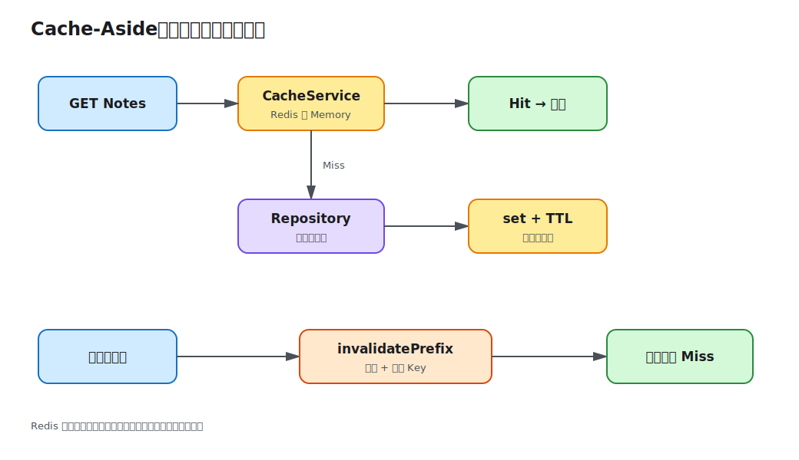

# 第 11 课：Redis 与缓存

数据库查询已经正确，但热点列表和单条读取每次都访问数据库。本课引入 Cache-Aside：读取先查缓存，未命中再查数据库并回填；写入成功后主动失效相关 Key。配置 Redis 时使用共享缓存，未配置、连接失败或运行时操作失败时降级到带 TTL 的进程内缓存。



## 缓存是副本，不是事实来源

数据库仍是 Source of Truth。缓存可以删除和重建，因此不应保存唯一业务状态。Cache-Aside 的读取路径是：

```ts
const cached = await cache.get<Note>(cacheKey);
if (cached) return cached;

const note = await repository.findOneBy({ id });
await cache.set(cacheKey, note);
return note;
```

首次请求日志显示 `Cache miss`，第二次相同请求显示 `Cache hit`。日志只输出 Key 的资源前缀，不记录搜索条件或用户输入。

## Key 必须包含所有影响结果的上下文

单条 Key 使用 `note:<id>:<role>:<userId>`，列表 Key 使用角色、用户 ID 和规范化后的查询 DTO。角色和用户不能省略，否则普通用户可能命中管理员或其他用户缓存，造成越权数据泄漏。把 Note ID 放在前面，也让写操作能用 `note:<id>:` 一次失效管理员与所有者的全部视图。

Key 设计还要考虑 schema 版本、租户、语言等上下文。不要直接把密码、Token 或长请求体写进 Key。

## 写后失效比“双写缓存”更稳健

创建、更新、删除和发布先提交数据库，再失效列表与单条缓存：

```ts
await Promise.all([
  cache.invalidatePrefix('notes:'),
  cache.invalidatePrefix(`note:${noteId}:`),
]);
```

课程选择“删缓存”而不是同时更新所有可能的列表缓存，因为筛选、分页和管理员视图组合很多，精确双写容易漏掉。代价是下一次读取会回源数据库。

当前用前缀失效，Redis 实现通过 `KEYS` 查找，便于 Demo 观察但会阻塞大型生产 Redis。生产应维护索引集合、使用版本化 namespace、事件驱动失效，或谨慎使用 `SCAN`。

## TTL 限制陈旧时间和空间

`CACHE_TTL_SECONDS` 必须是正整数。Redis 使用 `SET ... EX`，内存降级记录 `expiresAt` 并在读取时惰性删除。TTL 是最后一道陈旧保护，不替代写后失效；过短会导致频繁回源，过长会放大漏失效的影响。

热点 Key 同时过期会造成缓存击穿。生产可使用随机抖动、请求合并或互斥锁；大面积过期和 Redis 故障造成的缓存雪崩还需要限流与数据库容量保护。

## Redis 故障时保持基础流程

`CacheService` 启动时尝试连接 `REDIS_URL`。为空或连接失败时使用内存缓存；运行中 Redis 操作抛错也会断开客户端并切换到内存。这样缓存故障不会直接让业务读写失败。

降级不是等价替代：每个应用实例拥有自己的 Map，数据不共享，重启即丢失，命中率与一致性都会变化。健康与指标应暴露当前后端，生产系统还需重连和告警策略。

`REDIS_URL` 必须使用 `redis:` 或 `rediss:`，TTL 和 URL 在启动时校验。真实凭据只放本地 `.env` 或秘密管理系统。

## 本地运行与观察

不启动 Redis，验证内存降级：

```bash
cd lessons/11-redis-caching/demo
cp .env.example .env
REDIS_URL= npm run start:dev
```

登录后连续两次请求相同列表，终端依次出现 miss 和 hit。创建或更新 Note 后再查询，会再次出现 miss。

使用 Redis：

```bash
docker compose up -d redis
npm run start:dev
```

启动日志不再出现内存降级警告。可以执行 `docker compose exec redis redis-cli TTL '<key>'` 观察剩余 TTL；Key 具体值可通过 Redis CLI 扫描，仅限本地学习环境。

## 工程取舍与易错点

- 永远先完成数据库写入，再失效缓存；反过来会让并发读取重新填入旧值。
- 缓存反序列化得到普通对象，不能依赖 Entity 实例方法或 `Date` 实例语义。
- 多实例不能把内存降级当成共享一致缓存。
- `KEYS` 不适合大型生产实例，前缀失效策略必须可扩展。
- 缓存命中率、延迟、错误和回源量都应进入可观测性；第 14 课继续处理。

完整步骤见 [Demo README](demo/README.md)。
