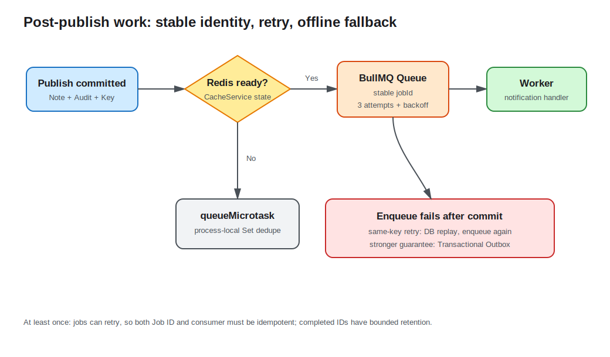

# Lesson 12: Queues and Background Jobs

A published note also needs a notification. Running that work inside HTTP makes third-party latency and transient failure part of response time. This lesson submits an event to a BullMQ Worker after the transaction commits, with retries and exponential backoff. Without Redis, an in-process microtask fallback keeps the basic learning flow runnable.



## A queue separates response path from work path

The publish endpoint commits its database transaction, then submits `note.published`. HTTP can return after the queue accepts it while a Worker processes notification independently:

```ts
await queue.add('note.published', payload, {
  jobId,
  attempts: 3,
  backoff: { type: 'exponential', delay: 1_000 },
  removeOnComplete: { age: 86_400, count: 1_000 },
});
```

Attempts and backoff handle transient failures; the `failed` event records terminal failure. Production also needs dead-letter handling, alerting, and controlled replay rather than logs alone.

The Worker only logs “notification generated,” making request/work separation observable without introducing an email provider early.

## Job identity must be stable

HTTP idempotency does not automatically make background work idempotent. A publish retry still attempts enqueue so it can repair “database committed, first enqueue failed.” `BackgroundJobsService` derives a stable SHA-256 `jobId` from user and idempotency key:

```ts
const jobId = createHash('sha256')
  .update(`${user.id}:${idempotencyKey.trim()}`)
  .digest('hex');
```

BullMQ will not add that ID while the existing Job is retained. Completed records remain for one day and at most 1000 entries, so this is bounded deduplication, not a permanent guarantee. A real consumer should persist event IDs and atomically check before irreversible side effects.

The fallback also keeps a process-local `fallbackJobIds` Set. Restarts and replicas do not share it.

## A boundary remains between commit and enqueue

The order is transaction commit, then enqueue. If enqueue fails, the endpoint throws and a client retries with the same key. The database replays its Note while enqueue tries again. This covers normal retries, but a client that never retries can still leave a missing task.

Stronger delivery uses a Transactional Outbox: write an outbox row in the publish transaction, then let a Relay deliver and mark it. Business commit and “pending delivery” then share one database transaction. Do not claim distributed atomicity between the database and Redis.

## Worker lifecycle follows application lifecycle

`onModuleInit()` creates Queue and Worker when Redis is ready and attaches failure handling. `onModuleDestroy()` closes both, releasing connections and stopping new work during shutdown.

Worker concurrency, timeouts, shutdown grace, and container termination must be designed together. Handlers must be reentrant because crashes or expired locks can cause reprocessing.

## Redis-offline fallback

When `REDIS_URL` is empty or the cache layer did not connect, `queueMicrotask()` runs the job later in the same process and logs fallback processing. It is not durable, has no cross-process retry, and loses work on exit. It is a learning and basic-degradation path, not a production queue replacement.

`QUEUE_NAME` is trimmed and cannot be empty. Redis URL and cache TTL retain lesson 11 validation.

## Run and observe

Without Redis:

```bash
cd lessons/12-queues-and-background-jobs/demo
cp .env.example .env
REDIS_URL= npm run start:dev
```

Publishing returns `200`, followed by `Fallback job processed for note ...` in the terminal. Replaying the same idempotency key does not print the same fallback Job again.

With BullMQ:

```bash
docker compose up -d redis
npm run start:dev
```

After publish, the Worker logs `Notification generated...`. The same request is deduplicated by stable Job ID. Queue and Worker close during application shutdown.

## Engineering tradeoffs and common mistakes

- Queues usually provide at-least-once processing. Consumers must be idempotent; do not assume exactly once.
- HTTP key, queue Job ID, and consumer event ID should derive from the same business intent.
- Enqueue only after commit so rolled-back work does not notify; use Outbox for stronger delivery.
- Retry transient errors, but route permanent validation failures quickly to failure handling.
- Keep payloads small and stable; resource IDs are often safer than copied Entities.

See the [Demo README](demo/README.md) for complete steps.
