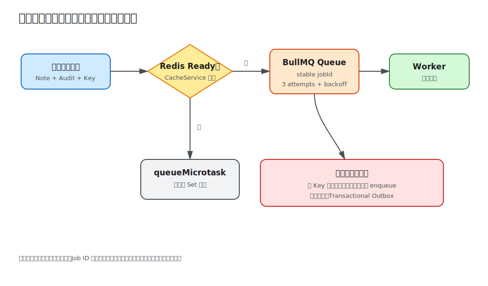

# 第 12 课：消息队列与后台任务

发布事务完成后还要生成通知。若把通知处理放在 HTTP 请求中，第三方延迟和临时失败会直接拖慢接口。本课在事务提交后将事件交给 BullMQ 工作进程（Worker），配置重试和指数退避；没有 Redis 时使用进程内微任务降级，保证基础流程可运行。



## 队列把响应路径与工作路径分开

发布接口先完成数据库事务，再提交 `note.published` 任务。队列接受任务后 HTTP 返回，工作进程独立处理通知：

```ts
await queue.add('note.published', payload, {
  jobId,
  attempts: 3,
  backoff: { type: 'exponential', delay: 1_000 },
  removeOnComplete: { age: 86_400, count: 1_000 },
});
```

`attempts` 和 `backoff` 处理暂时性失败；最终失败由 `failed` 事件记录。生产还应配置死信处理、告警和人工重放，而不是只写日志。

本课的工作进程只记录“已生成通知”，用于观察任务与请求分离，不提前接入邮件供应商。

## 任务身份必须稳定

HTTP 幂等并不自动保证后台任务幂等。客户端重试发布时，服务（Service）仍会尝试入队，以修复“数据库已提交但第一次入队失败”的间隙；`BackgroundJobsService` 使用用户 ID 和幂等键的 SHA-256 作为稳定任务 ID（Job ID）：

```ts
const jobId = createHash('sha256')
  .update(`${user.id}:${idempotencyKey.trim()}`)
  .digest('hex');
```

BullMQ 在同一任务仍保留时不会重复添加相同 ID。完成记录保留一天、最多 1000 条，因此这是有界去重窗口，不是永久保证。真实消费者还应把事件 ID 写入业务数据库，并在产生不可逆副作用前原子检查。

进程内降级也维护 `fallbackJobIds` Set，避免同一进程内重复微任务；重启或多实例不会共享它。

## 提交数据库与入队之间仍有边界

当前顺序是：事务提交 → 入队。若入队失败，接口抛错，客户端用同一个幂等键重试；数据库路径重放已有 Note，入队路径再次尝试。这能覆盖常见重试，但如果客户端永不重试，任务仍可能丢失。

要求更强可靠性时使用事务发件箱（Transactional Outbox）：在发布事务中同时写入发件箱记录，由独立中继进程（Relay）投递到队列，成功后标记。这样“业务提交”和“待投递事实”处于同一数据库事务。不要宣称数据库与 Redis 队列存在分布式原子性。

## 工作进程生命周期属于应用生命周期

`onModuleInit()` 在 Redis 可用时创建队列（Queue）和工作进程，并注册失败监听；`onModuleDestroy()` 同时关闭两者，使进程在部署或本地停止时不再接收新任务并释放连接。

工作进程的并发数、任务超时、停机宽限期和 Kubernetes termination grace period 应一起设计。处理函数必须可重入，因为工作进程崩溃或锁超时会导致任务再次执行。

## Redis 离线降级

若 `REDIS_URL` 为空或缓存层未连接 Redis，任务通过 `queueMicrotask()` 在当前进程稍后执行并打印 fallback 日志。它不持久化、没有跨进程重试，进程退出时任务会丢失，因此只用于本地学习和基础降级，不是生产队列替代品。

`QUEUE_NAME` 在启动时去空格并拒绝空值。Redis URL、缓存 TTL 继续沿用第 11 课的验证。

## 本地运行与观察

无 Redis：

```bash
cd lessons/12-queues-and-background-jobs/demo
cp .env.example .env
REDIS_URL= npm run start:dev
```

发布 Note 后，HTTP 返回 `200`，终端随后出现 `Fallback job processed for note ...`。用相同幂等键重放，不会再次打印同一降级任务。

使用 BullMQ：

```bash
docker compose up -d redis
npm run start:dev
```

发布后工作进程打印 `Notification generated...`。重复相同请求由稳定任务 ID 去重。停止应用时队列与工作进程正常关闭。

## 工程取舍与易错点

- 队列通常提供至少一次处理，消费者必须幂等，不能假设严格一次。
- HTTP 幂等键、队列任务 ID 和消费者事件 ID 应来自同一次业务意图。
- 只在数据库提交后入队，避免回滚事务却已经发送通知；强可靠性使用事务发件箱。
- 重试只适合暂时性错误，参数错误等永久失败应快速进入失败处理。
- 任务载荷（Payload）应小而稳定，传资源 ID 通常比复制整个实体（Entity）更安全。

完整步骤见 [Demo README](demo/README.md)。
