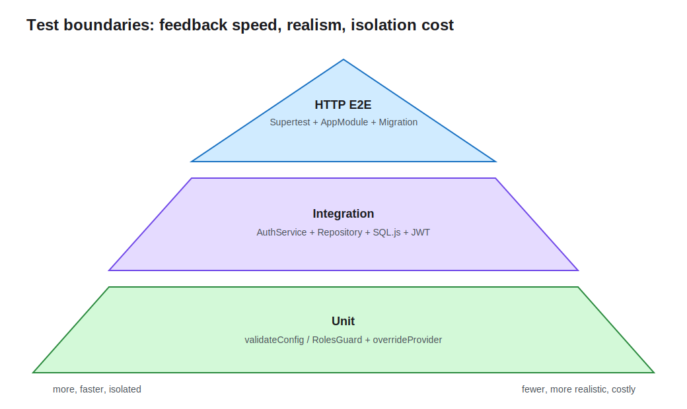

# Lesson 13: Automated Testing

The first twelve lessons primarily observe behavior through local requests. This lesson adds automated regression protection and is the only Demo in the course that keeps test code. Boundaries follow risk: pure configuration and a Guard use unit tests, Service plus real SQL.js/JWT uses integration tests, and Supertest E2E covers the complete HTTP path.



## Test behavior, not framework implementation

Useful assertions protect public contracts and invariants: invalid configuration rejects startup, insufficient role returns 403, password hashes authenticate, anonymous requests return 401, and publish replays idempotently. Avoid asserting Nest internals or decorator implementation because harmless refactors would break such tests.

The three levels are not a fixed ratio:

- Unit tests are fast and focused for branch-heavy pure logic and Guards.
- Integration tests verify Providers against real adapters such as Repository, SQL.js, bcrypt, and JWT.
- E2E starts at HTTP and exercises Middleware, Guard, Pipe, Controller, Service, and database together. It is closest to user behavior and most expensive.

## Unit tests cover input boundaries directly

`validateConfig.spec.ts` calls a pure function without booting Nest:

```ts
expect(() => validateConfig({ PORT: '70000' })).toThrow(
  'PORT must be an integer between 1 and 65535',
);
```

It covers port, JWT secret, CORS origins, cache TTL, and queue name. Pure tests avoid I/O and shared state, so failures point directly to a rule.

## Replace a Provider with TestingModule

`RolesGuard` depends on `Reflector`. The test keeps the real Guard and replaces only metadata lookup:

```ts
const moduleRef = await Test.createTestingModule({
  providers: [RolesGuard, Reflector],
})
  .overrideProvider(Reflector)
  .useValue({ getAllAndOverride: jest.fn() })
  .compile();
```

This is more useful than mocking the subject itself. Mocks express boundaries irrelevant to one test. A Service needing many mocks often signals the wrong test boundary or too many responsibilities.

## Integration uses a real Repository and JWT

`auth.service.integration.spec.ts` builds an isolated TestingModule with in-memory SQL.js, a real TypeORM Repository, bcrypt, and JwtService. It verifies persisted email normalization, hash-based login, duplicate-email conflict semantics, and invalid-password unauthorized semantics.

```ts
TypeOrmModule.forRoot({
  type: 'sqljs',
  autoSave: false,
  dropSchema: true,
  synchronize: true,
  entities: [User],
});
```

`synchronize` is acceptable only for this disposable test database; production still uses Migrations. `afterAll` closes the TestingModule and DataSource. A Migration test should boot with migrations instead.

## E2E verifies the complete HTTP contract

E2E imports the real `AppModule`, calls production `configureApp()` for prefix, Pipes, Filter, and Interceptor, then uses Supertest against the in-memory HTTP server:

```ts
app = moduleRef.createNestApplication();
configureApp(app);
await app.init();

await request(app.getHttpServer())
  .get('/api/notes')
  .expect(401);
```

Scenarios cover registration and ownership, anonymous access, publish replay/key conflict, cross-user 404, and regular-user delete 403. Every `it` creates its own users and Notes instead of depending on a token or ID from a previous test.

`test/setup-env.ts` sets a unique temporary database, test JWT secret, and empty Redis URL before module loading, keeping E2E independent from Docker. Teardown closes the application and removes the database file.

## Stability matters more than a coverage number

- Do not wait on real TTL or backoff time; inject a Clock or use fake timers.
- Do not call external Redis, email, or network services; use controlled replacements at those boundaries.
- Use unique test data to avoid ordering and concurrency pollution.
- `--runInBand` serializes this file-backed SQL.js E2E. Larger systems should allocate a database per worker.
- Coverage shows unexecuted code, not assertion quality. Prioritize permission, transaction, idempotency, and error branches.

## Run the tests

```bash
cd lessons/13-testing/demo
npm run lint
npm run build
npm test
npm run test:e2e
```

`npm test` runs configuration and Guard unit tests plus the AuthService integration test. `test:e2e` uses separate E2E configuration. On failure, distinguish a business regression, isolation problem, or intentional contract change instead of merely updating expectations.

## Engineering tradeoffs and common mistakes

- Test files exist only in lesson 13. Later cumulative Demos retain business source but do not copy tests.
- `overrideProvider` replaces a boundary dependency; it should not mock away the behavior under test.
- E2E must apply real application setup or missing global Pipes and Filters can produce false confidence.
- Close applications and databases in `afterAll` even after failed assertions.
- Assert status, response semantics, and persisted behavior, not only “a method was called.”

See the [Demo README](demo/README.md) for complete commands.
