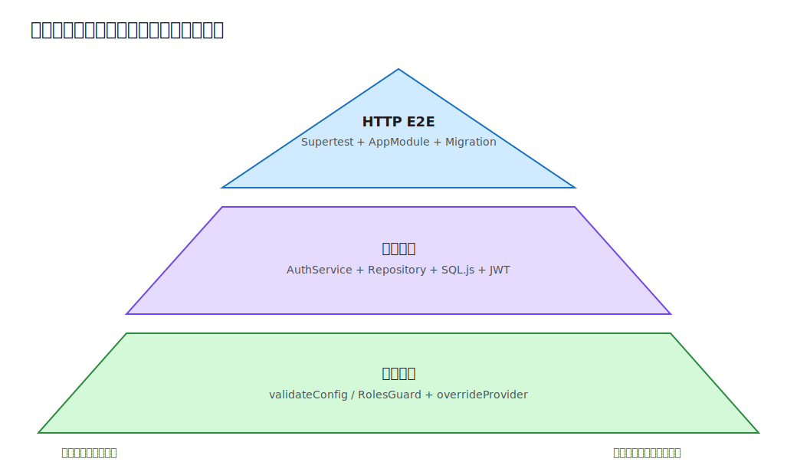

# 第 13 课：自动化测试

前十二课主要通过本地请求观察行为。本课专门建立自动化回归保护，并且是全课程唯一保留测试代码的 Demo。测试按风险选择边界：纯函数和 Guard 用单元测试，Service 与真实 SQL.js/JWT 用集成测试，完整 HTTP 请求链用 Supertest E2E。



## 测试行为，而不是框架实现

有价值的断言围绕对外契约和业务不变量：无效配置拒绝启动、角色不足返回 403、密码哈希可验证、匿名请求返回 401、发布可幂等重放。不要断言 Nest 内部调用次数或装饰器如何实现，否则重构会产生大量无意义破坏。

本课的三个层次不是固定比例：

- 单元测试速度快，定位清楚，适合分支密集的纯逻辑与 Guard；
- 集成测试验证 Provider 与真实基础设施适配，例如 Repository、SQL.js、bcrypt、JWT；
- E2E 从 HTTP 入口验证 Middleware、Guard、Pipe、Controller、Service 和数据库协作，最接近用户行为但成本最高。

## 单元测试：直接覆盖输入边界

`validateConfig.spec.ts` 直接调用纯函数，不需要启动 Nest：

```ts
expect(() => validateConfig({ PORT: '70000' })).toThrow(
  'PORT must be an integer between 1 and 65535',
);
```

它覆盖端口、JWT 密钥、CORS Origin、缓存 TTL 和队列名。纯函数测试应避免 I/O 和共享状态，失败时能直接指向规则。

## 用 TestingModule 替换 Provider

`RolesGuard` 依赖 `Reflector`。测试保留真实 Guard，只替换元数据读取者：

```ts
const moduleRef = await Test.createTestingModule({
  providers: [RolesGuard, Reflector],
})
  .overrideProvider(Reflector)
  .useValue({ getAllAndOverride: jest.fn() })
  .compile();
```

这比 Mock 被测对象本身更有价值。Mock 只表达当前测试不关心的边界；若一个 Service 需要十几个 Mock，通常说明职责或测试边界选错了。

## 集成测试：使用真实 Repository 与 JWT

`auth.service.integration.spec.ts` 创建独立 TestingModule，使用内存 SQL.js、真实 TypeORM Repository、bcrypt 和 JwtService。它验证邮箱规范化真正写入数据库、密码哈希能登录、重复邮箱映射为 409 语义、错误密码映射为 401。

```ts
TypeOrmModule.forRoot({
  type: 'sqljs',
  autoSave: false,
  dropSchema: true,
  synchronize: true,
  entities: [User],
});
```

这里的 `synchronize` 只用于一次性测试库；生产仍使用 Migration。`afterAll` 关闭 TestingModule，释放 DataSource。若要验证 Migration 本身，应使用迁移启动而不是 synchronize。

## E2E：从 HTTP 契约验证完整链路

E2E 导入真实 `AppModule`，用与生产启动相同的 `configureApp()` 注册前缀、Pipe、Filter 和 Interceptor，再通过 Supertest 调用内存 HTTP Server：

```ts
app = moduleRef.createNestApplication();
configureApp(app);
await app.init();

await request(app.getHttpServer())
  .get('/api/notes')
  .expect(401);
```

场景覆盖注册与所有权、匿名访问、发布重放/Key 冲突、跨用户 404 和普通用户删除 403。每个 `it` 创建自己的用户和 Note，不依赖上一个测试留下的 Token 或 ID。

`test/setup-env.ts` 在模块加载前设置独立临时数据库、测试 JWT 密钥和 `REDIS_URL=''`，使 E2E 不依赖 Docker。测试结束关闭应用并删除数据库文件。

## 稳定性比覆盖率数字更重要

- 不使用真实时间等待 TTL 或退避；需要时注入 Clock 或使用 fake timers。
- 不访问外部 Redis、邮件或网络服务；在对应边界使用受控替代。
- 测试数据使用唯一邮箱，避免顺序和并发污染。
- `--runInBand` 让当前单文件 SQL.js E2E 串行运行；大型项目应为每个 Worker 分配独立数据库。
- 覆盖率只能提示未执行代码，不能证明断言质量。优先覆盖权限、事务、幂等和错误分支。

## 运行测试

```bash
cd lessons/13-testing/demo
npm run lint
npm run build
npm test
npm run test:e2e
```

`npm test` 执行配置与 Guard 单元测试、AuthService 集成测试；`test:e2e` 单独使用 E2E 配置。失败时先确认是业务回归、测试隔离问题还是契约已经有意改变，不要直接更新期望值让红灯消失。

## 工程取舍与易错点

- 测试文件只存在于第 13 课；后续累计 Demo 保留业务源码但不复制测试。
- `overrideProvider` 应替换边界依赖，不应把被测逻辑全部 Mock 掉。
- E2E 必须调用真实应用配置，否则全局 Pipe/Filter 缺失会产生虚假通过。
- 清理资源要放在 `afterAll`，即使断言失败也应关闭应用和数据库。
- 对状态码、响应语义和持久化结果做断言，不只断言“方法被调用”。

完整测试命令见 [Demo README](demo/README.md)。
