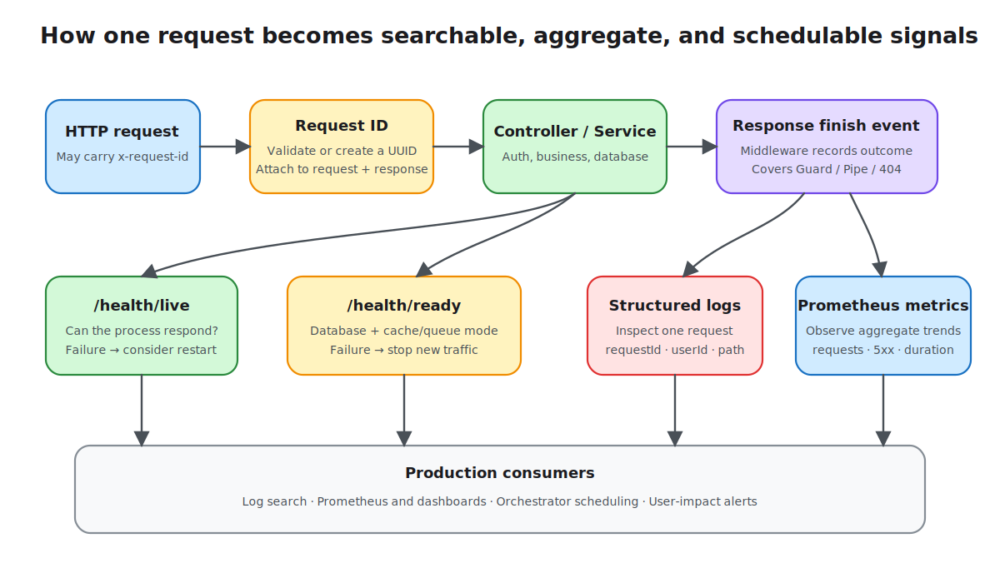

# Lesson 14: Logging and Observability

An HTTP 500 only says that a request failed. It does not reveal where it failed, how many requests are affected, or whether the instance should keep receiving traffic. This lesson adds a minimal observability path to the cumulative knowledge API: a correlation ID ties one request together, structured logs preserve context, metrics expose aggregate trends, and health checks tell an orchestrator whether the instance is usable.



## Three signals answer different questions

- **Logs** capture discrete events and context, answering “what happened to this request?”
- **Metrics** aggregate counts and latency, answering “is the error rate or latency getting worse?”
- **Traces** arrange cross-process calls on a timeline, answering “which service consumed the time?”

The Demo implements the first two signals and uses a request ID as the smallest form of trace context. Full distributed tracing normally uses OpenTelemetry to create traces and spans and export them to a Collector. A custom request ID is not a substitute for tracing.

## Correlation IDs make one request searchable

`RequestIdMiddleware` runs before route handling. It preserves a valid `x-request-id` or creates a UUID, then places the value on both the request and response:

```ts
const candidate = request.header('x-request-id');
const requestId =
  candidate && /^[A-Za-z0-9._:-]{1,128}$/.test(candidate)
    ? candidate
    : randomUUID();

request.requestId = requestId;
response.setHeader('x-request-id', requestId);
```

The character and length limits matter: unconstrained external values can corrupt logs, and oversized values increase storage cost. Pass the value to downstream services. After adopting OpenTelemetry, logs should also carry the standard `trace_id` and `span_id`.

## Structured request logs need stable fields

`RequestIdMiddleware` listens for the outer response `finish` event, records JSON when the response completes, and updates metrics at the same time:

```ts
{
  requestId,
  userId: request.user?.id,
  method: request.method,
  path: request.path,
  statusCode: response.statusCode,
  durationMs,
}
```

Stable fields can be indexed and aggregated by a log backend. The Demo deliberately uses `request.path` rather than a query string that may contain secrets. It does not record Authorization, cookies, passwords, tokens, or request bodies. If production diagnostics need business fields, use an allowlist and centralized redaction instead of logging everything first.

Middleware is also an execution-order decision. A Guard rejection or an unmatched route can produce a 401 or 404 before an interceptor runs. When a Pipe produces a 400, the interceptor's pre-handler logic has already run, but whether it records the failure still depends on how it handles the Observable's error path. The outer middleware observes the final response, so “total requests” reliably includes all of these failures. Its listener only observes completion and never writes the response again.

Nest's `Logger` is enough to demonstrate structured context. Production systems commonly switch to a logger with JSON output, levels, asynchronous transport, and redaction. Configure levels per environment: `debug` locally, `info` by default in production, and elevated detail only for a controlled window.

## Metrics show trends instead of duplicating logs

`MetricsService` keeps a request count, a 5xx count, and cumulative duration. `GET /api/metrics` emits the Prometheus exposition format:

```text
knowledge_http_requests_total 12
knowledge_http_errors_total 1
knowledge_http_duration_ms_total 86
```

Cumulative duration divided by request count gives a process-lifetime average, but averages hide tail latency. A production implementation should use a mature client with a histogram and low-cardinality labels such as method, normalized route, and status class. Never label metrics with unbounded values such as userId, noteId, or a full URL; that creates an uncontrolled number of time series.

These counters live in one process, reset on restart, and are not automatically combined across replicas. They teach the scrape protocol; they do not replace `prom-client`, OpenTelemetry Metrics, or a managed agent.

## Liveness and readiness serve different decisions

The endpoints have distinct consumers:

- `GET /api/health/live` only proves that the Node.js process can respond. An orchestrator may restart the instance when this fails.
- `GET /api/health/ready` checks the database and reports cache and queue modes. An unready instance should stop receiving new traffic, but does not necessarily need a restart.

The Demo can fall back to an in-memory cache and in-process jobs when Redis is unavailable, so fallback mode may still be ready; the response explicitly reports `cache: "memory"`. A database query failure or unavailable job facility changes the status to `degraded`. Whether a dependency is mandatory must follow the application's degradation policy rather than a blanket “all dependencies online” rule.

Health checks should be fast, read-only, and protected by short timeouts. Do not probe the database from liveness: a brief database incident could restart every application instance at once and amplify the outage.

## Run the Demo

```bash
npm install
cp lessons/14-observability/demo/.env.example lessons/14-observability/demo/.env
npm run start:dev --workspace lesson-14-observability-demo
```

The default port is `3014`. Redis is optional. To observe Redis caching and the BullMQ queue, run `docker compose up -d redis` in the Demo directory.

First send a request with a fixed correlation ID:

```bash
curl -i http://localhost:3014/api/health/live \
  -H 'x-request-id: local-observe-001'
```

The response echoes `x-request-id: local-observe-001`, and the terminal log contains the same value, path, status, and duration. Then inspect readiness and metrics:

```bash
curl http://localhost:3014/api/health/ready
curl http://localhost:3014/api/metrics
```

Make several requests and fetch metrics again to see the count and cumulative duration increase. `/api/metrics` also passes through the middleware, but it is counted after its response has been sent. The current scrape therefore shows state before that scrape, which is normal collection timing.

## Alert on user impact

Logs, metrics, and health endpoints become an observability system only after collection. Production also needs log, metric, and trace backends, dashboards, and alert routing. Prefer alerts based on sustained error rate, latency, traffic anomalies, and saturation, with windows and inhibition rules. Paging on every individual error log usually produces alert fatigue.

This lesson stops at application signals and health semantics. Collector deployment, SLO calculation, and a complete alerting platform are infrastructure concerns. The next lesson uses health checks in container deployment and CI/CD release gates.
