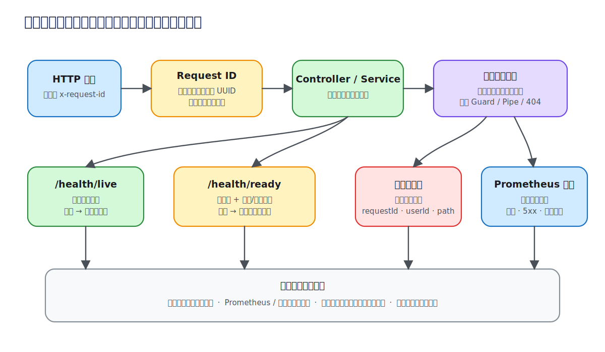

# 第 14 课：日志与可观测性

API 返回 500 只说明请求失败了，不能说明失败发生在哪一层、影响了多少请求，也不能判断实例是否应该继续接收流量。本课为累计的知识管理 API 建立一条最小可观测链路：用关联 ID 串起一次请求，用结构化日志保留上下文，用指标观察整体趋势，再用健康检查告诉编排系统实例是否可用。



## 三类信号回答不同问题

- **日志（logs）**记录离散事件及其上下文，适合回答“这一次请求发生了什么”。
- **指标（metrics）**聚合计数和耗时，适合回答“错误率或延迟是否正在恶化”。
- **追踪（traces）**把跨进程调用组成一条时间线，适合定位“时间花在了哪个服务”。

Demo 实现前两类信号，并用 Request ID 展示追踪上下文的最小形态。真正的分布式追踪通常接入 OpenTelemetry，由 SDK 生成 trace/span 并向 Collector 导出；不要把自定义 Request ID 当成完整 tracing。

## 关联 ID：让一次请求可以被检索

`RequestIdMiddleware` 在路由处理前执行。合法的 `x-request-id` 会沿用，否则生成 UUID；最终值同时写入请求对象和响应头：

```ts
const candidate = request.header('x-request-id');
const requestId =
  candidate && /^[A-Za-z0-9._:-]{1,128}$/.test(candidate)
    ? candidate
    : randomUUID();

request.requestId = requestId;
response.setHeader('x-request-id', requestId);
```

限制字符和长度不是装饰：未经约束的外部值可能污染日志，超长值也会放大存储成本。跨服务调用时应把该值继续传给下游；接入 OpenTelemetry 后，日志还应附带标准 `trace_id` 和 `span_id`。

## 结构化请求日志：稳定字段比句子更重要

`RequestIdMiddleware` 在最外层监听响应的 `finish` 事件，结束时记录 JSON 并同步更新指标：

```ts
{
  requestId,
  userId: request.user?.id,
  method: request.method,
  path: request.path,
  statusCode: response.statusCode,
  durationMs,
}
```

固定字段可以被日志平台索引和聚合。这里使用 `request.path`，故意不记录可能包含敏感参数的查询串；也不记录 Authorization、Cookie、密码、Token 和请求体。真实项目若确实需要业务字段，应采用白名单和集中脱敏，而不是先完整记录再补救。

选择中间件还有执行顺序上的原因：Guard、Pipe 或路由匹配可能在 interceptor 运行前就返回 401、400 或 404。最外层中间件订阅最终响应，才能让“请求总数”覆盖这些失败。监听器只观察完成事件，不在其中再次写响应。

Nest 的 `Logger` 足以展示结构化上下文。生产系统通常会换成支持 JSON 输出、日志级别、异步传输和字段脱敏的 logger，并通过环境配置级别：本地可用 `debug`，生产默认 `info`，只在可控时间窗口临时提升详细度。

## 指标：观察趋势，而不是复刻每条日志

`MetricsService` 维护请求总数、5xx 总数和累计耗时，`GET /api/metrics` 以 Prometheus exposition format 输出：

```text
knowledge_http_requests_total 12
knowledge_http_errors_total 1
knowledge_http_duration_ms_total 86
```

累计耗时除以请求数可以得到进程启动后的平均值，但平均值会掩盖长尾延迟。生产实现应使用成熟客户端提供 histogram，并按低基数字段（method、规范化 route、status class）打标签。不要把 userId、noteId、完整 URL 等无界值放进 label，否则时间序列数量会失控。

本 Demo 的计数器保存在单进程内存中，重启即清零，多实例也不会自动汇总；它用于理解采集协议，不替代 `prom-client`、OpenTelemetry Metrics 或托管 agent。

## Liveness 与 Readiness 不能混用

两个端点面向不同决策：

- `GET /api/health/live` 只证明 Node.js 进程还能响应。失败时，编排系统可以重启实例。
- `GET /api/health/ready` 检查数据库，并报告缓存和队列模式。未就绪时应停止给实例分配新流量，不一定要重启它。

Demo 允许 Redis 不可用时回退到内存缓存和进程内任务，因此回退模式仍可 ready；响应会明确显示 `cache: "memory"`。数据库不可查询或任务设施不可用时状态变为 `degraded`。是否把某个依赖视为硬依赖，必须由业务降级策略决定，不能机械地要求所有依赖都在线。

健康检查应快速、只读并设置短超时。不要在 liveness 中探测数据库：数据库短暂抖动会触发所有实例一起重启，反而扩大故障。

## 运行 Demo

```bash
npm install
cp lessons/14-observability/demo/.env.example lessons/14-observability/demo/.env
npm run start:dev --workspace lesson-14-observability-demo
```

默认端口是 `3014`。Redis 是可选的；要观察 Redis 缓存和 BullMQ 队列，可以在 Demo 目录运行 `docker compose up -d redis`。

先发送带固定关联 ID 的请求：

```bash
curl -i http://localhost:3014/api/health/live \
  -H 'x-request-id: local-observe-001'
```

响应头会回显 `x-request-id: local-observe-001`，终端日志会出现同一值、路径、状态码和耗时。随后查看就绪状态和指标：

```bash
curl http://localhost:3014/api/health/ready
curl http://localhost:3014/api/metrics
```

多请求几次再读取 metrics，可以观察请求总数和累计耗时增长。`/api/metrics` 本身也经过中间件，但它是在响应发送完成后才被计数，因此本次抓取显示的是抓取之前的状态，这是正常的采集时序。

## 告警从用户影响出发

日志、指标和健康端点只有被采集后才形成可观测系统。生产环境还需要日志/指标/追踪后端、仪表盘以及告警路由。告警应优先围绕持续的错误率、延迟、流量异常和资源饱和度，并设置窗口与抑制规则；“出现一条 error 日志就呼叫值班人员”通常只会制造告警疲劳。

本课边界是应用侧信号与健康语义。Collector 部署、SLO 计算和完整告警平台属于基础设施实践；下一课会把健康检查用于容器部署和 CI/CD 发布门禁。
