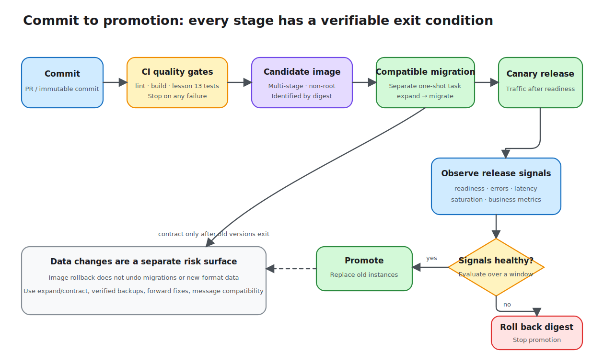

# Lesson 15: Deployment and CI/CD

“It starts locally” is not the same as “it can be released safely.” The same source must pass repeatable gates, become a small image with restricted privileges, receive traffic only after configuration and data changes are ready, and roll back quickly when signals deteriorate. This lesson puts the cumulative API from the first 14 lessons into a container and connects verification, migrations, health checks, rolling release, and rollback on one delivery map.



## Separate build tooling from the runtime

The Demo `Dockerfile` has two stages:

```dockerfile
FROM node:24-alpine AS build
WORKDIR /app
COPY package*.json ./
RUN npm install
COPY . .
RUN npm run build

FROM node:24-alpine AS runtime
WORKDIR /app
ENV NODE_ENV=production
COPY package*.json ./
RUN npm install --omit=dev && mkdir -p /app/data && chown -R node:node /app
COPY --from=build /app/dist ./dist
USER node
CMD ["node", "dist/main.js"]
```

The build stage has TypeScript, Nest CLI, and other development tools. The runtime stage contains only production dependencies and compiled output and runs as a non-root user. `.dockerignore` excludes `node_modules`, `dist`, `.env`, and local databases so machine state and secrets do not enter the image.

The standalone Demo build context has no dedicated lockfile, so the image example uses `npm install`. A real project should commit the lockfile matching its image context and use `npm ci`. It should also pin the base image digest, scan the image, and produce an SBOM. Otherwise, one commit may resolve different dependencies on different dates.

## Configuration belongs to deployment, not the image

The image contains no `.env`. The port, database path, JWT secret, initial admin credentials, CORS origins, and Redis URL are injected at runtime. Compose values are local examples; `change-this-*` values must never enter a real environment.

Production secrets should come from platform Secrets or an external secret manager, with restricted access, rotation, and audit. Environment variables suit startup configuration, but changing them usually requires new instances; do not expect a running process to reload them automatically.

The SQL.js file is mounted at `/app/data`, so replacing the container preserves data. SQL.js is still a single-process teaching database and is unsuitable for a replicated production deployment. A real rolling release should use an external database such as PostgreSQL.

## Migrate compatibly before switching code

For local convenience, the Demo runs TypeORM migrations during application startup. Multiple production replicas racing to migrate create locks and uncertainty. Production should use a separate one-shot release task and an expand/contract sequence:

1. Release a backward-compatible schema change, such as a nullable column or a new table.
2. Release code compatible with both schemas and backfill gradually.
3. Tighten constraints or remove the old column only after old application versions have exited.

Old and new versions can then share the database during a rolling release. A destructive migration generally cannot be undone by rolling back an image, so it needs a separate recovery plan and verified backups.

## Shutdown and health signals define traffic boundaries

The application calls `enableShutdownHooks()`. After the platform sends `SIGTERM`, Nest runs lifecycle hooks; the BullMQ worker and queue close in `onModuleDestroy`. Production also needs an adequate termination grace period. Mark the instance unready first, stop new traffic, and then wait for in-flight requests and jobs.

Compose checks `/api/health/ready`. A platform such as Kubernetes should configure distinct probes:

- liveness → `/api/health/live`, deciding whether to restart;
- readiness → `/api/health/ready`, deciding whether to send traffic;
- a startup probe for slow applications, preventing liveness from killing initialization.

## CI produces a trustworthy candidate

The root `.github/workflows/ci.yml` installs locked dependencies with `npm ci`, lints and builds every lesson Demo, and—following the course rule—runs unit, integration, and E2E tests only for the testing-focused lesson 13. It then builds the lesson 15 image.

```yaml
- run: npm ci
- run: npm run lint:lessons
- run: npm run build:lessons
- run: npm test --workspace lesson-13-testing-demo
- run: npm run test:e2e --workspace lesson-13-testing-demo
- run: docker build lessons/15-deployment-and-cicd/demo
```

CI should stop on failure in a clean environment and protect the main branch. Deploy by immutable image digest rather than a mutable `latest` tag. If dependency, license, or image vulnerability gates are added, define severity, exception expiry, and ownership instead of permanent unmanaged ignores.

## CD increases traffic gradually and reacts to signals

A reliable release does not replace every instance as soon as CI passes. A typical flow runs compatible migrations, deploys a small number of new instances, waits for readiness, gradually increases traffic, and watches the error rate, latency, and saturation signals introduced in lesson 14.

When a release threshold is exceeded, stop promotion and roll back to the last known image digest. Rolling back code does not roll back data. If the new version wrote data that the old version cannot understand, use a forward fix or a compatibility path designed in advance. Queue consumers also need old and new message formats to coexist.

## Run the final Demo

Run directly on the host:

```bash
npm install
cp lessons/15-deployment-and-cicd/demo/.env.example lessons/15-deployment-and-cicd/demo/.env
npm run start:dev --workspace lesson-15-deployment-and-cicd-demo
curl http://localhost:3015/api/health/ready
```

Or run the complete local topology in containers:

```bash
cd lessons/15-deployment-and-cicd/demo
docker compose up --build
```

Verify from another terminal:

```bash
curl http://localhost:3015/api/health/live
curl http://localhost:3015/api/health/ready
curl http://localhost:3015/api/metrics
docker compose ps
```

After startup, `docker compose ps` should report both app and Redis as healthy. Use `docker compose down` to stop and remove containers. Add `-v` only when you intentionally want to delete local database data.

This lesson adds no tests; its focus is a final source snapshot, image, and delivery configuration that run locally. Cloud-specific manifests, Ingress/TLS, registry authentication, and a complete GitOps platform depend on the target infrastructure and are not faked in the Demo.
