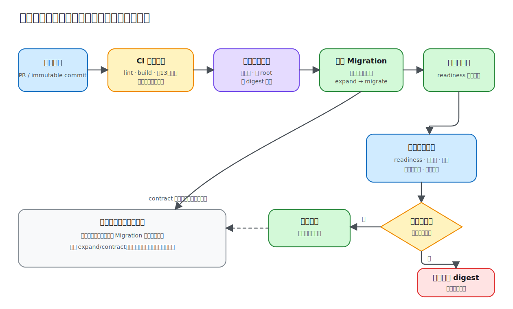

# 第 15 课：部署与 CI/CD

“本地能启动”与“可以安全发布”之间隔着一条完整链路：同一份源码必须通过可重复的质量门禁，被构建为尽量小且权限受限的镜像，在配置和数据变更就绪后逐步接流量，并且能在异常时快速回退。本课把前 14 课的累计 API 放进容器，并把验证、迁移、健康检查、滚动发布和回滚放进同一张发布地图。



## 构建产物应该与运行环境分离

Demo 的 `Dockerfile` 使用两个阶段：

```dockerfile
FROM node:24-alpine AS build
WORKDIR /app
COPY package*.json ./
RUN npm install
COPY . .
RUN npm run build

FROM node:24-alpine AS runtime
WORKDIR /app
ENV NODE_ENV=production
COPY package*.json ./
RUN npm install --omit=dev && mkdir -p /app/data && chown -R node:node /app
COPY --from=build /app/dist ./dist
USER node
CMD ["node", "dist/main.js"]
```

build 阶段拥有 TypeScript、Nest CLI 等开发工具；runtime 阶段只保留生产依赖和编译产物，并以非 root 用户运行。`.dockerignore` 排除 `node_modules`、`dist`、`.env` 和本地数据库，避免把机器状态或密钥打进镜像。

课程 Demo 的独立构建上下文没有单独 lockfile，因此镜像示例使用 `npm install`。真实项目应提交与镜像上下文匹配的 lockfile 并改用 `npm ci`，还应固定基础镜像 digest、扫描镜像并生成 SBOM；否则同一个提交在不同日期可能解析到不同依赖。

## 配置属于部署，不属于镜像

镜像不包含 `.env`。端口、数据库路径、JWT 密钥、管理员初始凭据、CORS 和 Redis 地址在运行时注入。Compose 中的值只是本地示例，尤其是 `change-this-*` 不能进入真实环境。

生产秘密应来自平台 Secret 或外部秘密管理服务，并限制读取权限、轮换和审计。环境变量适合注入短配置，但修改后通常需要新实例；不要期待运行中的进程自动重读。

SQL.js 数据文件挂载到命名卷 `/app/data`，因此容器替换后数据仍在。不过 SQL.js 是课程用的单进程数据库，不适合多副本生产部署；真正滚动发布应使用 PostgreSQL 等独立数据库。

## Migration 必须先兼容，再切换代码

Demo 为方便本地运行，在应用启动时执行 TypeORM migration。多个生产副本同时启动并抢跑 migration 会带来锁和不确定性，生产应使用独立的一次性发布任务，并遵循 expand/contract：

1. 先发布向后兼容的结构变更，例如新增可空列或新表。
2. 再发布同时兼容新旧结构的应用，逐步回填数据。
3. 确认旧版本已退出后，才收紧约束或删除旧列。

这样滚动期间新旧版本可以同时访问数据库。破坏性 migration 通常不能靠“把镜像回滚”撤销，因此需要单独的恢复方案和备份验证。

## 停机与健康信号决定流量边界

应用调用 `enableShutdownHooks()`。平台发送 `SIGTERM` 后，Nest 会执行生命周期钩子；BullMQ worker 和 queue 在 `onModuleDestroy` 中关闭。生产环境还需设置足够的 termination grace period，并先把实例标记为 unready，让负载均衡停止送入新请求，再等待进行中的请求和任务结束。

Compose 使用 `/api/health/ready` 做容器健康检查。Kubernetes 等平台应分别配置：

- liveness → `/api/health/live`，决定是否重启；
- readiness → `/api/health/ready`，决定是否接收流量；
- 对慢启动应用可再用 startup probe，避免初始化期间被 liveness 误杀。

## CI 只产生可信候选物

根目录 `.github/workflows/ci.yml` 使用 `npm ci` 安装锁定依赖，对全部课程 Demo 执行 lint 和 build；按照课程规则，只在测试主题的第 13 课执行单元、集成和 E2E 测试；最后构建第 15 课镜像。

```yaml
- run: npm ci
- run: npm run lint:lessons
- run: npm run build:lessons
- run: npm test --workspace lesson-13-testing-demo
- run: npm run test:e2e --workspace lesson-13-testing-demo
- run: docker build lessons/15-deployment-and-cicd/demo
```

CI 应在干净环境失败即停止，并保护主分支。部署通常使用镜像 digest，而不是可变的 `latest`。如果增加依赖审计、许可证或镜像漏洞门禁，应定义严重级别、例外期限与负责人，避免不可维护的永久忽略。

## CD：逐步放量并用信号决定继续还是回退

可靠发布不是“CI 通过后立刻替换全部实例”。常见流程是：运行兼容 migration → 部署少量新实例 → readiness 通过 → 逐步增加流量 → 观察第 14 课的错误率、延迟和资源饱和度。

超过发布阈值时停止扩容并回滚到上一个已知镜像 digest。回滚应用不等于回滚数据；如果新版本已经写入旧版本无法理解的数据，必须有前向修复或事先设计好的兼容路径。队列消费者也要考虑新旧消息格式共存。

## 运行最终 Demo

直接在宿主机运行：

```bash
npm install
cp lessons/15-deployment-and-cicd/demo/.env.example lessons/15-deployment-and-cicd/demo/.env
npm run start:dev --workspace lesson-15-deployment-and-cicd-demo
curl http://localhost:3015/api/health/ready
```

或用容器运行完整本地拓扑：

```bash
cd lessons/15-deployment-and-cicd/demo
docker compose up --build
```

另一个终端验证：

```bash
curl http://localhost:3015/api/health/live
curl http://localhost:3015/api/health/ready
curl http://localhost:3015/api/metrics
docker compose ps
```

应用健康后，`docker compose ps` 应显示 app 与 redis 为 healthy。停止并清理容器使用 `docker compose down`；只有确定要删除本地数据库数据时才加 `-v`。

本课不编写测试，重点是最终源码、镜像和交付配置可以在本地直接运行。云厂商部署清单、Ingress/TLS、镜像仓库鉴权和完整 GitOps 平台取决于实际基础设施，不在 Demo 中伪造一套通用答案。
