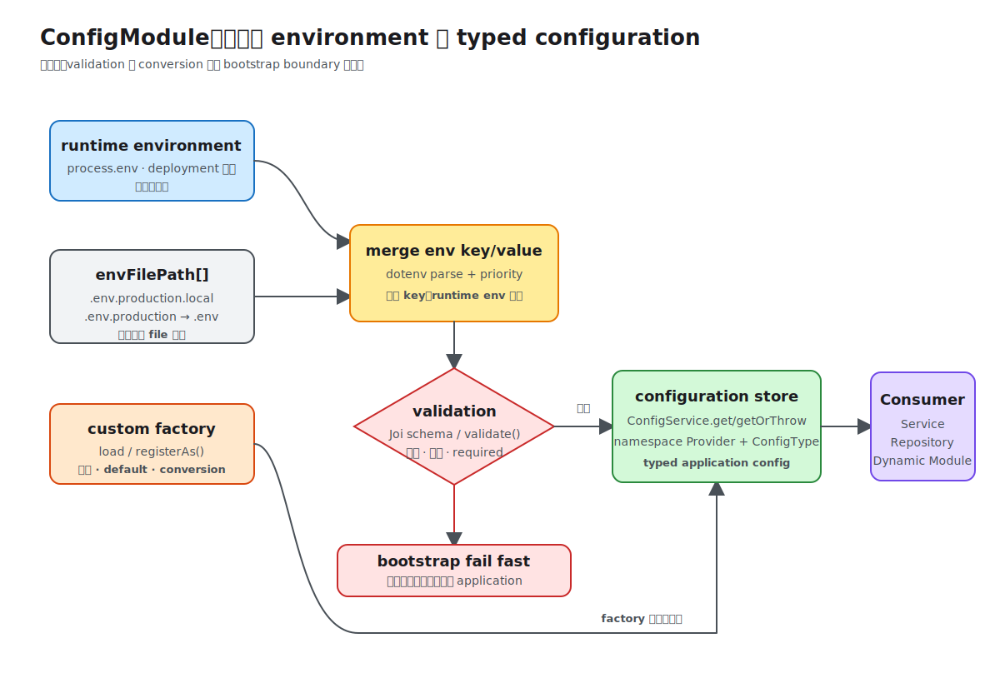

# ConfigModule

`ConfigModule` 来自 `@nestjs/config`，负责把 runtime environment、`.env` file 和 custom configuration factory 统一为可注入的 `ConfigService`。它基于 `dotenv` 解析 `.env`，但增加了 Nest Module integration、validation、namespace、partial registration 和类型安全读取。

配置的核心边界是：部署环境提供原始值，application bootstrap 负责校验和转换，业务 Provider 只消费已经明确类型和语义的配置。



## 安装与最小配置

```bash
npm install @nestjs/config
```

```ts
import { Module } from '@nestjs/common';
import { ConfigModule } from '@nestjs/config';

@Module({
  imports: [
    ConfigModule.forRoot({
      isGlobal: true,
    }),
  ],
})
export class AppModule {}
```

默认行为：

- 从 application root 读取 `.env`；
- 把 `.env` 与 `process.env` 合并；
- 相同 key 冲突时，runtime `process.env` 优先；
- 注册 `ConfigService` Provider；
- `isGlobal: true` 后，其他 Module 无需重复 import `ConfigModule`。

`.env` 只适合本地开发和测试便利。production secret 应由 deployment platform、Secret Manager、Kubernetes Secret 等注入 runtime environment，不提交真实 `.env`。

## `ConfigModule.forRoot()`

`forRoot(options?)` 是 Dynamic Module registration，通常只在 root Module 调用一次。

### 常用 options

| option | 类型/示例 | 作用 |
| --- | --- | --- |
| `isGlobal` | `true` | 将 ConfigModule 注册为 global Module |
| `envFilePath` | `string \| string[]` | 指定一个或多个 `.env` path |
| `ignoreEnvFile` | `true` | 不读取 `.env`，只使用 runtime environment/custom config |
| `load` | `[appConfig, dbConfig]` | 加载 custom configuration factory |
| `cache` | `true` | cache `process.env` lookup，提高频繁读取性能 |
| `expandVariables` | `true` | 展开 `.env` 中的 `${OTHER_VAR}` reference |
| `validationSchema` | `Joi.object(...)` | 使用 Joi 校验原始 environment variables |
| `validationOptions` | Joi options | 控制 unknown key、abort early 等 Joi 行为 |
| `validate` | `(config) => validatedConfig` | 使用 custom function 校验、转换配置 |
| `skipProcessEnv` | `true` | `ConfigService#get` 不再从 `process.env` fallback |

### 多个 `.env` file 与优先级

```ts
ConfigModule.forRoot({
  envFilePath: [
    `.env.${process.env.NODE_ENV}.local`,
    `.env.${process.env.NODE_ENV}`,
    '.env.local',
    '.env',
  ],
});
```

在 `envFilePath` array 中，先出现的 file 优先。无论 file 顺序如何，已经存在的 runtime environment variable 优先于 `.env` 中的同名 key。

如果 production 完全依赖 deployment environment，使用：

```ts
ConfigModule.forRoot({
  isGlobal: true,
  ignoreEnvFile: true,
});
```

`ignoreEnvFile` 只是不读取 file，不会禁用 `process.env`。`skipProcessEnv` 则影响 `ConfigService` 的读取来源，两者解决的问题不同。

### Variable expansion

```dotenv
APP_HOST=localhost
APP_URL=http://${APP_HOST}:3000
```

```ts
ConfigModule.forRoot({
  expandVariables: true,
});
```

启用后 `APP_URL` 会展开其他 environment variable。避免循环 reference，也不要依赖复杂 shell expression；`.env` 不是 scripting language。

## 使用 `ConfigService`

```ts
import { Injectable } from '@nestjs/common';
import { ConfigService } from '@nestjs/config';

@Injectable()
export class ServerOptions {
  constructor(private readonly config: ConfigService) {}

  get port(): number {
    return this.config.get<number>('PORT', 3000);
  }
}
```

### `get()`

```ts
config.get<string>('DATABASE_HOST');
config.get<number>('PORT', 3000);
config.get<DatabaseConfig>('database');
config.get<string>('database.host');
```

- 第一个参数是 key，支持 nested dot notation；
- 第二个参数可以是 default value；
- generic 只告诉 TypeScript 期望类型，不会在 runtime 把 string 自动转换成 number；
- key 不存在且没有 default value 时返回 `undefined`。

下面的写法并不会完成 runtime conversion：

```ts
const port = config.get<number>('PORT');
```

`.env` 中的 `PORT=3000` 原始值仍是 string。应在 validation/custom factory 阶段完成转换。

### `getOrThrow()`

必要配置优先使用：

```ts
const databaseUrl = config.getOrThrow<string>('DATABASE_URL');
```

key 缺失时立即抛出 Exception，比后续用 `undefined` 建立连接更容易定位问题。若值需要格式、范围或组合校验，仍应在 bootstrap validation 阶段处理，而不是只依赖存在性检查。

### 使用 generic 与 `infer`

```ts
interface EnvironmentVariables {
  PORT: number;
  DATABASE_URL: string;
  database: {
    poolSize: number;
  };
}

@Injectable()
export class AppSettings {
  constructor(
    private readonly config: ConfigService<EnvironmentVariables>,
  ) {}

  get port(): number {
    return this.config.get('PORT', { infer: true }) ?? 3000;
  }

  get poolSize(): number {
    return this.config.get('database.poolSize', { infer: true }) ?? 10;
  }
}
```

`{ infer: true }` 让 TypeScript 从 `ConfigService<T>` 推断 key 和 value type，也支持 nested dot path。它提高 compile-time safety，但不替代 runtime validation。

当 application 已保证所有 key 都存在时，可使用第二个 generic：

```ts
ConfigService<EnvironmentVariables, true>
```

这会从 `get()` return type 中移除 `undefined`。只有 validation 确实保证完整配置时才使用，否则只是隐藏风险。

## Environment validation

application 应在 bootstrap 阶段 fail fast，而不是第一次访问数据库时才发现配置错误。

### 使用 Joi schema

```ts
import * as Joi from 'joi';

ConfigModule.forRoot({
  validationSchema: Joi.object({
    NODE_ENV: Joi.string()
      .valid('development', 'test', 'production')
      .default('development'),
    PORT: Joi.number().port().default(3000),
    DATABASE_URL: Joi.string().uri().required(),
  }),
  validationOptions: {
    abortEarly: false,
  },
});
```

`validationSchema` 需要额外安装 `joi`。Joi schema 中未标记 `required()` 的 key 默认是 optional；`abortEarly: false` 可以一次报告多个配置错误。

### 使用 custom `validate()`

不希望引入 Joi，或需要项目特定转换时，使用 custom function：

```ts
interface ValidatedEnvironment {
  NODE_ENV: 'development' | 'test' | 'production';
  PORT: number;
  DATABASE_URL: string;
}

function validateEnvironment(
  raw: Record<string, unknown>,
): ValidatedEnvironment {
  const port = Number(raw.PORT ?? 3000);
  const databaseUrl = raw.DATABASE_URL;

  if (!Number.isInteger(port) || port < 1 || port > 65535) {
    throw new Error('PORT must be an integer between 1 and 65535');
  }

  if (typeof databaseUrl !== 'string' || databaseUrl.length === 0) {
    throw new Error('DATABASE_URL is required');
  }

  const nodeEnv = raw.NODE_ENV ?? 'development';
  if (!['development', 'test', 'production'].includes(String(nodeEnv))) {
    throw new Error('NODE_ENV is invalid');
  }

  return {
    NODE_ENV: nodeEnv as ValidatedEnvironment['NODE_ENV'],
    PORT: port,
    DATABASE_URL: databaseUrl,
  };
}

ConfigModule.forRoot({
  validate: validateEnvironment,
});
```

`validate(rawConfig)` 接收已合并的 environment key/value，返回值成为经过验证的配置。它适合统一完成 default、parsing 和 validation。

`validationSchema`/`validate` 主要校验 environment variables。通过 `load` 加载的 custom configuration factory 不会自动被 `validationSchema` 校验；需要在 factory 内自行验证。

## Custom configuration factory

复杂配置不要让业务代码到处读取 `process.env`。集中在 factory 中完成命名、转换和 default：

```ts
// config/app.config.ts
export default () => ({
  app: {
    port: Number(process.env.PORT ?? 3000),
    environment: process.env.NODE_ENV ?? 'development',
  },
  database: {
    url: process.env.DATABASE_URL,
    poolSize: Number(process.env.DATABASE_POOL_SIZE ?? 10),
  },
});
```

```ts
ConfigModule.forRoot({
  load: [appConfig],
});
```

`load` 接收 factory array，factory 返回的 plain object 会加入配置 store。此后使用 `app.port`、`database.url` 等语义化 key，而不是在所有 Service 中散落 environment variable name。

若 factory 读取 YAML/JSON asset，Nest CLI 不会自动复制任意非 TypeScript file；需要在 `nest-cli.json` 的 `compilerOptions.assets` 中声明，并对解析结果自行校验。

## Namespaced configuration：`registerAs()`

`registerAs(namespace, factory)` 创建具有稳定 namespace、token 和类型信息的 configuration factory：

```ts
// config/database.config.ts
import { registerAs } from '@nestjs/config';

export default registerAs('database', () => ({
  url: process.env.DATABASE_URL,
  poolSize: Number(process.env.DATABASE_POOL_SIZE ?? 10),
}));
```

root registration：

```ts
ConfigModule.forRoot({
  load: [databaseConfig],
});
```

可以通过 dot notation 读取：

```ts
config.getOrThrow<string>('database.url');
```

更类型安全的方式是直接注入 namespace Provider：

```ts
import { Inject, Injectable } from '@nestjs/common';
import { ConfigType } from '@nestjs/config';

@Injectable()
export class DatabaseConnection {
  constructor(
    @Inject(databaseConfig.KEY)
    private readonly options: ConfigType<typeof databaseConfig>,
  ) {}
}
```

- `databaseConfig.KEY` 是 `registerAs()` 生成的 injection token；
- `ConfigType<typeof databaseConfig>` 推断 factory return type；
- consumer 不需要手写 string key，也不会丢失 nested type。

## Partial registration：`forFeature()`

feature-specific config 可以在所属 Module 注册：

```ts
@Module({
  imports: [ConfigModule.forFeature(databaseConfig)],
  providers: [DatabaseConnection],
  exports: [DatabaseConnection],
})
export class DatabaseModule {}
```

`forFeature(configuration)` 只注册对应 namespaced configuration，适合大型 application 避免把全部 feature config 堆到 root Module。

需要注意 Module initialization order：如果其他 Module 在 constructor 中读取 partial registration 的配置，配置可能尚未初始化。跨 Module 读取时优先直接注入对应 namespace Provider；确实依赖初始化顺序时，在 `onModuleInit()` 中读取。

## 传给其他 Dynamic Module：`.asProvider()`

namespaced configuration 可以转换成 Async Options Provider：

```ts
@Module({
  imports: [
    TypeOrmModule.forRootAsync(databaseConfig.asProvider()),
  ],
})
export class DatabaseModule {}
```

`.asProvider()` 近似生成：

```ts
{
  imports: [ConfigModule.forFeature(databaseConfig)],
  inject: [databaseConfig.KEY],
  useFactory: (
    options: ConfigType<typeof databaseConfig>,
  ) => options,
}
```

这适合将同一个 typed namespace 直接传入 `forRootAsync()`/`registerAsync()`，减少重复的 imports/inject/useFactory boilerplate。

## 在 bootstrap 与初始化阶段使用

### `main.ts` 中读取

```ts
const app = await NestFactory.create(AppModule);
const config = app.get(ConfigService);
const port = config.getOrThrow<number>('PORT');

await app.listen(port);
```

如果配置在 Nest bootstrap 之前就必须存在，例如传给 `NestFactory.createMicroservice()`，可以使用 Nest CLI/Node 支持的 `--env-file` 先加载 environment file，而不是等待 `ConfigModule` 初始化。

### `ConfigModule.envVariablesLoaded`

```ts
await ConfigModule.envVariablesLoaded;
```

这是一个 Promise，在 environment variables 加载完成后 resolve。只有非 Provider 的 bootstrap glue code 确实需要等待加载时才使用；普通 Provider 应通过 `ConfigService` 或 typed namespace injection 读取。

### Conditional Module

```ts
import { ConditionalModule } from '@nestjs/config';

@Module({
  imports: [
    ConfigModule.forRoot(),
    ConditionalModule.registerWhen(
      DebugModule,
      'DEBUG_MODE',
    ),
  ],
})
export class AppModule {}
```

`ConditionalModule.registerWhen(module, condition, options?)` 等待 environment variables 加载，再按 key 或 predicate 决定是否 import Module。它适合可选 debug/observability integration，不适合用配置隐藏核心业务 Module。

## Cache 与读取策略

`cache: true` cache 对 `process.env` 的 lookup：

```ts
ConfigModule.forRoot({
  cache: true,
});
```

配置通常应在 bootstrap 后保持稳定。不要在运行中修改 `process.env` 并期待所有已注入 Provider 自动同步；需要动态配置时应使用专门的 configuration service、feature flag system 或 refresh mechanism。

## 工程边界与安全

- `.env.example` 只放 key 和安全 placeholder，不放真实 secret。
- 必要配置在 bootstrap validation 阶段 fail fast。
- raw environment variable 是 string；在 config boundary 明确 parsing 和 validation。
- feature code 注入 typed namespace 或封装后的 Options Provider，不到处读取 `process.env`。
- `isGlobal: true` 适合 application-level config，但 feature library 仍应声明明确的 configuration contract。
- 不把整个 `ConfigService` 无边界传进领域层；注入该组件真正需要的 typed options。
- 不在日志、Exception response、Swagger example 中输出 password、token、private key 或完整 connection string。
- secret rotation 和动态 feature flag 不是 `.env` file 的职责。

官方资料：[Configuration](https://docs.nestjs.com/techniques/configuration)。本仓库示例：[第 6 课 ConfigModule](../06-crud-pagination-errors-config/index.md)。
