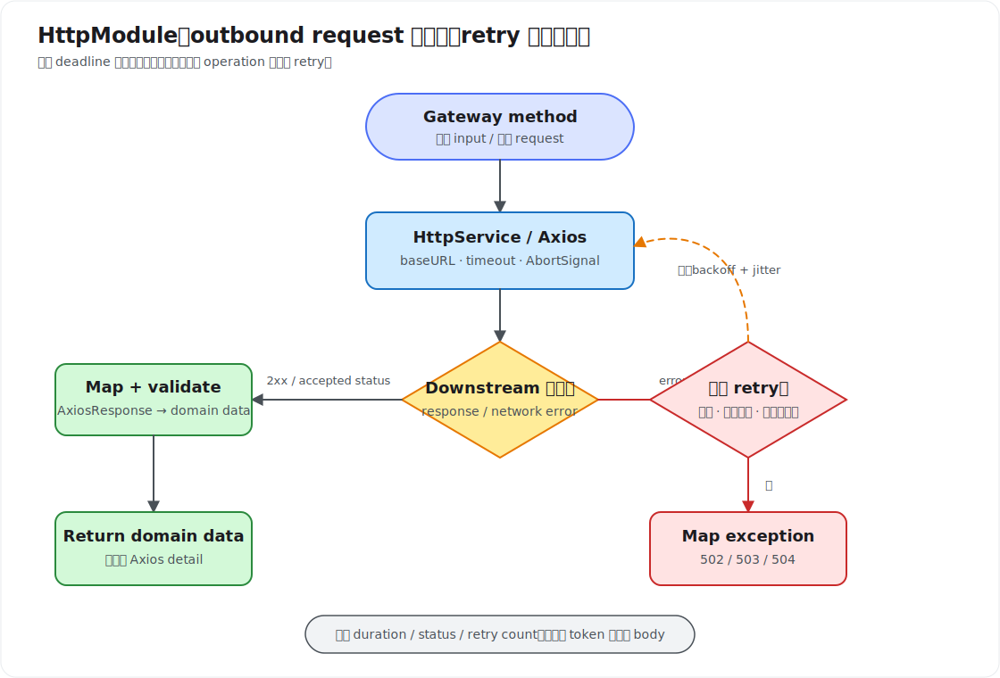

# HttpModule

`HttpModule` 用于让 Nest application 主动调用外部 HTTP service。它来自 `@nestjs/axios`，内部创建 Axios instance，并导出可注入的 `HttpService`。`HttpService` 的 request method 返回 `Observable<AxiosResponse<T>>`，因此既可以保留 RxJS pipeline，也可以用 `firstValueFrom()` 转成 `Promise`。

不要把它与 Nest application 接收请求时使用的 HTTP adapter 混淆：

| 能力 | 方向 | 主要对象 |
| --- | --- | --- |
| Controller / HTTP adapter | inbound request | client 调用当前 Nest application |
| `HttpModule` / `HttpService` | outbound request | 当前 application 调用 downstream service |

Nest 官方也明确说明，可以直接使用 `undici`、`got` 等通用 Node.js HTTP client；`HttpModule` 的价值是 Axios instance 能通过 Module 配置并使用 Dependency Injection (DI)。

## 安装与最小注册

```bash
npm install @nestjs/axios axios
```

```ts
// users/users.module.ts
import { HttpModule } from '@nestjs/axios';
import { Module } from '@nestjs/common';
import { UsersGateway } from './users.gateway';

@Module({
  imports: [HttpModule],
  providers: [UsersGateway],
  exports: [UsersGateway],
})
export class UsersModule {}
```

`HttpModule` 注册并导出 `HttpService` Provider。只有导入该 Module 的 Module scope 才能注入 `HttpService`；不要因为多个 feature 都会发 HTTP request，就把它随意做成 global Module。不同 downstream service 往往需要不同 `baseURL`、credential、timeout 和故障策略，分开配置边界更清楚。

## 注入并发送 request

```ts
import { HttpService } from '@nestjs/axios';
import { Injectable } from '@nestjs/common';
import type { AxiosResponse } from 'axios';
import type { Observable } from 'rxjs';
import { map } from 'rxjs';

interface RemoteUser {
  id: string;
  displayName: string;
}

@Injectable()
export class UsersGateway {
  constructor(private readonly http: HttpService) {}

  findOne(id: string): Observable<RemoteUser> {
    return this.http
      .get<RemoteUser>(`/users/${encodeURIComponent(id)}`)
      .pipe(map((response: AxiosResponse<RemoteUser>) => response.data));
  }
}
```

常用 method 与 Axios 相同：

```ts
http.get<T>(url, config);
http.delete<T>(url, config);
http.post<T>(url, body, config);
http.put<T>(url, body, config);
http.patch<T>(url, body, config);
http.request<T>(config);
```

generic `T` 只描述 TypeScript 期望的 response body 类型，不会执行 runtime validation。downstream response 属于外部输入；边界严格时仍应使用 schema library 或自定义 parser 校验，不能因为写了 `get<RemoteUser>()` 就相信数据一定正确。

## `AxiosResponse<T>` 包含什么

`HttpService` 产生的不是 body 本身，而是完整 Axios response：

```ts
interface AxiosResponse<T> {
  data: T;
  status: number;
  statusText: string;
  headers: unknown;
  config: unknown;
  request?: unknown;
}
```

业务通常只需要 `data`，所以在 Gateway / client Provider 中完成 mapping，不要让 `AxiosResponse` 泄漏到 Controller 或 domain Service。确实需要 status/header 时再保留完整 response。

## Observable 还是 Promise

保留 Observable 适合继续组合 `map()`、`catchError()`、`timeout()`、`retry()` 等 operator：

```ts
findOne(id: string): Observable<RemoteUser> {
  return this.http.get<RemoteUser>(`/users/${id}`).pipe(
    map(({ data }) => data),
  );
}
```

多数 Service 使用 `async/await` 时，可用官方示例中的 `firstValueFrom()`：

```ts
import { firstValueFrom, map } from 'rxjs';

async findOne(id: string): Promise<RemoteUser> {
  return firstValueFrom(
    this.http
      .get<RemoteUser>(`/users/${encodeURIComponent(id)}`)
      .pipe(map(({ data }) => data)),
  );
}
```

一次 HTTP request 通常只产生一个 response，因此使用 `firstValueFrom()`。`lastValueFrom()` 会等待 Observable complete 后取最后一个 value，更适合可能产生多个 value 的有限 Observable；对普通 `HttpService` request 没有额外收益。Observable、Promise 与 cancellation 不是同一概念：要真正取消底层 Axios request，应把 `AbortSignal` 传给 request config。

## 同步配置 `register()`

```ts
@Module({
  imports: [
    HttpModule.register({
      baseURL: 'https://users.example.com/v1',
      timeout: 3_000,
      maxRedirects: 0,
      maxContentLength: 2 * 1024 * 1024,
      maxBodyLength: 1 * 1024 * 1024,
    }),
  ],
  providers: [UsersGateway],
})
export class UsersModule {}
```

`register(options)` 的参数会传给底层 Axios instance。常用配置：

| 参数 | 含义与边界 |
| --- | --- |
| `baseURL` | relative URL 的统一前缀；应使用固定且可信的 downstream origin |
| `timeout` | Axios 等待 request 完成的上限，单位为毫秒；默认 `0` 表示不主动超时，不适合 production |
| `headers` | instance 默认 header；不要把 request-specific credential 写成可变的全局状态 |
| `maxRedirects` | Node.js 环境允许的 redirect 次数；调用固定 API 时通常设为 `0` 或较小值 |
| `maxContentLength` | 限制 response body，降低异常或恶意 response 耗尽内存的风险 |
| `maxBodyLength` | 限制 outbound request body |
| `validateStatus` | 决定哪些 HTTP status 被当作成功；修改默认行为后必须同步调整错误映射 |
| `signal` | request-level `AbortSignal`，用于主动取消底层 request |

`HttpModule.register()` 是 Dynamic Module：每个 importing Module 可以创建具有不同配置的 `HttpService`。它不像通常只配置一次的 `forRoot()`，不要假设一个 Module 的配置会自动成为整个 application 的唯一配置。

## 异步配置 `registerAsync()`

production 配置通常来自已校验的 `ConfigService`：

```ts
import { HttpModule } from '@nestjs/axios';
import { Module } from '@nestjs/common';
import { ConfigModule, ConfigService } from '@nestjs/config';

@Module({
  imports: [
    HttpModule.registerAsync({
      imports: [ConfigModule],
      inject: [ConfigService],
      useFactory: (config: ConfigService) => ({
        baseURL: config.getOrThrow<string>('USERS_API_URL'),
        timeout: config.getOrThrow<number>('USERS_API_TIMEOUT_MS'),
        maxRedirects: 0,
        maxContentLength: 2 * 1024 * 1024,
      }),
    }),
  ],
  providers: [UsersGateway],
  exports: [UsersGateway],
})
export class UsersModule {}
```

`registerAsync()` 支持：

- `useFactory`：直接返回 options，可通过 `inject` 使用其他 Provider；最常见。
- `useClass`：实例化实现 `HttpModuleOptionsFactory` 的 class，并调用其 `createHttpOptions()`。
- `useExisting`：复用已存在的 `HttpModuleOptionsFactory` Provider，避免创建新 instance。
- `extraProviders`：向 Dynamic Module 增加仅配置过程需要的额外 Provider。

URL、timeout 等 configuration 必须在 application startup 时完成 validation 与类型转换。environment variable 原始值是 string，`getOrThrow<number>()` 的 generic 本身不会把 string 转成 number。

## Timeout、retry 与错误映射

完整 outbound flow 如下：



Axios 的 `timeout` 负责限制实际 HTTP request；RxJS `timeout()` 负责限制 Observable pipeline。通常优先配置 Axios timeout，因为它更贴近底层 operation。二者同时使用时要明确哪个先触发以及如何取消底层 request，不能把 Observable timeout 自动理解为网络连接一定停止。

```ts
import { HttpService } from '@nestjs/axios';
import {
  BadGatewayException,
  GatewayTimeoutException,
  Injectable,
  ServiceUnavailableException,
} from '@nestjs/common';
import { AxiosError } from 'axios';
import { catchError, firstValueFrom, map, retry, throwError, timer } from 'rxjs';

@Injectable()
export class UsersGateway {
  constructor(private readonly http: HttpService) {}

  async findOne(id: string): Promise<RemoteUser> {
    return firstValueFrom(
      this.http.get<RemoteUser>(`/users/${encodeURIComponent(id)}`).pipe(
        retry({
          count: 2,
          delay: (error: unknown, retryCount: number) => {
            if (!this.isRetryable(error)) return throwError(() => error);
            return timer(100 * 2 ** (retryCount - 1));
          },
        }),
        map(({ data }) => data),
        catchError((error: unknown) => {
          if (error instanceof AxiosError && error.code === 'ECONNABORTED') {
            throw new GatewayTimeoutException('Users API timed out');
          }
          if (error instanceof AxiosError && error.response) {
            throw new BadGatewayException('Users API rejected the request');
          }
          throw new ServiceUnavailableException('Users API is unavailable');
        }),
      ),
    );
  }

  private isRetryable(error: unknown): boolean {
    return (
      error instanceof AxiosError &&
      (!error.response || error.response.status >= 500)
    );
  }
}
```

retry 不是“失败就再试”：

- 通常只自动 retry idempotent operation，如 GET/HEAD，或带有可靠 idempotency key 的写操作。
- retry network error、`429`、部分 `5xx` 前应遵守 `Retry-After`，使用 exponential backoff 和 jitter。
- 不 retry validation error、authentication error 和确定性的 `4xx`。
- retry 会放大 downstream pressure；必须限制次数，并结合 circuit breaker、bulkhead 和整体 deadline。
- 对外只返回稳定的 application exception，不泄漏 upstream URL、credential、response body 或 Axios config。

## Header、authentication 与 tracing

request-specific metadata 通过 config 传递：

```ts
return this.http.post<CreateRemoteNoteResponse>(
  '/notes',
  payload,
  {
    headers: {
      authorization: `Bearer ${accessToken}`,
      'x-request-id': requestId,
    },
  },
);
```

- service credential 应由 secret manager / configuration Provider 提供，不能提交到源码。
- 不要无条件把 inbound `authorization`、cookie 或全部 header 转发给 downstream，避免 credential confused deputy 和隐私泄漏。
- correlation ID、trace context 可按 observability 规范传播；日志记录 method、service name、status、duration 和 retry count，但不记录 token 与敏感 body。
- 动态 URL 只能使用允许的 origin，并对 path parameter 编码。若用户可控制完整 URL，会形成 SSRF 风险；需要 allowlist，并阻止访问 loopback、link-local 和内部 metadata endpoint。

## `axiosRef`：直接使用 Axios Promise API

官方提供 `HttpService#axiosRef` 访问底层 `AxiosInstance`：

```ts
async findOne(id: string): Promise<RemoteUser> {
  const response = await this.http.axiosRef.get<RemoteUser>(
    `/users/${encodeURIComponent(id)}`,
  );
  return response.data;
}
```

适合以下场景：

- application 统一使用 Promise，不需要 RxJS operator；
- 需要调用 Axios instance 的特殊 API；
- 需要安装 Axios request/response interceptor。

不要把 Axios interceptor 与 Nest Interceptor 混淆。Axios interceptor 只观察该 Axios instance 的 outbound request/response；Nest Interceptor 观察进入当前 application 的 Handler lifecycle。安装 Axios interceptor 时要在 Provider lifecycle 中只注册一次，并在 hot reload/test teardown 时避免重复注册。

## Gateway / client Provider 边界

不要让所有 Service 直接注入 `HttpService`。为每个 downstream service 建立专用 Gateway/client Provider：

```text
NotesService
  → UsersGateway.findOne(userId)
    → HttpService.get(...)
      → Users API
```

这样可以集中处理：

- base URL、authentication 和 header；
- remote DTO validation 与 domain mapping；
- timeout、retry、circuit breaker 与 concurrency limit；
- upstream error 到 application exception 的映射；
- metrics、tracing 和 test stub。

Controller 不应返回下游的 `AxiosResponse`，domain Service 也不应依赖 Axios-specific type。

## Testing

unit test 可以 mock `HttpService`，但需要返回 Observable：

```ts
const httpService = {
  get: jest.fn().mockReturnValue(
    of({ data: { id: 'u-1', displayName: 'Ada' } }),
  ),
};
```

这类 test 只能验证 mapping 和错误策略。timeout、socket reset、redirect、response limit、retry 次数和 cancellation 应使用受控 HTTP test server 或 network mock 做 integration test；不要访问真实第三方 service。本仓库按规则只在第 13 课保留测试代码。

## 常见错误

- 未设置 timeout，让 request 无限等待并占用 socket。
- 在每次 method 调用中创建新的 Axios instance，失去统一配置和 connection reuse。
- 把 `Observable<AxiosResponse<T>>` 直接返回给 Controller，泄漏 downstream transport detail。
- 对所有 method 和 status 无条件 retry，造成重复写入或 retry storm。
- 只写 TypeScript generic，不校验不可信 response body。
- 接受用户提供的完整 URL，形成 SSRF。
- 记录完整 Axios error，意外写入 authorization header 或 response secret。
- 把 Nest Interceptor 当成 Axios interceptor，混淆 inbound 与 outbound lifecycle。

## 官方资料

- [NestJS HTTP module](https://docs.nestjs.com/techniques/http-module)：安装、`HttpService`、`register()`、`registerAsync()`、Observable 与 `axiosRef`。
- [NestJS Dynamic modules](https://docs.nestjs.com/fundamentals/dynamic-modules)：`register()` 与 `forRoot()` 的配置语义。
- [Axios Request Config](https://axios-http.com/docs/req_config)：timeout、header、redirect、response limit 与 `AbortSignal`。
- [Axios Handling Errors](https://axios-http.com/docs/handling_errors)：`AxiosError`、`response`、`request` 与 `validateStatus`。
- [Axios Cancellation](https://axios-http.com/docs/cancellation)：使用 `AbortController` 取消 request。
- [RxJS firstValueFrom](https://rxjs.dev/api/index/function/firstValueFrom)：把有限 Observable 转为 Promise。

RxJS 的完整心智模型见 [Interceptor](Interceptor.md#为什么-interceptor-使用-rxjs)，configuration 组织方式见 [ConfigModule](ConfigModule.md)。
