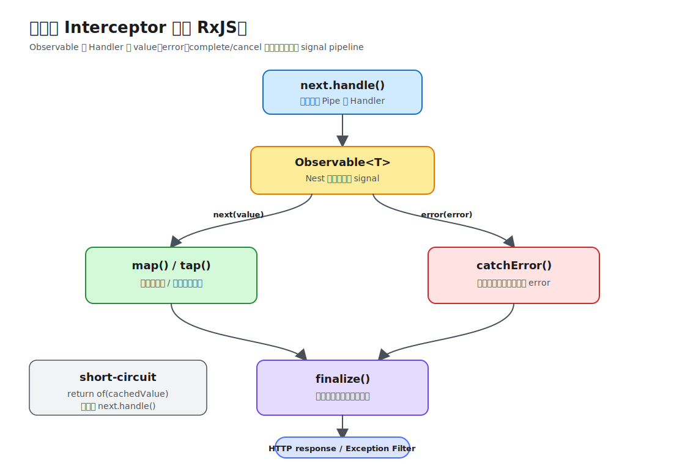

# Interceptor

Interceptor 可以在 Handler 调用前执行逻辑，并通过 `next.handle()` 返回的 Observable 观察或改写结果、错误和完成事件。常见用途包括耗时日志、响应映射、缓存和超时控制。

## 最小实现

```ts
import {
  CallHandler,
  ExecutionContext,
  Injectable,
  Logger,
  NestInterceptor,
} from '@nestjs/common';
import type { Request } from 'express';
import type { Observable } from 'rxjs';
import { finalize } from 'rxjs';

@Injectable()
export class RequestLoggingInterceptor implements NestInterceptor {
  private readonly logger = new Logger(RequestLoggingInterceptor.name);

  intercept(context: ExecutionContext, next: CallHandler): Observable<unknown> {
    const request = context.switchToHttp().getRequest<Request>();
    const startedAt = Date.now();

    return next.handle().pipe(
      finalize(() => {
        this.logger.log(
          `${request.method} ${request.originalUrl} ${Date.now() - startedAt}ms`,
        );
      }),
    );
  }
}
```

局部绑定示例：

```ts
@UseInterceptors(RequestLoggingInterceptor)
@Get()
findAll(): Promise<Note[]> {
  return this.notesService.findAll();
}
```

## `@UseInterceptors()`

`@UseInterceptors(...interceptors)` 把 Interceptor 绑定到 Controller class 或 Handler method：

- 参数可以是一个或多个 Interceptor class/instance；传 class 时 Nest 负责实例化并支持 Dependency Injection；
- 多个 Interceptor 按声明顺序进入调用链，响应阶段按相反顺序退出；
- 放在 Controller class 上时覆盖全部 Handler，放在 method 上时只覆盖当前 Handler；
- 同一个 Interceptor 若又通过 `APP_INTERCEPTOR` 注册为 global Interceptor，会执行多次。

需要 Dependency Injection (DI) 的 global Interceptor 使用 `APP_INTERCEPTOR`：

```ts
import { APP_INTERCEPTOR } from '@nestjs/core';

@Module({
  providers: [
    { provide: APP_INTERCEPTOR, useClass: RequestLoggingInterceptor },
  ],
})
export class AppModule {}
```

`APP_INTERCEPTOR` 是 global Interceptor 的 framework token，不是 Decorator。示例中的 `@Injectable()`、`@Module()` 和 `@Get()` 属于其他主题，本章不展开。

## 为什么 Interceptor 使用 RxJS

Controller/Service 并不需要全部使用 RxJS。Handler 可以返回同步值、`Promise` 或 `Observable`，Nest 会把 Handler 的最终调用结果统一成 `next.handle()` 返回的 `Observable<T>`，让 Interceptor 使用同一套方式处理它。



```ts
const result$ = next.handle();
```

变量名末尾的 `$` 是常见约定，表示它是 Observable。这里的 Observable 可以理解为“Handler 调用产生的结果 stream”，它具有三种 signal：

```text
next(value)      Handler 成功产生结果
error(error)     Handler、Pipe 或下游链路失败
complete()       stream 正常结束
```

HTTP Handler 通常只产生一个 value，因此它看起来很像 Promise。但 Observable 除了成功值，还把 error、complete 和 unsubscribe/cancellation 纳入同一模型，并允许用 operator 组合处理规则。这正好对应 Interceptor 需要观察或修改“调用前后”的能力。

### `next.handle()` 是调用边界

`intercept()` 中，调用 `next.handle()` 之前的普通代码属于进入阶段：

```ts
intercept(context: ExecutionContext, next: CallHandler): Observable<unknown> {
  const startedAt = Date.now(); // Handler 之前

  return next.handle().pipe(
    finalize(() => {
      // Handler 成功、失败或 stream 被取消之后
      console.log(Date.now() - startedAt);
    }),
  );
}
```

不调用 `next.handle()`，后续 Pipe 和 Handler 就不会执行。Interceptor 可以返回自己的 Observable，直接短路调用链：

```ts
if (cachedValue !== undefined) {
  return of(cachedValue);
}

return next.handle();
```

这就是 cache hit 可以绕过 Handler 的原因。

### `pipe()` 和 operator 做什么

`pipe(...operators)` 把多个 operator 组合成一条处理 pipeline。它不是数组的 `pipe`，也不是 Node.js stream；Nest 最终订阅 Observable 时，value/error/complete signal 会依次经过这些 operator。

```ts
return next.handle().pipe(
  map((value) => ({ data: value })),
  catchError((error: unknown) => {
    return throwError(() => this.mapError(error));
  }),
  finalize(() => this.metrics.finish()),
);
```

这段代码表达三条路径：

- 成功 value 经过 `map()`，变成 `{ data: value }`；
- error 跳过 `map()`，进入 `catchError()`，被重新映射或抛出；
- 无论成功、失败或取消，最后都执行 `finalize()`。

### 为什么不只使用 `await`

`await` 很适合在 Service 内描述顺序异步流程，但 Interceptor 需要组合的是整个 Handler lifecycle。只使用 `try/finally` 很难同时表达 response mapping、error channel、timeout、short-circuit Observable 和 stream cancellation。

RxJS operator 可以保持 pipeline 声明式并可组合：

```text
Handler Observable
  → timeout
  → map response
  → catch/map error
  → finalize metrics
```

Nest 允许 `intercept()` 本身是 `async` method，但只要需要处理 `next.handle()` 之后的结果，仍然通常会回到 Observable pipeline。

### Observable 不等于自动取消底层工作

unsubscribe 可以停止 Observable 后续通知，但不一定能取消已经启动的数据库查询、HTTP request 或普通 Promise。若需要真正取消底层操作，相关 library 必须支持 `AbortSignal`、unsubscribe 或自己的 cancellation API，并由 Interceptor/Service 显式接入。

因此 `timeout()` 表示 response stream 超时，不应自动理解成数据库或第三方请求一定已经停止。

## Observable 操作符怎样选

- `map()`：改写成功返回值；
- `tap()`：观察成功路径但不改写值；
- `catchError()`：观察或映射错误，之后必须重新抛出或返回明确替代值；
- `finalize()`：成功、错误或取消时都执行，适合释放资源和记录耗时；
- `timeout()`：为处理链设置超时，并配合错误映射。

还会经常看到三个创建函数：

- `of(value)`：创建立即产生一个 value 的 Observable，常用于 cache short-circuit；
- `throwError(() => error)`：创建 error Observable，常用于 `catchError()` 中重新抛出；
- `from(promise)`：把 Promise/iterable 等转换成 Observable；Interceptor 通常不需要手动转换 Handler 返回值，因为 Nest 已经处理 `next.handle()`。

`next.handle()` 才会进入后续 Pipe 和 Handler。忘记返回 Observable，或在 `catchError()` 中静默吞掉异常，会改变请求语义。

## 顺序和边界

多个 Interceptor 在进入阶段按 global、Controller、route 顺序执行，返回阶段按相反方向展开。Guard 拒绝或路由未匹配可能发生在 Interceptor 之前；Pipe 错误发生在 Interceptor 前置逻辑之后，并进入其 Observable 链。

不要把 Interceptor 理解成“包裹处理器”的中文名称；`Interceptor` 是 NestJS 的正式术语，调用前后观察只是其工作模型。

官方资料：[Interceptors](https://docs.nestjs.com/interceptors)、[RxJS Observable](https://rxjs.dev/guide/observable)、[RxJS Operators](https://rxjs.dev/guide/operators)、[Request lifecycle](https://docs.nestjs.com/faq/request-lifecycle)。本仓库示例：[第 3 课请求日志 Interceptor](../03-request-lifecycle/index.md#拦截器interceptor观察调用前后)。
