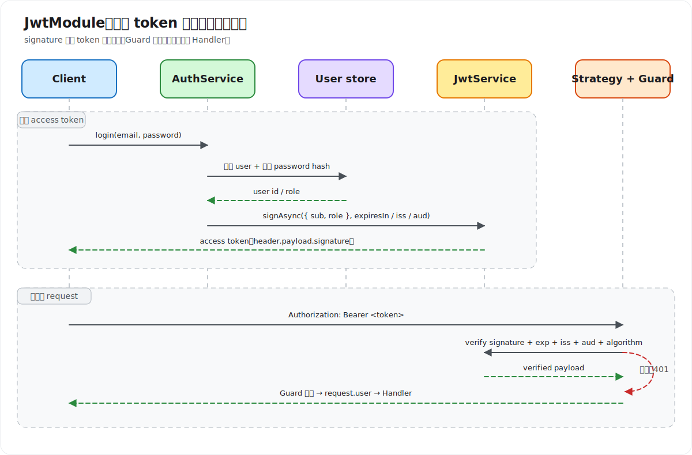

# JwtModule

`JwtModule` 来自 `@nestjs/jwt`，负责把 JWT configuration 注册到 Nest application graph，并导出可注入的 `JwtService`。`JwtService` 基于 `jsonwebtoken` 提供 token 的 sign、verify 和 decode。

`JwtModule` 不是完整 authentication framework。它不会验证 password、提取 Bearer token、自动保护 route、查询 user，也不会实现 refresh token 或 revoke。常见职责边界是：

| 能力 | 负责对象 |
| --- | --- |
| `AuthService` | credential 校验、选择 claim、签发 token |
| `JwtModule` / `JwtService` | JWT sign 与 verify |
| Passport `JwtStrategy` | 从 request 提取 token、验证并生成 `request.user` |
| Guard | 决定 route 是否需要 authentication |
| authorization policy | 根据 role/permission/resource 判断是否允许操作 |

JWT 是签名后的 claim container，不是加密 session。header 和 payload 可以被任何拿到 token 的人解码；signature 用于检测篡改，不提供 confidentiality。

## 安装与最小配置

```bash
npm install @nestjs/jwt
```

```ts
import { Module } from '@nestjs/common';
import { JwtModule } from '@nestjs/jwt';
import { AuthService } from './auth.service';

@Module({
  imports: [
    JwtModule.register({
      secret: 'local-example-only',
      signOptions: { expiresIn: '15m' },
    }),
  ],
  providers: [AuthService],
})
export class AuthModule {}
```

`register()` 返回 Dynamic Module，并在当前 Module scope 注册 `JwtService`。官方 authentication 示例为了简化使用设置了 `global: true`；真实项目通常让 JWT 能力留在 `AuthModule`，由 `AuthService` 或 token Provider 封装，避免任意 feature 随意签发 token。

源码中不能出现 production secret。上面的字符串只用于说明参数；实际 secret/key 应由 secret manager 或 runtime environment 注入。

## 异步配置 `registerAsync()`

```ts
import { Module } from '@nestjs/common';
import { ConfigModule, ConfigService } from '@nestjs/config';
import { JwtModule } from '@nestjs/jwt';

@Module({
  imports: [
    JwtModule.registerAsync({
      imports: [ConfigModule],
      inject: [ConfigService],
      useFactory: (config: ConfigService) => ({
        secret: config.getOrThrow<string>('JWT_SECRET'),
        signOptions: {
          algorithm: 'HS256',
          expiresIn: '15m',
          issuer: 'knowledge-api',
          audience: 'knowledge-web',
        },
        verifyOptions: {
          algorithms: ['HS256'],
          issuer: 'knowledge-api',
          audience: 'knowledge-web',
        },
      }),
    }),
  ],
})
export class AuthModule {}
```

`registerAsync()` 支持三种 Provider pattern：

- `useFactory`：factory 直接返回 `JwtModuleOptions`，可通过 `inject` 使用 `ConfigService`；最常见。
- `useClass`：实例化实现 `JwtOptionsFactory` 的 class，并调用 `createJwtOptions()`。
- `useExisting`：复用 imported Module 已注册的 `JwtOptionsFactory` Provider，不创建新 instance。

configuration 必须在 startup 时 validation。secret 为空、过短、仍为 example value 或 issuer/audience 缺失时，应让 production application 启动失败，而不是继续使用 fallback secret。

## `JwtModuleOptions`

| 参数 | 含义 |
| --- | --- |
| `global` | 是否把 `JwtModule` 注册为 global Module；默认不需要开启 |
| `secret` | HMAC algorithm 使用的 shared secret，可为 string、Buffer 或 `KeyObject` |
| `privateKey` | asymmetric algorithm sign 使用的 private key |
| `publicKey` | asymmetric algorithm verify 使用的 public key |
| `signOptions` | 所有 sign operation 的默认 `SignOptions` |
| `verifyOptions` | 所有 verify operation 的默认 `VerifyOptions` |
| `secretOrKeyProvider` | 根据 sign/verify operation 动态返回 secret 或 key，适合 rotation / multi-key |

`secretOrPrivateKey` 已 deprecated，不应在新代码中使用。Nest 官方 package 建议高频使用时传入 Node.js `KeyObject`，可通过 `createSecretKey()`、`createPrivateKey()` 或 `createPublicKey()` 创建。

## 注入 `JwtService` 并签发 token

```ts
import { Injectable } from '@nestjs/common';
import { JwtService } from '@nestjs/jwt';
import { randomUUID } from 'node:crypto';

interface AccessTokenPayload {
  sub: string;
  role: 'user' | 'admin';
}

@Injectable()
export class AuthService {
  constructor(private readonly jwt: JwtService) {}

  async issueAccessToken(userId: string, role: 'user' | 'admin') {
    return this.jwt.signAsync(
      { sub: userId, role } satisfies AccessTokenPayload,
      { jwtid: randomUUID() },
    );
  }
}
```

`sign()` 与 `signAsync()`：

```ts
jwt.sign(payload, options);       // string
jwt.signAsync(payload, options);  // Promise<string>
```

两者都使用 Module 中的默认 secret/key 和 `signOptions`，method-level options 可以覆盖本次 operation 的大部分值。项目通常统一使用 `signAsync()`，尤其是 `secretOrKeyProvider` 可能异步读取 key 时；异步 key provider 与同步 `sign()` 组合会抛出异常。

不要把完整 User Entity 放入 payload。只放 request authentication/authorization 所需的稳定标识，避免 password hash、secret、address、phone 或其他隐私数据进入可解码 token。

## 常用 claim

| claim | 含义 | 典型用法 |
| --- | --- | --- |
| `sub` | subject | 稳定 user ID，不使用可变 email 作为主身份 |
| `iss` | issuer | 谁签发了 token；verify 时应检查 |
| `aud` | audience | token 预期给哪个 application/API；verify 时应检查 |
| `exp` | expiration time | token 过期时间，NumericDate，单位为秒 |
| `nbf` | not before | 在该时间前 token 不生效 |
| `iat` | issued at | sign 时通常自动加入，用于 token age 判断 |
| `jti` | JWT ID | token 唯一标识，可用于 audit 或 denylist |

`expiresIn` 可使用 number 或带单位的 duration string。number 表示秒；string 必须显式带单位，例如 `'15m'`、`'2h'`。不要写 `'120'` 这种没有单位的 string，因为底层 duration parser 会把它解释成毫秒，而不是 120 秒。

自定义 claim 应保持少而稳定。role/permission 写入 token 后，在 token 过期前可能陈旧；高风险 authorization 应使用短 access token，或在服务端重新读取 account status/policy version。

## 验证 token

```ts
interface VerifiedAccessToken extends AccessTokenPayload {
  iat: number;
  exp: number;
  iss: string;
  aud: string;
}

const payload = await this.jwt.verifyAsync<VerifiedAccessToken>(token, {
  algorithms: ['HS256'],
  issuer: 'knowledge-api',
  audience: 'knowledge-web',
});
```

`verify()` / `verifyAsync()` 会验证 signature，并按 options 验证 `exp`、`nbf`、`aud`、`iss`、`sub`、`jti`、`maxAge` 等约束：

```ts
jwt.verify<T>(token, options);       // T，失败时 throw
jwt.verifyAsync<T>(token, options);  // Promise<T>，失败时 reject
```

generic `T` 只是 TypeScript type assertion，不会执行 runtime schema validation。verified payload 虽然通过了 cryptographic verification，仍属于外部输入；只读取允许的 claim，并在复杂边界使用 runtime schema validation。

显式设置 `algorithms` allowlist，避免 verifier 根据不可信 token header 自由选择 algorithm。sign 和 verify 的 issuer、audience、algorithm 必须一致。

## `decode()` 不是验证

```ts
const decoded = this.jwt.decode(token);
```

`decode()` 只解析 token，不验证 signature、expiration、issuer 或 audience。它可以用于读取 header 中的 `kid` 以选择 verification key，或用于诊断，但不能据此建立用户身份、授权访问或信任任何 claim。

```text
decode(token)  → “这个字符串声称自己是谁”
verify(token)  → “signature 与约束证明它由可信 issuer 签发且当前有效”
```

## 签发与受保护请求



签发前必须先验证 credential。验证 token 后也不能直接把任意 payload 当成 User Entity；应建立最小 `AuthenticatedUser`，必要时再查询 database 确认 account status。

## 与 Passport `JwtStrategy` 配合

`JwtModule` 与 Passport 的职责不同。`JwtService` 可由 application 主动调用；`passport-jwt` Strategy 负责从 request 提取和验证 Bearer token，再把 `validate()` 的结果放入 `request.user`。

```ts
import { Injectable } from '@nestjs/common';
import { ConfigService } from '@nestjs/config';
import { PassportStrategy } from '@nestjs/passport';
import { ExtractJwt, Strategy } from 'passport-jwt';

@Injectable()
export class JwtStrategy extends PassportStrategy(Strategy) {
  constructor(config: ConfigService) {
    super({
      jwtFromRequest: ExtractJwt.fromAuthHeaderAsBearerToken(),
      secretOrKey: config.getOrThrow<string>('JWT_SECRET'),
      algorithms: ['HS256'],
      issuer: 'knowledge-api',
      audience: 'knowledge-web',
      ignoreExpiration: false,
    });
  }

  validate(payload: AccessTokenPayload): AuthenticatedUser {
    return { id: payload.sub, role: payload.role };
  }
}
```

这里 `JwtStrategy` 由 `passport-jwt` 自己执行 verification，不是调用 `JwtService.verifyAsync()`。因此 `JwtModule` 的 verify configuration 不会自动同步给 Strategy；secret/key、algorithm、issuer 和 audience 必须来自同一份 typed configuration，避免签发与验证配置漂移。

`ignoreExpiration: false` 才会拒绝过期 token。不要为了“方便调试”在 production 设置 `true`。

## HMAC 与 asymmetric algorithm

### HMAC（如 HS256）

同一个 secret 同时用于 sign 和 verify：

- 配置简单，适合单体 application 或签发/验证方处于同一 trust boundary；
- 任何能验证 token 的 service 也能签发 token，因此 secret 不能广泛分发；
- secret 必须由 cryptographically secure random source 生成，不能使用可猜测短语。

### asymmetric（如 RS256 / ES256）

private key sign，public key verify：

```ts
JwtModule.register({
  privateKey,
  publicKey,
  signOptions: {
    algorithm: 'RS256',
    issuer: 'identity-service',
    audience: 'knowledge-api',
    expiresIn: '15m',
  },
  verifyOptions: {
    algorithms: ['RS256'],
    issuer: 'identity-service',
    audience: 'knowledge-api',
  },
});
```

- resource service 只持有 public key，可以 verify 但不能 sign；
- 更适合独立 identity service 和多个 resource service；
- 需要管理 key ID (`kid`)、rotation、public key distribution 和 cache。

不能把 RSA public key 当 HMAC secret，也不要启用不匹配 key type 的兼容选项。

## 动态 key 与 rotation

`secretOrKeyProvider` 根据 operation 类型和 token/payload 返回 key：

```ts
import { JwtSecretRequestType } from '@nestjs/jwt';

JwtModule.register({
  secretOrKeyProvider: async (requestType, tokenOrPayload) => {
    if (requestType === JwtSecretRequestType.SIGN) {
      return keyStore.currentPrivateKey();
    }

    if (typeof tokenOrPayload !== 'string') {
      throw new Error('Verification requires a token');
    }
    return keyStore.publicKeyForToken(tokenOrPayload);
  },
});
```

官方 package 的 precedence 是：dynamic `secretOrKeyProvider` 高于 static secret/public/private key；static `secret` 又高于 public/private key。异步 provider 必须配合 `signAsync()` / `verifyAsync()`。

可靠 rotation 通常包含：

- sign 时在 JWT header 写入 `kid`；
- verifier 根据 `kid` 选择 allowlist 中的 public key；
- 新旧 verification key 在最长 token lifetime + clock tolerance 内重叠；
- key cache 有 TTL、并发合并和失败策略，不能每次 request 都远程拉取；
- 未知 `kid`、错误 issuer/audience 或 algorithm 立即拒绝。

如果使用外部 identity provider，应优先采用经过验证的 OIDC/JWKS integration，而不是自行实现完整 protocol。

## Access token、refresh token 与 revoke

短期 access token 适合 API authentication；refresh token 用于换取新的 access token。二者应使用不同 audience、secret/key 或 token type claim，不能让 refresh token 直接访问业务 API。

- access token 尽量短时，泄漏窗口更小；
- refresh token 生命周期更长，应安全存储、rotation，并在服务端保存 hash/session state；
- logout 若只删除 client token，已泄漏 access token 在过期前仍有效；
- 需要即时 revoke 时使用 session version、denylist 或每次请求查询服务端状态，但会引入 state 与 availability trade-off。

JWT 不等于“完全 stateless”。key rotation、account disable、permission change、refresh rotation 和 revoke 都可能需要服务端状态。

## 错误处理

底层 verification 常见错误包括：

- `TokenExpiredError`：`exp` 已过期；
- `NotBeforeError`：当前时间早于 `nbf`；
- `JsonWebTokenError`：token malformed、signature、algorithm、audience 或 issuer 不匹配等。

authentication boundary 通常统一映射为 `UnauthorizedException`，避免向攻击者暴露“用户存在但 token 只差哪个 claim”。内部日志只记录稳定 error category、request/trace ID 和 issuer，不记录完整 token、secret 或敏感 payload。

`clockTolerance` 只能容忍少量服务器时钟偏差；基础设施仍应同步时间。不要通过大幅增加 tolerance 或 `ignoreExpiration` 掩盖时钟问题。

## Testing

- unit test 使用专用 test secret/key 和极短 payload，验证 claim mapping；不要复用 production key。
- verification test 覆盖 signature 篡改、过期、`nbf`、错误 issuer/audience、错误 algorithm 和未知 `kid`。
- authentication integration/e2e test 应真实经过 Bearer extraction、Strategy、Guard 与 `request.user`。
- 时间相关 test 使用可控 clock 或明确的 `clockTimestamp`，避免依赖 sleep。

本仓库只在第 13 课保留测试代码；第 7 课通过本地 request 验证 authentication flow。

## 常见错误

- 把 JWT 当成 encryption，在 payload 放 password、secret 或隐私数据。
- 使用源码 hard-coded secret，或 production 启动时回退到公开 example secret。
- 只 `decode()` 不 `verify()`。
- 不限制 `algorithms`，不验证 issuer 和 audience。
- access token 永不过期，或使用过长 lifetime。
- 把整个 User Entity 签进 token，导致数据泄漏和 claim 快速陈旧。
- 认为 JWT 自带 logout、revoke、refresh rotation 或 permission 实时更新。
- `JwtModule` 与 Passport Strategy 各写一份不一致的 key/configuration。
- 把 access token 放在 URL、日志或 local persistence 中长期保存。

## 官方资料

- [NestJS Authentication](https://docs.nestjs.com/security/authentication)：`JwtModule`、`JwtService`、Bearer token 与 protected route 的官方流程。
- [`@nestjs/jwt` package](https://github.com/nestjs/jwt)：`registerAsync()`、`secretOrKeyProvider` 和 `JwtService` API。
- [`jsonwebtoken` API](https://github.com/auth0/node-jsonwebtoken)：claim、sign/verify options、algorithm 与 verification error。
- [RFC 7519 — JSON Web Token](https://www.rfc-editor.org/rfc/rfc7519)：JWT 格式与 registered claim 定义。
- [OWASP JSON Web Token Cheat Sheet](https://cheatsheetseries.owasp.org/cheatsheets/JSON_Web_Token_for_Java_Cheat_Sheet.html)：token storage、revoke 与 algorithm 风险。

本仓库可运行示例见[第 7 课：用户与 JWT 认证](../07-jwt-authentication/index.md)。Guard 与 authorization metadata 分别见 [Guard](Guard.md) 和[第 8 课](../08-authorization-rbac/index.md)。
