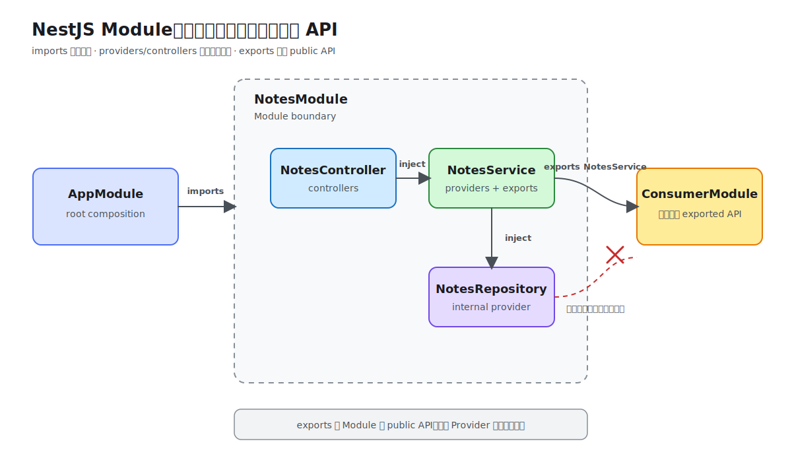

# Module

Module 用来组织 application graph：它把一组高内聚的 Controller 和 Provider 放在同一边界内，并明确哪些 dependency 可以被其他 Module 使用。每个 Nest application 至少有一个 root Module，Nest 从它开始构建完整 dependency graph。



## 最小 Feature Module

```ts
import { Module } from '@nestjs/common';
import { NotesController } from './notes.controller';
import { NotesRepository } from './notes.repository';
import { NotesService } from './notes.service';

@Module({
  controllers: [NotesController],
  providers: [NotesService, NotesRepository],
  exports: [NotesService],
})
export class NotesModule {}
```

消费方通过 `imports` 引入：

```ts
@Module({
  imports: [NotesModule],
})
export class AppModule {}
```

## `@Module()`

`@Module(metadata)` 是 Module 的核心 class decorator。它接收一个 metadata object，Nest 使用这些 metadata 构建 Module、Controller 和 Provider 之间的关系。

### `providers`

声明由当前 Module 的 IoC container 管理的 Provider：

```ts
providers: [NotesService, NotesRepository]
```

class shorthand 等价于 `{ provide: NotesService, useClass: NotesService }`。Provider 默认只在当前 Module 内可见；同一 Module 内的 Controller 和 Provider 可以注入它。

### `controllers`

声明由当前 Module 创建的 Controller：

```ts
controllers: [NotesController]
```

Controller 不应放入 `providers`。Nest 根据 Controller 上的 routing metadata 注册 Handler，并从当前 Module context 解析其 constructor dependency。

### `imports`

引入其他 Module 或 Dynamic Module：

```ts
imports: [NotesModule, ConfigModule.forRoot()]
```

引入 Module 后，只能使用它通过 `exports` 暴露的 Provider；不能访问其全部内部 Provider。`imports` 接收 Module class、Dynamic Module、`Promise<DynamicModule>` 或 `forwardRef()` wrapper。

### `exports`

定义当前 Module 的 public API：

```ts
exports: [NotesService]
```

可以导出当前 Module 注册的 Provider、custom provider token，或 re-export 已导入的 Module。未导出的 Provider 仍被封装在当前 Module 内。

四个字段的关系可以概括为：

```text
imports     从其他 Module 获得公开 Provider
providers   定义当前 Module 的内部 dependency
controllers 使用当前 Module context 处理入口请求
exports     向其他 Module 暴露 public API
```

## Provider encapsulation

Module 默认封装 Provider。假设 `NotesModule` 注册了 `NotesService` 和 `NotesRepository`，但只导出 `NotesService`：

```ts
@Module({
  providers: [NotesService, NotesRepository],
  exports: [NotesService],
})
export class NotesModule {}
```

引入 `NotesModule` 的其他 Module 可以注入 `NotesService`，但不能直接注入 `NotesRepository`。这让 Repository 保持为内部实现，调用方只依赖稳定的 Service API。

不要在消费方重新注册 `NotesService` 来绕过 `exports`。重复注册可能创建另一份 instance，并破坏 cache、connection 或内存状态的一致性。

## Shared Module 与 re-export

Module class 默认是 singleton，可被多个 Module 引入。定义方导出 Provider 后，多个 importing Module 会共享该 Provider instance（具体生命周期仍由 Provider scope 决定）。

Module 也可以 re-export 已导入的 Module：

```ts
@Module({
  imports: [ConfigModule],
  exports: [ConfigModule],
})
export class CoreModule {}
```

引入 `CoreModule` 的 Module 因而可以使用 `ConfigModule` 导出的 Provider。re-export 适合稳定的基础设施组合，但不要用一个巨大的 Shared Module 汇总所有业务 Module，否则 dependency boundary 会变得不可见。

## `@Global()`

`@Global()` 把 Module 标记为 global-scoped Module：只要它被注册一次，其他 Module 无需显式 `imports` 就能使用它导出的 Provider。

```ts
@Global()
@Module({
  providers: [AppLogger],
  exports: [AppLogger],
})
export class LoggingModule {}
```

`@Global()` 没有参数。它不会自动导出所有 Provider，仍需通过 `exports` 明确公开；global Module 也必须在 root/core Module 中注册一次。只对真正 application-wide 且稳定的基础设施使用，业务 Module 应保留显式 imports。

## Dynamic Module

Dynamic Module 让调用方在 import 时提供配置，并动态决定 Provider。它不是一种 Decorator，而是 static method 返回的 `DynamicModule` object。

```ts
import { DynamicModule, Module } from '@nestjs/common';

export interface NotesModuleOptions {
  maxTitleLength: number;
}

export const NOTES_OPTIONS = Symbol('NOTES_OPTIONS');

@Module({})
export class NotesModule {
  static register(options: NotesModuleOptions): DynamicModule {
    return {
      module: NotesModule,
      providers: [
        { provide: NOTES_OPTIONS, useValue: options },
        NotesService,
      ],
      exports: [NotesService],
    };
  }
}
```

调用方使用：

```ts
@Module({
  imports: [NotesModule.register({ maxTitleLength: 120 })],
})
export class AppModule {}
```

`DynamicModule` 常用字段与 `@Module()` metadata 相同，并额外要求：

- `module`：Dynamic Module 所属的 Module class；
- `global?`：是否将这次注册设为 global；
- `imports/providers/controllers/exports`：追加到 static `@Module()` metadata，而不是覆盖它。

`register()`、`forRoot()`、`forFeature()` 都只是社区约定的 static method name：通常 `register/forRoot` 提供 application-level 配置，`forFeature` 注册 feature-specific resource。Nest 根据返回的 `DynamicModule` 工作，不依赖 method 名称。

## `registerAsync()` / `forRootAsync()`

配置依赖其他 Provider 或异步来源时，让 Dynamic Module 接收 Async Options：

```ts
NotesModule.registerAsync({
  imports: [ConfigModule],
  inject: [ConfigService],
  useFactory: async (config: ConfigService): Promise<NotesModuleOptions> => ({
    maxTitleLength: config.getOrThrow<number>('MAX_TITLE_LENGTH'),
  }),
});
```

- `imports`：让 options Factory 所需的 Provider 进入当前 Module context；
- `inject`：按顺序列出传给 `useFactory` 的 injection token；
- `useFactory`：返回 options 或 `Promise<options>`；Nest 在构建依赖方前等待它完成。

可复用 library 可以使用 `ConfigurableModuleBuilder` 生成 `register()`/`registerAsync()` 基础设施，减少手写 Dynamic Module boilerplate。

## Circular dependency

两个 Module 相互 imports 通常说明边界设计需要调整。优先提取共同能力到第三个 Module，或通过 event/port 解除双向依赖。

确实无法消除时，两侧都使用 `forwardRef()`：

```ts
@Module({
  imports: [forwardRef(() => UsersModule)],
})
export class AuthModule {}
```

`forwardRef(() => ModuleClass)` 延迟解析 class reference，但不会解决职责耦合，也不能保证依赖实例的创建顺序。Provider 之间若也循环依赖，还需在 constructor injection point 对应使用 `@Inject(forwardRef(() => OtherService))`。

## 工程边界

- 按业务 capability 建 Feature Module，不按 Controller/Service/Repository 技术类型拆 Module。
- `exports` 保持最小，它是 Module 对外承诺的 public API。
- root Module 主要负责 composition，不堆积业务 Provider。
- 避免把所有 Module 标记为 global；显式 imports 更容易追踪 dependency graph。
- Dynamic Module 负责配置和 Provider composition，不应成为隐藏业务逻辑的入口。
- 不把 Module class 当作普通 Provider 注入；需要共享状态或行为时导出明确的 Provider。

官方资料：[Modules](https://docs.nestjs.com/modules)、[Dynamic modules](https://docs.nestjs.com/fundamentals/dynamic-modules)、[Circular dependency](https://docs.nestjs.com/fundamentals/circular-dependency)。本仓库示例：[第 2 课 Module 与 Dependency Injection](../02-modules-and-dependency-injection/index.md)。
