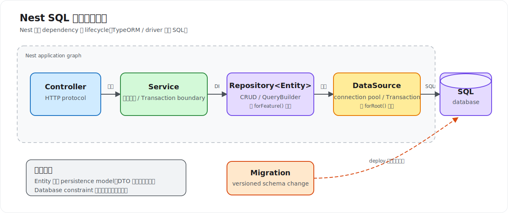

# SQL Database

Nest 本身不负责执行 SQL，也不绑定某一种 database 或 ORM。它提供 Module、Provider 和 Dependency Injection (DI) 机制，把 TypeORM、Prisma、Sequelize、Knex 或原生 database driver 接入 application graph。本课程选择 TypeORM，因为 `@nestjs/typeorm` 能直接展示 Entity、Repository、Transaction 和 Migration 如何融入 Nest。

这几层不要混在一起：

| 层 | 负责什么 | 常见选择 |
| --- | --- | --- |
| database driver | 建立 connection、发送 SQL、接收结果 | `pg`、`mysql2`、`better-sqlite3` |
| Query Builder / ORM | parameter binding、对象映射、关系与 Migration | TypeORM、Prisma、Knex |
| Nest integration | 注册和注入 database dependency | `TypeOrmModule`、自定义 Provider |
| application code | 业务规则、Transaction boundary、错误映射 | Service / Provider |

Controller 只处理 HTTP protocol；Service 决定业务流程；Repository 负责 persistence。Entity 描述 persistence model，不应同时承担 request validation，因此外部输入仍使用 DTO。



## 选择访问方式

- **TypeORM**：适合希望使用 Entity、Repository、relation 和 Migration，并希望与 Nest Module 深度集成的项目。本课程采用此方案。
- **Prisma**：适合偏好 schema-first、生成 type-safe client 的项目。通常把 `PrismaClient` 封装为 `PrismaService` Provider。
- **Query Builder**：适合 SQL 较复杂、希望保留 SQL 心智模型，又需要安全 parameter binding 的项目。
- **原生 driver**：控制最直接，但 connection lifecycle、Transaction、类型映射和测试边界都要自行维护。应封装为 Provider，不要在每个 Service 中创建 connection。

Nest 的上层组织方式不会因此改变：在 Module 注册 database dependency，在 Service 注入并使用，在 application bootstrap/shutdown 阶段管理 connection lifecycle。

## 建立 TypeORM connection

以 PostgreSQL 为例：

```bash
npm install @nestjs/typeorm typeorm pg
```

本课程 Demo 使用 `sql.js`，无需启动外部 database；真实服务通常使用 PostgreSQL 或 MySQL。生产项目推荐通过 `TypeOrmModule.forRootAsync()` 读取已校验的 configuration：

```ts
// app.module.ts
import { Module } from '@nestjs/common';
import { ConfigModule, ConfigService } from '@nestjs/config';
import { TypeOrmModule } from '@nestjs/typeorm';

@Module({
  imports: [
    ConfigModule.forRoot({ isGlobal: true }),
    TypeOrmModule.forRootAsync({
      inject: [ConfigService],
      useFactory: (config: ConfigService) => ({
        type: 'postgres',
        host: config.getOrThrow<string>('DB_HOST'),
        port: config.getOrThrow<number>('DB_PORT'),
        username: config.getOrThrow<string>('DB_USER'),
        password: config.getOrThrow<string>('DB_PASSWORD'),
        database: config.getOrThrow<string>('DB_NAME'),
        autoLoadEntities: true,
        synchronize: false,
        migrations: ['dist/database/migrations/*.js'],
        retryAttempts: 10,
        retryDelay: 3_000,
      }),
    }),
  ],
})
export class AppModule {}
```

关键配置：

| 配置 | 含义与取舍 |
| --- | --- |
| `forRoot()` | 同步注册 connection；适合配置已经直接可用的场景 |
| `forRootAsync()` | 通过 `useFactory`、`useClass` 或 `useExisting` 延迟生成配置，可注入 `ConfigService` |
| `autoLoadEntities` | 自动收集通过 `forFeature()` 注册的 Entity；只出现在 relation 中、未注册的 Entity 不会自动加入 |
| `synchronize` | 根据 Entity 自动修改 schema；开发实验可用，production 必须关闭 |
| `migrations` | 指定编译后 Migration 文件；路径要与运行环境和构建产物一致 |
| `retryAttempts` / `retryDelay` | application startup 时 connection 失败的重试次数和间隔，默认分别为 `10` 和 `3000ms` |

`TypeOrmModule` 创建的 `DataSource` 和 `EntityManager` 也可以直接注入。`DataSource` 应是 application-level singleton，不应为每次 request 重新初始化。connection pool 大小要结合 database 上限、application replica 数量与后台任务并发共同计算。

## 定义 Entity

```ts
// notes/note.entity.ts
import {
  Column,
  CreateDateColumn,
  Entity,
  Index,
  PrimaryGeneratedColumn,
  UpdateDateColumn,
} from 'typeorm';

@Entity('notes')
@Index('idx_notes_owner_updated_at', ['ownerId', 'updatedAt'])
export class Note {
  @PrimaryGeneratedColumn('uuid')
  id!: string;

  @Column({ type: 'varchar', length: 120 })
  title!: string;

  @Column({ type: 'text', default: '' })
  content!: string;

  @Column({ type: 'uuid' })
  ownerId!: string;

  @CreateDateColumn()
  createdAt!: Date;

  @UpdateDateColumn()
  updatedAt!: Date;
}
```

- `@Entity('notes')` 把 class 映射到 `notes` table；显式 table name 能减少命名策略变化带来的意外。
- `@PrimaryGeneratedColumn('uuid')` 定义由 database/driver 生成的 UUID primary key。
- `@Column()` 描述 column type、长度、`nullable`、`default` 和 `unique` 等 schema 信息；这些不是 request validation。
- `@CreateDateColumn()`、`@UpdateDateColumn()` 由 TypeORM 在写入时维护时间。
- `@Index()` 应服务真实 query pattern。索引会加速读取，也会增加写入与存储成本。

不要为了省事把所有 relation 都设为 eager。relation 加载方式应由 use case 决定，否则容易造成过量查询或 N+1 problem。

## 注册并注入 Repository

`forFeature()` 只在当前 Module scope 注册指定 Entity 的 Repository：

```ts
// notes/notes.module.ts
import { Module } from '@nestjs/common';
import { TypeOrmModule } from '@nestjs/typeorm';
import { Note } from './note.entity';
import { NotesService } from './notes.service';

@Module({
  imports: [TypeOrmModule.forFeature([Note])],
  providers: [NotesService],
  exports: [NotesService],
})
export class NotesModule {}
```

```ts
// notes/notes.service.ts
import { Injectable, NotFoundException } from '@nestjs/common';
import { InjectRepository } from '@nestjs/typeorm';
import { Repository } from 'typeorm';
import { Note } from './note.entity';

@Injectable()
export class NotesService {
  constructor(
    @InjectRepository(Note)
    private readonly notesRepository: Repository<Note>,
  ) {}

  async findOne(id: string): Promise<Note> {
    const note = await this.notesRepository.findOneBy({ id });
    if (!note) throw new NotFoundException('Note not found');
    return note;
  }
}
```

`@InjectRepository(Note)` 不是“创建 Repository”，而是请求 Nest 注入由 `TypeOrmModule.forFeature([Note])` 注册的 `Repository<Note>` Provider。若另一个 Module 需要直接注入该 Repository，定义它的 Module 必须 `exports: [TypeOrmModule]`；通常更推荐导出封装业务规则的 Service，避免 persistence detail 跨 Module 扩散。

## Repository CRUD 语义

```ts
async create(input: CreateNoteDto, ownerId: string): Promise<Note> {
  const note = this.notesRepository.create({ ...input, ownerId });
  return this.notesRepository.save(note);
}

async update(id: string, input: UpdateNoteDto): Promise<Note> {
  const note = await this.notesRepository.preload({ id, ...input });
  if (!note) throw new NotFoundException('Note not found');
  return this.notesRepository.save(note);
}

async remove(id: string): Promise<void> {
  const result = await this.notesRepository.delete({ id });
  if (result.affected === 0) throw new NotFoundException('Note not found');
}
```

几个容易混淆的方法：

| 方法 | 实际语义 |
| --- | --- |
| `create()` | 只创建 Entity instance，不访问 database |
| `save()` | 根据 primary key 执行 `INSERT` 或 `UPDATE`，会触发 Entity lifecycle behavior |
| `preload()` | 查询已有 row，并把 partial input 合并成 Entity；找不到时返回 `undefined` |
| `insert()` / `update()` | 直接执行 persistence operation，不先加载完整 Entity；适合不需要 Entity lifecycle 的明确写入 |
| `delete()` | 按条件执行 `DELETE`；row 不存在通常不会抛错，应检查 `affected` |
| `findOneBy()` / `find()` | 按条件查询；列表接口必须考虑 pagination、排序和 projection |

不要先 `findOneBy()` 再无条件 `save()` 来假装解决 concurrency；两个操作之间仍可能被其他 Transaction 修改。需要原子约束时使用 database constraint、conditional update、optimistic/pessimistic lock 或 Transaction。

## QueryBuilder 与 relation

简单 CRUD 使用 Repository method 更清楚；dynamic condition、join、aggregate 或精确 projection 使用 QueryBuilder：

```ts
async findPage(ownerId: string, cursor: Date, limit: number) {
  return this.notesRepository
    .createQueryBuilder('note')
    .select(['note.id', 'note.title', 'note.updatedAt'])
    .where('note.ownerId = :ownerId', { ownerId })
    .andWhere('note.updatedAt < :cursor', { cursor })
    .orderBy('note.updatedAt', 'DESC')
    .take(limit)
    .getMany();
}
```

动态值始终通过 parameter binding 传入，不能拼接用户输入形成 SQL。relation 是否 join、分批查询或只返回 foreign key，应根据数据量和 endpoint 需求决定；通过 query log 和 execution plan 发现 N+1、missing index 与 full table scan，而不是凭 Entity 结构猜性能。

## Transaction

一个业务动作包含多次相互依赖的写入时，需要明确 Transaction boundary：

```ts
import { DataSource } from 'typeorm';

constructor(private readonly dataSource: DataSource) {}

async transferNote(noteId: string, nextOwnerId: string): Promise<void> {
  await this.dataSource.transaction(async (manager) => {
    const notes = manager.getRepository(Note);
    const note = await notes.findOneByOrFail({ id: noteId });

    note.ownerId = nextOwnerId;
    await notes.save(note);
    await manager.insert(NoteTransferLog, { noteId, nextOwnerId });
  });
}
```

Transaction callback 中的所有 database operation 必须使用 callback 提供的 `manager`，不能回到普通 injected Repository，否则该操作可能使用另一条 connection，不属于当前 Transaction。

需要手动控制 `BEGIN`、`COMMIT`、`ROLLBACK`、lock 或多个步骤间的 connection 时使用 `QueryRunner`，并在 `finally` 中 `release()`。Transaction 应尽量短，不在其中调用外部 HTTP API；长时间持锁会降低吞吐并放大 deadlock 风险。并发控制与幂等的完整场景见[第 10 课](../10-transactions-concurrency-idempotency/index.md)。

## Migration 管理 schema

production 中必须使用 Migration 演进 schema，而不是 `synchronize: true`：

```ts
import { MigrationInterface, QueryRunner } from 'typeorm';

export class AddNotesOwnerIndex1710000000000 implements MigrationInterface {
  async up(queryRunner: QueryRunner): Promise<void> {
    await queryRunner.query(
      'CREATE INDEX "idx_notes_owner_updated_at" ON "notes" ("ownerId", "updatedAt")',
    );
  }

  async down(queryRunner: QueryRunner): Promise<void> {
    await queryRunner.query('DROP INDEX "idx_notes_owner_updated_at"');
  }
}
```

- `up()` 描述部署新版本时的 schema change，`down()` 描述可行的 rollback；涉及数据丢失时不能假设 rollback 总是安全。
- TypeORM CLI 通常读取独立的 `DataSource` 文件，因为 CLI 不会 bootstrap Nest application。
- Migration 应在 deploy job 中执行一次，再启动或放量 application replica；不要让多个 replica 同时争抢 Migration。
- 大 table 的 column rewrite、index build 和 data backfill 需要拆分并评估 lock time，不能只看 Migration 能否在本地运行。

第 5 课提供 TypeORM 与 Migration 的可运行版本：[数据库、ORM 与迁移](../05-database-orm-migrations/index.md)。

## 多个 database connection

只有确实存在 read/write separation、独立 reporting database 或 bounded context 隔离时才增加 named connection：

```ts
TypeOrmModule.forRoot({
  name: 'reporting',
  type: 'postgres',
  // ...
});

TypeOrmModule.forFeature([Report], 'reporting');

constructor(
  @InjectRepository(Report, 'reporting')
  private readonly reports: Repository<Report>,
) {}
```

connection name 必须在 `forRoot`、`forFeature` 和 injection point 保持一致。默认 connection 已满足大多数项目；过早拆分会增加 Transaction、Migration、health check 和测试复杂度。

## 错误、安全与可观测性

- 用 unique constraint、foreign key、`NOT NULL` 和 check constraint 保证最终数据一致性，不能只依赖 DTO validation。
- 在 Service 或 persistence adapter 把已知 database error 映射为 `ConflictException`、`NotFoundException` 等 application exception；不要把 SQL、constraint name、credential 或 stack trace 原样返回客户端。
- 使用 parameterized query，database account 遵循 least privilege，secret 通过 configuration 注入。
- 所有 list query 都应有 pagination 和稳定排序；对慢查询记录 duration、operation 与 trace context，但不要记录敏感 parameter。
- startup retry 只解决暂时不可用，不能掩盖错误 credential 或 schema 不兼容。readiness check 应反映 application 当前是否能够安全接收流量。
- unit test 可通过 `getRepositoryToken(Note)` 提供 mock；涉及 SQL、constraint、relation、Transaction 或 Migration 的行为必须用真实 test database 做 integration/e2e test。本仓库只在第 13 课保留测试代码。

## 官方资料

- [NestJS Database](https://docs.nestjs.com/techniques/database)：database-agnostic 原则、TypeORM integration、Repository、relation 和 Transaction。
- [NestJS Prisma recipe](https://docs.nestjs.com/recipes/prisma)：把 Prisma Client 封装为 Nest Provider 的方式。
- [TypeORM DataSource](https://typeorm.io/docs/data-source/data-source/)：connection、pool 与 DataSource lifecycle。
- [TypeORM Repository APIs](https://typeorm.io/docs/working-with-entity-manager/working-with-repository/)：Repository method 的完整语义。
- [TypeORM Transactions](https://typeorm.io/docs/advanced-topics/transactions/) 与 [Migrations](https://typeorm.io/docs/advanced-topics/migrations/)：Transaction manager、QueryRunner 与 schema 演进。
